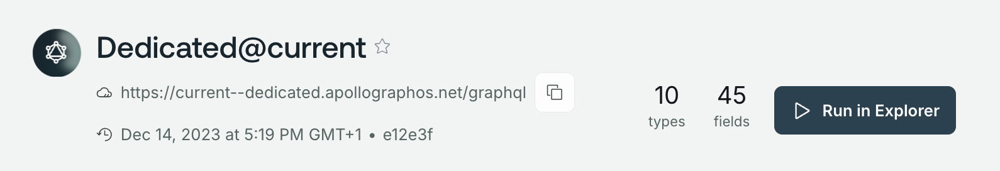

<CloudPlanPause />

To interact with your supergraph, clients send requests to your router's endpoint. The _custom domains_ feature lets you replace the default `apollographos.net` router endpoint URL with your own subdomain.

Custom domains can help to:

- Minimize client-side changes
- Use your existing CORS policies and security controls
- Protect your cloud routers from DDoS attacks
- Provide TLS termination to your cloud routers

## How custom domains work

Custom domains use [CNAME records](https://www.cloudflare.com/learning/dns/dns-records/dns-cname-record/) to point requests made to your subdomain to your `apollographos.net` router endpoint URL. Custom domains run on [Cloudflare's](https://www.cloudflare.com/) global network.

## Custom domains setup

Setup includes two steps:

1. Setting up a CNAME record in your DNS provider.
2. Opening a ticket with Apollo support to enable your CNAME.

<Note>

Custom domains will be available through self-service in GraphOS Studio later in 2024. In the meantime, you must open a support request to enable your CNAME with Apollo.

</Note>

### Setup a CNAME

Create a CNAME record in your DNS provider that points to your Dedicated variant's [existing subdomain](/graphos/routing/cloud/dedicated-quickstart#router-endpoint-url). For example, create a CNAME for `api.mydomain.com` that points to `current--docs-example.apollographos.net`.

You can find your Dedicated variant's subdomain in [GraphOS Studio](https://studio.apollographql.com?referrer=docs-content) on the **Cloud Router** page under **API Endpoint**.

<Note>

CNAME records are assigned at the variant level, so you must set up a separate CNAME record for each graph variant that requires a custom domain.

</Note>

### Using an existing CNAME

If you already have a CNAME record for the custom domain you want to use, [contact Apollo Support](#open-a-support-ticket) before making any changes. We'll guide you through remapping from a different host to the GraphOS Cloud subdomain.

### Open a support ticket

Next, open a support ticket requesting Apollo to enable your new CNAME.
You can open a ticket by emailing [support@apollographql.com](mailto:support@apollographql.com). Your request may take up to two business days to process. Apollo will notify you when your new CNAME is live.

Your request may take up to two business days to process. Apollo will notify you when your new CNAME is live.

## Limitations

The custom domains feature doesn't support the following:

- [Apex records](https://learn.microsoft.com/en-us/azure/dns/dns-zones-records#record-names) or [A records](https://learn.microsoft.com/en-us/azure/dns/dns-zones-records#record-types)
- Multiple custom domains per variant
- Load balancing traffic across multiple variants
