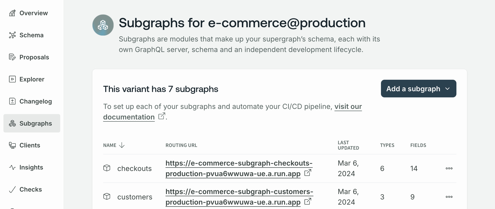

<CloudPlanPause />

Follow this hands-on guide to create a new graph that uses a Dedicated cloud router.
To learn about Dedicated cloud routing in general, go to the [Cloud Dedicated overview](/graphos/routing/cloud/dedicated).

## Prerequisites

To complete this quickstart, you must have the following:

- A [GraphOS Studio](https://studio.apollographql.com?referrer=docs-content) account
- An organization with the Dedicated plan—<TrackableLink href="https://www.apollographql.com/contact-sales?referrer=docs" eventName="content_contact_sales">get in touch</TrackableLink> to request access.
- One or more GraphQL APIs that Apollo can access. That means you must either:
  - Make your GraphQL API(s) available via a publicly accessible URL, for example, `https://api.mycompany.com/subgraphA`
  - Keep your GraphQL API(s) private but allow secure connections, for example, via [VPC networking](https://docs.aws.amazon.com/vpc/latest/peering/what-is-vpc-peering.html)

If you have multiple subgraphs, each needs to be exposed to Apollo. Your supergraph, however, should only be publicly accessible via your cloud router.

<Note>

In a supergraph, each GraphQL API is called a _subgraph_. Apollo refers to these GraphQL APIs as subgraphs, even if you only connect one GraphQL API.

The GraphOS Router doesn't supported nested federation—that is, a subgraph cannot act as a supergraph for another set of subgraphs.

</Note>

## Step 1. Create a new graph

To provision a new Dedicated cloud router, you must first create a new graph in [GraphOS Studio](https://studio.apollographql.com?referrer=docs-content). To do so, click **Create New Graph** from the **Graphs** tab.

## Step 2. Connect APIs

1. Next, connect your GraphQL API to Apollo.

   - If your API URL is publicly accessible, enter the API URL. This URL is the URL that client applications currently use to query your API.
   - If your API isn't publicly accessible and requires private networking, you can connect to it with [AWS VPC Lattice](/graphos/routing/cloud/lattice-configuration). Select **My endpoint isn't publicly accessible** to connect a VPC. Follow the prompts to complete private subgraph setup.

2. Enter a **Subgraph name**. The name should reflect your API's data or capabilities and uniquely identify your API among any other APIs you might add to the supergraph later.

   <Note>

   The subgraph name is immutable.

   </Note>

3. Select the backend **provider** and **region** to deploy your cloud router in.
4. Optionally, configure headers, secrets, CORS rules, or other configurations. You can always [update your router configuration](#step-3-inspect-and-configure-your-cloud-router) as needed.
5. Provide a **Supergraph name** and **ID**.

   - The supergraph name is displayed throughout Studio and helps your team distinguish between your graphs. You can change your graph's name at any time.
   - The ID is immutable and must be unique across all of Apollo. Ensure it starts with a letter and contains only letters, numbers, and dashes. You'll use the ID to reference your graph from various tools, such as the Rover CLI.

6. Click **Create GraphOS Router**.

Provisioning a router for your new supergraph may take a few moments. Once done, click **Query your supergraph** to open the Explorer and begin playing with your graph, or **Open README** to go to your graph's landing page.

Before moving to the next step, add any other GraphQL APIs you want to connect. Open the **Subgraphs** page from the left navigation and click **Add a subgraph**.

Every router configuration or supergraph schema change—including adding a subgraph—triggers a new [launch](/graphos/delivery/launches/). Every launch automatically deploys new cloud router instances for your supergraph.

<Note>

The launch process typically takes 1-2 minutes but may take up to 5 minutes. During the process, Apollo provisions new GCUs and swaps them in once they're online. Deployments minimize API degradation and downtime.

</Note>

## Step 3. Inspect and configure your cloud router

Dedicated cloud routers have a separate UI for management and configuration. Open the **Cloud Router** page from the left navigation. This page shows a summary of your cloud router, including its **API endpoint** and **API details**.

Use the **Configuration** tab to manage your cloud router's configuration, including **Secrets** and **Router configuration YAML**. See the [router docs](/router/configuration/overview) for more information.

## Step 4. Test and validate

To test whether your graph works as intended, run a sample query by clicking **Run in Explorer** from your graph's **README** page.

[Enable subgraph error reporting](/graphos/routing/cloud/lattice-troubleshooting/#enable-subgraph-error-inclusion) if you run into issues.

For further testing, you can add variants to your graph for development or staging environments. To do so, go to **Settings** > **This Graph** > **Variants** and click **Add a variant**.

Apollo recommends running a [load test](/graphos/routing/cloud/throughput-guide#load-testing) to determine how much [throughput capacity](/graphos/routing/cloud/throughput-guide) you need to run your graph.

## Step 5. Go live

Your supergraph is ready to start receiving client operations! If you have existing client applications that connect directly to your GraphQL API, you can update their GraphQL endpoint URL to your router's URL.

Similarly, any new client applications should use your router's URL.

<Note>

- For all browser-based clients, make sure their origin is allowed in your router's [CORS rules](#cors-rules).

- Only update clients that communicate with the correct instance of your GraphQL API. For example, if your API has staging and production instances, only update clients that communicate with the instance used by this supergraph variant.

</Note>

#### Router endpoint URL

You can find your endpoint URL on the **Cloud router** page in GraphOS Studio.

<Note>

By default, cloud router URLs are on a subdomain of `apollographos.net`. You can setup a [custom domain](/graphos/routing/cloud/custom-domains) to minimize client-side changes.

</Note>

## Next steps

Congratulations! 🎉 You've built a cloud supergraph on GraphOS. Check out the general Quickstart's [Next steps](/graphos/get-started/guides/quickstart#next-steps) for some of the most common and important features to learn about.
