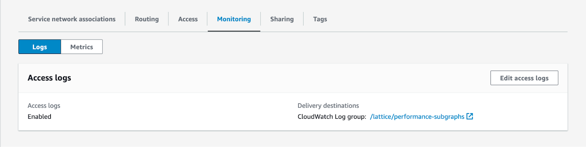
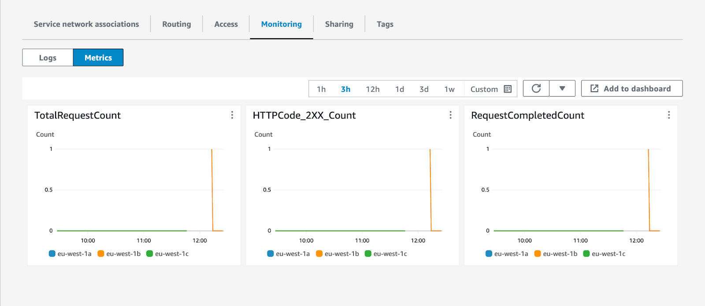
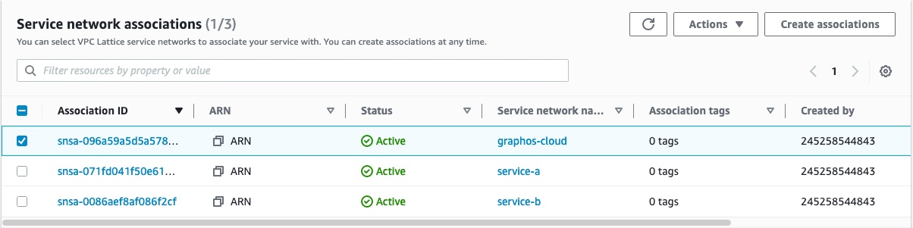
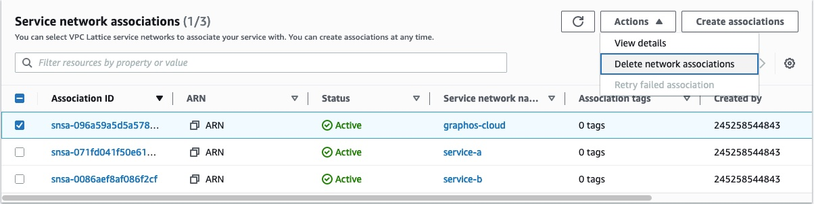

<CloudPlanPause />

This guide covers:

- How to monitor traffic flowing through Amazon VPC Lattice to your subgraphs.
- How to add access restrictions to your subgraphs
- How to remove GraphOS access to your subgraphs

<Tip>

If you haven't configured Amazon VPC Lattice yet or need to add new subgraphs, follow the [configuration guide](/graphos/routing/cloud/lattice-configuration).

</Tip>

## Amazon VPC Lattice monitoring

To confirm that traffic is flowing to your private subgraphs, you can use the metrics and access logs emitted by Amazon VPC Lattice:

1. In the AWS Console for your region of choice, go to the VPC service page.
2. In the left navigation, scroll down and open **VPC Lattice > Services**.
3. Click the Lattice service used by the subgraph in question.
4. Click the **Monitoring** tab.

From there, you can configure and enable access logs for your Amazon VPC Lattice service.



Use the **Metrics** tab to get a quick overview of traffic flowing to your private subgraphs.



You can also use [Amazon CloudWatch metrics emitted by Amazon VPC Lattice](https://docs.aws.amazon.com/vpc-lattice/latest/ug/monitoring-cloudwatch.html) to set up dashboards and alarms to understand the health of your private subgraphs.

## Further restrict access

Once you configure an Amazon VPC Lattice service to accept traffic from GraphOS, it's protected by multiple security layers:

- The Amazon VPC Lattice service network only allows traffic with a valid signature over HTTPS.
- The Lattice service's configured authorization policy allows traffic only from Apollo AWS accounts. (This is the authorization policy you configured in step 6 [when creating your Lattice service](/graphos/routing/cloud/lattice-configuration#step-2-create-a-lattice-service).)
- GraphOS cloud router provisioning compares subgraphs in a supergraph's configuration against the list of known private subgraphs in its Apollo account. It refuses to create or update cloud routers with unknown private subgraphs.
- Cloud routers can only invoke private subgraphs listed in their supergraph configuration.

You can further restrict access to your private subgraphs by configuring additional [conditions](https://docs.aws.amazon.com/IAM/latest/UserGuide/reference_policies_elements_condition.html) in your service's authorization policy.
Specifically, you can add conditions to restrict traffic based on your organization's Apollo account ID or your supergraph's graph ref.

### Update Lattice service authorization policy

To update a Lattice service's authorization policy, you first need the **Apollo account ID** and/or **graph ref** to which you want to restrict subgraph access.

#### Get account ID and graph ref

- Reach out to your Apollo contact to get your account ID. Specify that you need the account ID to update your Lattice service's authorization policy.

  <Note>

  The Apollo account ID you specify in your authorization policy isn't the GraphOS organization ID you can find in GraphOS Studio.

  </Note>

- You can find your supergraph's graph ref in your Apollo account:
  - Log in to [GraphOS Studio](https://studio.apollographql.com?referrer=docs-content).
  - Click on a graph variant on the **Graphs** page. The graph ref is at the top of the page.

If you want to provide subgraph access to multiple supergraphs or GraphOS accounts, specify multiple graph refs and account IDs when updating your policy.

#### Update policy

If you are using the [Apollo Terraform module](https://github.com/apollographql/terraform-graphos-aws), you can set the [`apollo_account_ids` and `apollo_graph_refs` variables](https://github.com/apollographql/terraform-graphos-aws#usage) to update your authorization policy. Provide one or more Apollo account IDs or graph refs:

```txt showLineNumbers=false disableCopy=true
apollo_account_ids = ["my_account_id", "another_account_id"]
apollo_graph_refs  = ["my-graph@my-variant", "another-graph@my-variant"]
```

If you aren't using the Apollo Terraform module, follow these steps:

1. In the AWS Console for your region of choice, go to the VPC service page:

- [US East (N. Virginia) - us-east-1](https://us-east-1.console.aws.amazon.com/ram/home?region=us-east-1)
- [Europe (Ireland) - eu-west-1](https://eu-west-1.console.aws.amazon.com/ram/home?region=eu-west-1)

2. In the left navigation, scroll down and open **Services** in the **VPC Lattice** section.
3. Click the Lattice service whose authorization policy you want to configure.
4. In the **Service access** section, update your authorization policy. You can use the following as an example&mdash;make sure to replace the account ID and graph ref with your own.

```json {13-17} showLineNumbers=false
{
  "Version": "2012-10-17",
  "Statement": [
    {
      "Effect": "Allow",
      "Principal": "*",
      "Action": "vpc-lattice-svcs:Invoke",
      "Resource": "*",
      "Condition": {
        "ForAnyValue:StringLike": {
          "aws:PrincipalOrgPaths": "o-9vaxczew6u/*/ou-leyb-l9pccq2t/ou-leyb-fvqz35yo/*"
        },
        // Restrict traffic based on Apollo account IDs or graphRefs
        "StringEquals": {
          "aws:PrincipalTag/Apollo:accountId": "my_account_id_xezf34",
          "aws:PrincipalTag/Apollo:graphRef": "my-graph@my-variant"
        }
      }
    }
  ]
}
```

If multiple supergraphs should have access to the subgraph, use a comma-separated string of graph refs for `aws:PrincipalTag/Apollo:graphRef`. For example:

```json showLineNumbers=false disableCopy=true
"aws:PrincipalTag/Apollo:graphRef": "my-graph@my-variant, my-graph@another-variant, another-graph@another-variant"
```

Similarly, you can use a comma-separated string of account IDs for `aws:PrincipalTag/Apollo:accountId`:

```json showLineNumbers=false disableCopy=true
"aws:PrincipalTag/Apollo:accountId": "my_account_id_xezf34", "my_account_id_dehs56"
```

## Remove access

To remove GraphOS access to private subgraphs, you must remove both resource shares and service network associations.
Keep in mind that any existing supergraphs that send traffic to your private subgraphs will stop working once you remove access.

### Remove resource shares

1. In the AWS Console for your region of choice, go to the Resource Access Manager service page:

- [US East (N. Virginia) - us-east-1](https://us-east-1.console.aws.amazon.com/ram/home?region=us-east-1)
- [Europe (Ireland) - eu-west-1](https://eu-west-1.console.aws.amazon.com/ram/home?region=eu-west-1)

2. In the left navigation, click **Resource shares** in the **Shared by me** section.
3. Select the resource share(s) associated with the Apollo AWS organization. Then click the **Delete** button in the top right corner.
4. Click **Delete** in the dialog that appears.

### Remove service network associations

1. In the AWS Console for your region of choice, go to the VPC service page:

- [US East (N. Virginia) - us-east-1](https://us-east-1.console.aws.amazon.com/ram/home?region=us-east-1)
- [Europe (Ireland) - eu-west-1](https://eu-west-1.console.aws.amazon.com/ram/home?region=eu-west-1)

2. In the left navigation, scroll down and open **Services** in the **VPC Lattice** section.
3. Click the Lattice service you want to disconnect.
4. In the **Service network associations**, select the **graphos-cloud** service name.



5. Click the **Actions** button in the top right of that section. Then, click **Delete network associations**.



6. Follow the confirmation instructions and click **Delete**.

Deleting the network association can take a few seconds. Once you delete the network association, GraphOS can no longer contact your subgraphs.
