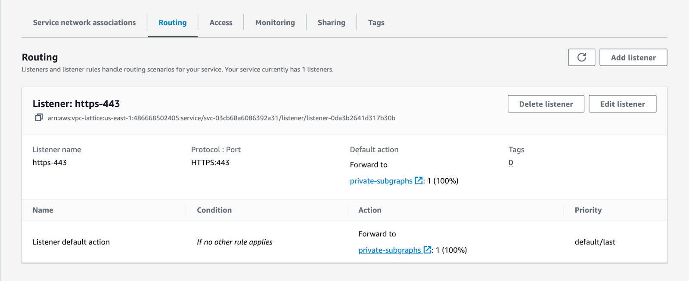

<CloudPlanPause />

Refer to the [configuration page](/graphos/routing/cloud/lattice-configuration) to learn how to configure AWS VPC Lattice to send traffic to your subgraphs.

## Enable subgraph error inclusion

To help resolve AWS VPC Lattice connection issues, enable subgraph error inclusions for your graph variant. This configuration lets you see error messages generated by your subgraphs. Follow these steps to set the configuration:

1. Go to [GraphOS Studio](https://studio.apollographql.com?referrer=docs-content).
2. Open the **Cloud Router** page from the left navigation.
3. Open the **Configuration** tab.
4. In **Router configuration YAML**, ensure your configuration has the following configuration block:

```yaml
include_subgraph_errors:
  all: true
```

5. Click the **Save** button in the top right corner of that section.

Configuration changes trigger a new launch. Please wait a few minutes for your cloud router to update with this new configuration. You can track your graph variant's deployment status on its **Launches** page.

Once you've found and resolved the issue, Apollo recommends turning off subgraph error inclusion. To do so, remove the `include_subgraph_errors` configuration. Then, save the router's configuration YAML.

## Common issues and errors

If you encounter an error not listed below and need help, don't hesitate to get in touch with your Apollo contact. We're here to help.

### Overriding `host` headers

Amazon VPC Lattice relies on the `host` header to secure and route requests. You can't change this header on Cloud Dedicated. Instead, consider using a header like `x-host`. You can rewrite an incoming header through your [router configuration](/graphos/routing/cloud/dedicated-quickstart#step-3-inspect-and-configure-your-cloud-router) YAML:

```yaml title="router.yaml"
# ...other configuration...
headers:
  all: # Header rules for all subgraphs
    request:
      - propagate:
        named: 'host'
        rename: 'x-host'
```

The previous example renames a `host` header to `x-host`.

### Service in resource share doesn't appear in private subgraphs

Cloud Dedicated doesn't automatically scan your resource shares for new Lattice services. [Adding a subgraph](/graphos/routing/cloud/lattice-configuration#setup-for-existing-graphs) or [creating a new graph](/graphos/routing/cloud/lattice-configuration#setup-for-new-graphs) automatically triggers a scan for new Lattice services. If you can't view the latest resource shares for your graph, please <TrackableLink href="https://www.apollographql.com/contact-sales?type=dedicated&referrer=docs" eventName="content_contact_cloud">get in touch</TrackableLink> for additional support.

### Providing `Authorization` headers

Because AWS Sigv4 relies on the [HTTP `Authorization` request header](https://developer.mozilla.org/en-US/docs/Web/HTTP/Headers/Authorization) for [signing requests](https://docs.aws.amazon.com/AmazonS3/latest/API/sigv4-auth-using-authorization-header.html), you may receive an error like this: `You must be authenticated to access this resource. Please provide a valid Bearer Token in the Authorization header.`

If your subgraphs rely on the `Authorization` header for authentication, your router must [rename](/router/configuration/header-propagation/#propagate) it. For example:

```yaml title="router.yaml"
# ...other configuration...
headers:
  all: # Header rules for all subgraphs
    request:
      - propagate:
        named: 'Authorization'
        rename: 'X-Authorization'
```

Then, update your subgraphs to check for `Authorization` or your new header name.

### Error trying to connect: Connection reset by peer (os error 104)

This error is likely to occur when your cloud router tries to send traffic to a port different from the listener on your AWS VPC Lattice service. Apollo GraphOS Cloud only supports communicating with private subgraphs over HTTPS on port 443.

You can check that a Lattice service is configured to receive traffic on the right port on a service's **Routing** page:

1. In the AWS Console for your region of choice, go to the VPC service page.
2. In the left navigation, scroll down and open **VPC Lattice > Services**.
3. Click the Lattice service used by the subgraph in question.
4. Click the **Routing** tab.



5. Check that you have a listener with a `protocol:port` configuration of **HTTPS:443**.

If not, you must create a new listener by clicking on the **Add listener** button at the top left of this section.
Refer to step 10 of [Create a Lattice service](/graphos/routing/cloud/lattice-configuration#step-2-create-a-lattice-service) for more details.

### HTTP fetch failed from '\_subgraph\_': 403: Forbidden

This error likely occurs for one of the following reasons:

- One of your clients is sending a subscription request to a private subgraph over WebSockets.
- The VPC Lattice IAM policy doesn't allow traffic from Apollo GraphOS Cloud.

#### Subscriptions over WebSockets

Subscriptions over WebSockets aren't supported in AWS VPC Lattice, as the platform currently [lacks WebSocket support](https://docs.aws.amazon.com/vpc-lattice/latest/ug/listeners.html#listener-configuration). When sending a request to upgrade to a WebSockets connection, Lattice returns a blank response with a 403 response code. In this situation, Lattice also doesn't emit access log entries to Amazon CloudWatch Logs. [Contact your AWS account team](https://aws.amazon.com/contact-us/sales-support/) to notify them of your interest in this feature.

#### VPC Lattice IAM policy

You can check that a Lattice service is configured to allow traffic from Apollo GraphOS Cloud on the service's **Access** page:

1. In the AWS Console for your region of choice, go to the VPC service page.
2. In the left navigation, scroll down and open **VPC Lattice > Services**.
3. Click the Lattice service used by the subgraph in question.
4. Click the **Access** tab.
5. Ensure that the Auth type is set to **IAM** and that the policy looks like this:

```json
{
  "Version": "2012-10-17",
  "Statement": [
    {
      "Effect": "Allow",
      "Principal": "*",
      "Action": "vpc-lattice-svcs:Invoke",
      "Resource": "*",
      "Condition": {
        "ForAnyValue:StringLike": {
          "aws:PrincipalOrgPaths": "o-9vaxczew6u/*/ou-leyb-l9pccq2t/ou-leyb-fvqz35yo/*"
        }
      }
    }
  ]
}
```
