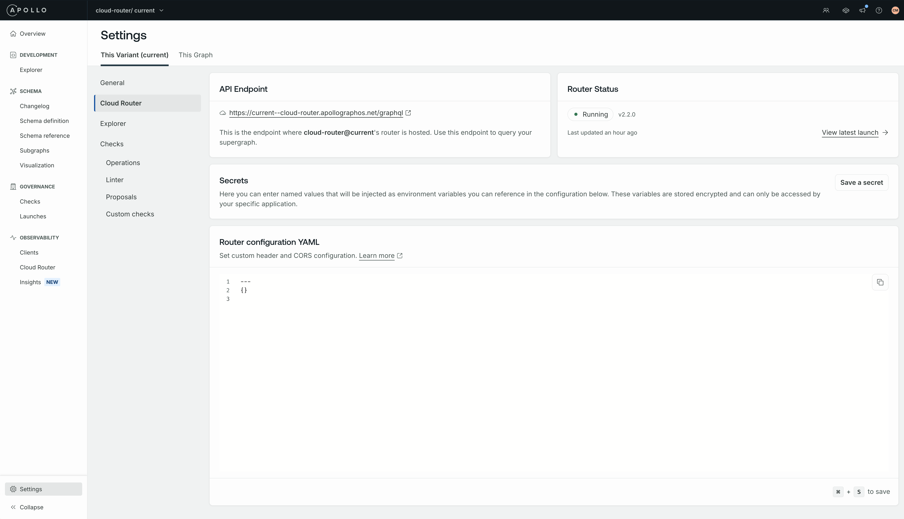
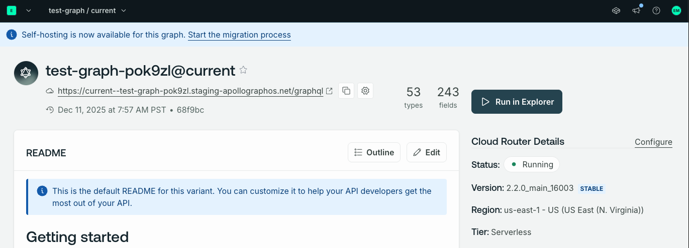
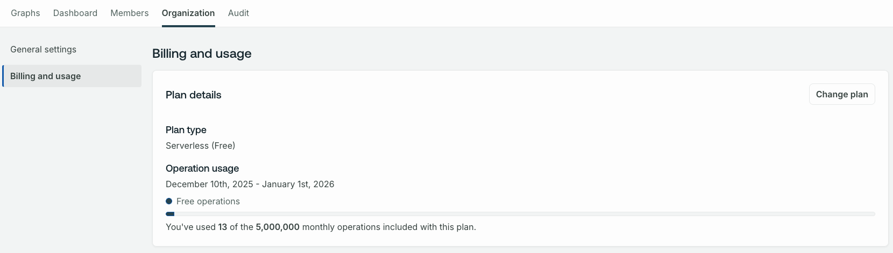

Serverless plans end on February 1, 2026, and Dedicated plans end on March 15, 2026. After these dates, cloud routers are no longer available.

If you are on a Serverless or Dedicated plan, migrate your graphs to self-hosted. After migrating your graphs, move your organization to a [supported plan](https://www.apollographql.com/pricing).

During the migration window, your cloud router continues to receive traffic, schema updates, and configuration updates. The migration window ends on February 1, 2026 for Serverless and March 15, 2026 for Dedicated.

<Note>

If a graph variant's page does not show the migration banner or a Cloud Router page within the Observability section, that graph and all of its variants are already self-hosted and no action is required.

</Note>

This guide provides step-by-step instructions to migrate graphs on Serverless or Dedicated plans to self-hosted graphs on a supported plan.

1. Export your cloud router configuration.
1. Change your graph's hosting mode to self-hosted.
1. Deploy a self-hosted router.
1. Validate and shift traffic to your self-hosted endpoint.
1. After you migrate all graphs to self-hosted, move your organization to a supported plan.

## Steps to migrate

### Export your cloud router configuration

You'll use your router configuration in a later step when you deploy your self-hosted router. You can export your router configuration with Studio or the Rover CLI.

#### Using Studio

In Studio, navigate to your graph's **Cloud Router** page and find the **Router configuration YAML** section to copy your router configuration.



Save the configuration to a `router.yaml` file on your local machine.

If you can't access the Cloud Router page (for example, if you have already changed your graph's hosting mode), use the Rover CLI to export the configuration.

#### Using the Rover CLI

Use the [`cloud config fetch` command](/rover/commands/cloud#cloud-config-fetch) to download your router configuration.

1. [Install](/rover/getting-started) and [configure](/rover/configuring) the Rover CLI.

1. Replace the `<GRAPH_REF>` placeholder in the following command with your own graph ref to download the router configuration YAML to a local `router.yaml` file.

    ```bash showLineNumbers={false}
    rover cloud config fetch <GRAPH_REF> > router.yaml
    ```

### Change the graph's hosting mode to self-hosted

In Studio, click the **Start the migration process** button at the top of the graph variant's page to change the graph's hosting mode to self-hosted.



Click **Confirm** to begin the process of migrating your graph to self-hosted.

When the process is successful, you'll see a message confirming that your graph has been switched to self-hosted mode.

During the migration window, the cloud router remains running and continues to receive schema and configuration updates.

### Deploy a self-hosted router

Deploy a self‑hosted router using your preferred platform. 

For Kubernetes deployments, use the [Apollo GraphOS Operator](/apollo-operator).

For other platforms, see the following guides:
- [Kubernetes](/graphos/routing/self-hosted/containerization/kubernetes/quickstart)
- [Docker](/graphos/routing/self-hosted/containerization/docker)
- [AWS](/graphos/routing/self-hosted/containerization/aws)
- [Azure](/graphos/routing/self-hosted/containerization/azure)
- [GCP](/graphos/routing/self-hosted/containerization/gcp)
- [Railway](/graphos/routing/self-hosted/managed-hosting/railway)
- [Render](/graphos/routing/self-hosted/managed-hosting/render)

Use the router configuration YAML you exported in the [first step](#export-your-cloud-router-configuration) to configure your self-hosted router.

### Validate and shift traffic

Validate the new endpoint, then gradually shift production traffic from the cloud router to your self-hosted endpoint.

### Move your organization to a supported plan

<Caution>

You must migrate all of your graphs to self-hosted mode before you can move your organization to a supported plan.

</Caution>

1. Navigate to **Organization** > **Billing and Usage**.

1. Click the **Change plan** button to move your organization to a supported plan. See the [Plan Selection Troubleshooting page](https://support.apollographql.com/space/ETKB/2006712337/Plan+Selection+Troubleshooting) for more information.



## Frequently asked questions

### What happens to your running cloud routers when you change your graph's hosting mode?

Changing a graph's hosting mode doesn't affect running cloud routers. Cloud routers continue to receive traffic, emit telemetry, and receive schema and configuration updates until a [shutdown event occurs for Serverless routers](/graphos/routing/cloud/serverless#automatic-deletion-of-unused-routers) or the migration period ends on February 1, 2026 for Serverless and March 15, 2026 for Dedicated.

### How do you retrieve and update the configuration of your running cloud routers after converting to self-hosted mode?

Use the [`cloud config fetch` command](/rover/commands/cloud#cloud-config-fetch) to fetch your cloud router configuration. [Install](/rover/getting-started) and [configure](/rover/configuring) the Rover CLI to run this command.

```bash showLineNumbers={false}
rover cloud config fetch <GRAPH_REF> > router.yaml
```

Use the [`cloud config update` command](/rover/commands/cloud#cloud-config-update) to update your running cloud routers' configuration. For example, to apply changes from a local `router.yaml`:

```bash showLineNumbers={false}
rover cloud config update --file router.yaml <GRAPH_REF>
```
