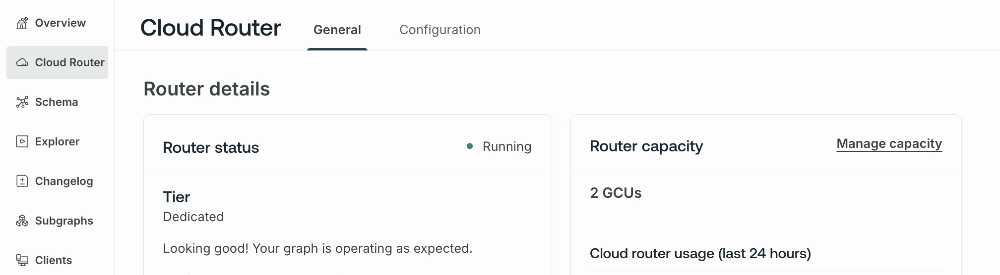

<CloudPlanPause />

This guide covers:

- An overview of _Graph Compute Units_ (GCUs) and their performance expectations
- How to calculate the number of GCUs your supergraph needs
- How to manage your supergraph's throughput capacity as needs change

## Overview

Cloud Dedicated pricing is based on the amount of Graph Compute Units (GCUs) needed to run your graph. A GCU is a unit of throughput capacity that takes into account:

- Processing incoming GraphQL requests
- Making a query plan across subgraphs
- Securely routing traffic to your backend services

GCUs run on [AWS in the region of your choice](/graphos/routing/cloud/dedicated#runs-on-aws).

### Performance expectations

<PreviewFeature>

While Cloud Dedicated is in [preview](#private-preview), these performance expectations may change.

</PreviewFeature>

From a single GCU, you can expect the following baseline performance:

- 25 requests per second (RPS)
- 150 subgraph RPS
- Up to 0.5 megabytes of response data per second

GCU performance varies depending on [additional factors](#throughput-factors), such as payload size. For example, requests that return large payloads may decrease throughput below the baseline 25 RPS. Conversely, requests that return small amounts of data may achieve above the baseline 25 RPS.

Apollo recommends [load testing](#load-testing) your GraphQL workload on Cloud Dedicated before going into production.

### Throughput factors

Beyond RPS, query complexity and response size influence GCU throughput. For example, the following scenarios would decrease relative GCU throughput:

- Requests that query more than five subgraphs
- Requests that return hundreds or thousands of fields per operation

Requests like this decrease throughput because they require additional compute resources to execute.
Factor in additional GCUs into your [GCU calculation](#gcu-calculation) if your supergraph receives complex queries or returns large responses.

<Note>

GCUs include burst capacity to handle the occasional complex query. A sustained period of complex queries can [exhaust this capacity](#rate-limiting).

</Note>

### Rate limiting

GCUs aren't rate-limited. However, GCUs do offer a specific amount of throughput capacity. It's possible to temporarily burst GCU throughput for a few seconds. After this period, clients receive 429 errors. Apollo recommends adding retry logic to your clients to minimize dropped requests.

## GCU calculation

If you already use GraphOS, you can calculate your required GCUs using the operation metrics in GraphOS Studio.

1. In [Studio](https://studio.apollographql.com?referrer=docs-content), go to the **Insights** page and select **Last month** as the timeframe.


2. Scroll down to the **Request Rate** chart. This chart shows the request rate in requests per minute (RPM).
3. To calculate your required requests per second (RPS), find the peak RPM and divide it by 60.
4. Since, as [a baseline](#performance-expectations), 1 GCU can serve 25 RPS, divide your peak RPS by 25 to calculate your required GCUs.


- In the example above, the peak is **19,000 RPM**.
- `19,000 / 60 = 317`, so the graph has a peak of **317 RPS**.
- `317 / 25 = 13`, so this workload requires at least **13 GCUs** to operate.

<Note>

Factor in additional GCUs if your supergraph serves [complex or large requests](#throughput-factors).

</Note>

### Load testing

Before going into production on Cloud Dedicated, Apollo highly recommends running a load test to simulate production traffic.
For example, suppose you run a load test of 10% of a typical day's traffic, which runs well on a single GCU. That means you need at least 10 GCUs to operate your graph on a typical day.

## Manage capacity

Cloud Dedicated supports mission-critical production workloads, and you can scale performance to meet the needs of your GraphQL APIs.
Dedicated supports up to 10 GCUs per GraphOS variant.

Dedicated starts with 1 GCU per variant. You can change a variant's GCUs via either:

- [GraphOS Studio](#edit-gcus-in-studio)
- [The Platform API](#edit-gcus-via-api)

<Note>

GCU updates takes about one minute to provision.

</Note>

### Edit GCUs in Studio

You can change a graph variant's GCUs from the **Cloud Router** page in Studio.
Click **Manage Capacity** to the right of **Router Capacity**.



Then, select the number of GCUs required and click **Save changes**.

### Edit GCUs via API

You can change a graph variant's GCUs with the following mutation from the [GraphOS Platform API](/graphos/reference/platform-api/).

```graphql
mutation Graph($graphId: ID!, $name: String!, $gcus: Int!) {
  graph(id: $graphId) {
    variant(name: $name) {
      router {
        setGcus(gcus: $gcus) {
          ... on RouterGcusSuccess {
            order {
              id
            }
          }
        }
      }
    }
  }
}
```

This mutation requires setting the following variables:

- `graphId`: a graph's ID is the first part of the graph's graph ref
  - You can a graph's ID in GraphOS Studio under **Settings** > **This Graph**
- `name`: the variant name
  - If you haven't set a variant name, the default is `current`
- `gcus`: the number of GCUs to provision for the variant
