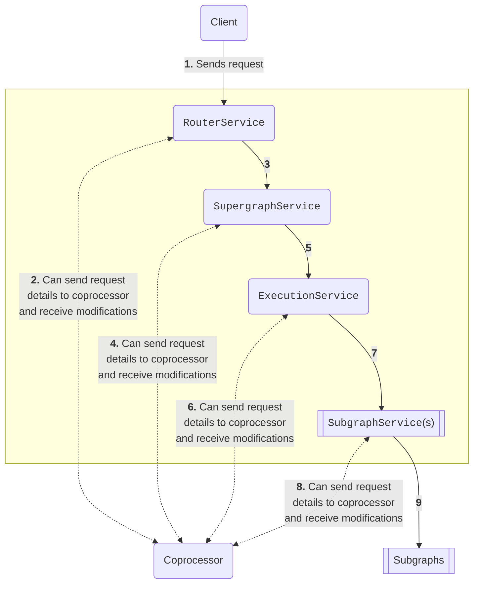
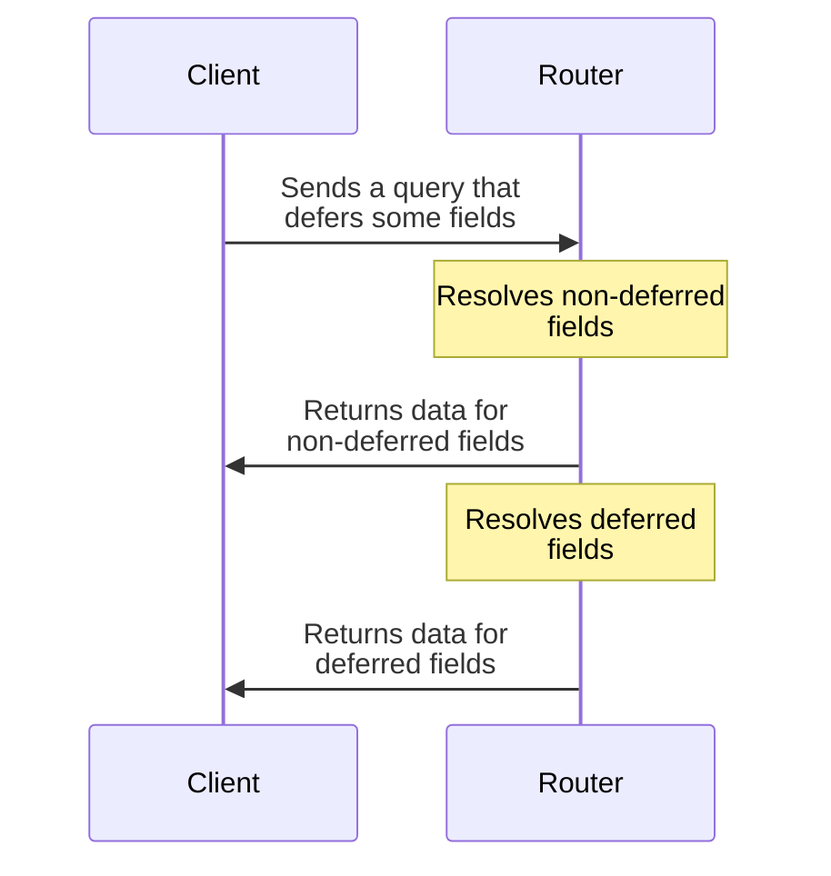

import CoprocTypicalConfig from "../../../../shared/coproc-typical-config.mdx";

<PlanRequired plans={["Free", "Developer", "Standard", "Enterprise"]}>

Rate limits apply on the Free plan.
Developer and Standard plans require Router v2.6.0 or later.

</PlanRequired>

With **external coprocessing**, you can hook into the GraphOS Router's request-handling lifecycle by writing standalone code in any language and framework. This code (i.e., your **coprocessor**) can run anywhere on your network that's accessible to the router over HTTP.

You can configure your router to "call out" to your coprocessor at different **stages** throughout the request-handling lifecycle, enabling you to perform custom logic based on a client request's headers, query string, and other details. This logic can access disk and perform network requests, all while safely isolated from the critical router process.

When your coprocessor responds to these requests, its response body can modify [various details](#responding-to-coprocessor-requests) of the client's request or response. You can even [terminate a client request](#terminating-a-client-request).

**Recommended locations for hosting your coprocessor include:**

- On the same host as your router (minimal request latency)
- In the same Pod as your router, as a "sidecar" container (minimal request latency)
- In the same availability zone as your router (low request latency with increased deployment isolation)

## How it works

Whenever your router receives a client request, at various **stages** in the [request-handling lifecycle](/graphos/routing/customization/rhai/#router-request-lifecycle) it can send HTTP POST requests to your coprocessor:



This diagram shows request execution proceeding "down" from a client, through the router, to individual subgraphs. Execution then proceeds back "up" to the client in the reverse order.

As shown in the diagram above, the `RouterService`, `SupergraphService`, `ExecutionService`, and `SubgraphService` steps of the [request-handling lifecycle](/graphos/routing/customization/rhai/#router-request-lifecycle) can send these POST requests (also called **coprocessor requests**).

Each supported service can send its coprocessor requests at two different **stages**:

- As execution proceeds "down" from the client to individual subgraphs
  - Here, the coprocessor can inspect and modify details of requests before GraphQL operations are processed.
  - The coprocessor can also instruct the router to [_terminate_ a client request](#terminating-a-client-request) immediately.
- As execution proceeds back "up" from subgraphs to the client
  - Here, the coprocessor can inspect and modify details of the router's response to the client.

At _every_ stage, the router waits for your coprocessor's response before it continues processing the corresponding request. Because of this, you should maximize responsiveness by configuring _only_ whichever coprocessor requests your customization requires.

### Multiple requests with `SubgraphService`

If your coprocessor hooks into your router's `SubgraphService`, the router sends a separate coprocessor request _for each subgraph request in its query plan._ In other words, if your router needs to query three separate subgraphs to fully resolve a client operation, it sends three separate coprocessor requests. Each coprocessor request includes the [name](#servicename) and [URL](#uri) of the subgraph being queried.

## Setup

First, make sure your router is [connected to a GraphOS Enterprise organization](/router/enterprise-features/#enabling-enterprise-features).

You configure external coprocessing in your router's [YAML config file](/router/configuration/overview/#yaml-config-file), under the `coprocessor` key.

### Typical configuration

This example configuration sends commonly used request and response details to your coprocessor (see the comments below for explanations of each field):

<CoprocTypicalConfig />

### Minimal configuration

You can confirm that your router can reach your coprocessor by setting this minimal configuration before expanding it as needed:

```yaml title="router.yaml"
coprocessor:
  url: http://127.0.0.1:8081 # Replace with the URL of your coprocessor's HTTP endpoint.
  router:
    request:
      headers: false
```

In this case, the `RouterService` only sends a coprocessor request whenever it receives a client request. The coprocessor request body includes _no_ data related to the client request (only "control" data, which is [covered below](#coprocessor-request-format)).

### Conditions

You can define [conditions](/router/configuration/telemetry/instrumentation/conditions) for a stage of the request lifecycle that you want to run the coprocessor. You can set coprocessor conditions with [selectors](/router/configuration/telemetry/instrumentation/selectors) based on headers or context entries.

<Note>

The `Execution` stage doesn't support coprocessor conditions.

</Note>

Example configurations:

- Run during the `SupergraphResponse` stage only for the first event of a supergraph response. Useful for handling only the first subscription event when a subscription is opened:

```yaml title="router.yaml"
coprocessor:
  url: http://127.0.0.1:3000
  supergraph:
    response:
      condition:
        eq:
          - true
          - is_primary_response: true # Will be true only for the first event received on a supergraph response (like classical queries and mutations for example)
      body: true
      headers: true
```

- Run during the `Request` stage only if the request contains a request header:

```yaml title="router.yaml"
coprocessor:
  url: http://127.0.0.1:3000
  router:
    request:
      condition:
        eq:
          - request_header: should-execute-copro # Header name
          - "enabled" # Header value
      body: true
      headers: true
```

### Context configuration

The router request context is used to share data across stages of the request pipeline. The coprocessor can also use this context.
By default, the context is not sent to the coprocessor (`context: false`).
You can send _all_ context keys to your coprocessor using `context: all`.
You can also specify exactly which context keys you wish to send to a coprocessor by listing them under the `selective` key. This will reduce the size of the request/response and may improve performance.

If you're upgrading from router 1.x, the [context key names changed](/docs/graphos/routing/upgrade/from-router-v1#renamed-context-keys) in router v2.0. You can specify `context: deprecated` to send all context with the old names, compatible with v1.x. Context keys are translated to their v1.x names before being sent to the coprocessor, and translated back to the v2.x names after being received from the coprocessor.

<Note>

`context: true` from router 1.x is still supported by the configuration, and is an alias for `context: deprecated`.
We strongly recommend using `context: deprecated` or `context: all` instead.

</Note>

Example:

```yaml title="router.yaml"
coprocessor:
  url: http://127.0.0.1:3000 # mandatory URL which is the address of the coprocessor
  router:
    request:
      context: false # Do not send any context entries
  supergraph:
    request:
      headers: true
      context: # It will only send these 2 context keys to your coprocessor
        selective:
          - apollo::supergraph::operation_name
          - apollo::demand_control::actual_cost
      body: true
    response:
      headers: true
      context: all # It will send all context keys with new names (2.x version)
      body: true
  subgraph:
    all:
      request:
        context: deprecated # It will send all the context keys with deprecated names (1.x version)
```

<Note>

If you use the `selective` configuration, you must use the new context key names from v2.x. It does not support the `deprecated` keys from v1.x. So for example, if you try to specify `operation_name` instead of `apollo::supergraph::operation_name`, it won't map to the new context key.

</Note>

### Client configuration

<HttpConnection type="coprocessor" />

For example, to enable h2c (http2 cleartext) communication with a coprocessor you can use this configuration:

```yaml title="router.yaml"
coprocessor:
  url: http://127.0.0.1:8081
  # Using an HTTP (not HTTPS) URL and experimental_http2: http2only results in connections that use h2c
  client:
    experimental_http2: http2only
```

## Coprocessor request format

The router communicates with your coprocessor via HTTP POST requests (called **coprocessor requests**). The body of each coprocessor request is a JSON object with properties that describe either the current client request or the current router response.

<Note>

**Body properties vary by the router's current execution stage.** [See example request bodies for each stage.](#example-requests-by-stage)

</Note>

Properties of the JSON body are divided into two high-level categories:

- "Control" properties
  - These provide information about the context of the specific router request or response. They provide a mechanism to influence the router's execution flow.
  - The router always includes these properties in coprocessor requests.
- Data properties
  - These provide information about the substance of a request or response, such as the GraphQL query string and any HTTP headers. Aside from `sdl`, your coprocessor can modify all of these properties.
  - You [configure which of these fields](#setup) the router includes in its coprocessor requests. By default, the router includes _none_ of them.

To learn more about coprocessor requests, go to:
- [Reference of request properties](/graphos/routing/customization/coprocessor/reference#properties)
- [Example requests by stage](/graphos/routing/customization/coprocessor/reference#example-requests-by-stage)

## Responding to coprocessor requests

The router expects your coprocessor to respond with a `200` status code and a JSON body that matches the structure of the [request body](#example-requests-by-stage).

In the response body, your coprocessor can return _modified values_ for certain properties. By doing so, you can modify the remainder of the router's execution for the client request.

The router supports modifying the following properties from your coprocessor:

- [`control`](#control)
  - Modify this property to immediately [terminate a client request](#terminating-a-client-request).
- [`body`](#body)
- [`headers`](#headers)
- [`context`](#context)

<Caution>

**Do not** modify other [control properties](#property-reference). Doing so can cause the client request to fail.

</Caution>

If you omit a property from your response body entirely, the router uses its existing value for that property.

### Terminating a client request

Every coprocessor request body includes a `control` property with the string value `continue`. If your coprocessor's response body _also_ sets `control` to `continue`, the router continues processing the client request as usual.

Alternatively, your coprocessor's response body can set `control` to an _object_ with a `break` property, like so:

```json
{
  "control": { "break": 401 }, //highlight-line
  "body": {
    "errors": [
      {
        "message": "Not authenticated.",
        "extensions": {
          "code": "ERR_UNAUTHENTICATED"
        }
      }
    ]
  }
}
```

If the router receives an object with this format for `control`, it immediately terminates the request-handling lifecycle for the client request. It sends an HTTP response to the client with the following details:

- The HTTP status code is set to the value of the `break` property (`401` in the example above).
- The response body is the coprocessor's returned value for `body`.
  - The value of `body` should adhere to the standard GraphQL JSON response format (see the example above).
  - Alternatively, you can specify a string value for `body`. If you do, the router returns an error response with that string as the error's `message`.

The example response above sets the HTTP status code to `400`, which indicates a failed request.

You can _also_ use this mechanism to immediately return a _successful_ response:

```json
{
  "control": { "break": 200 },
  "body": {
    "data": {
      "currentUser": {
        "name": "Ada Lovelace"
      }
    }
  }
}
```

<Note>

If you return a successful response, make sure the structure of the `data` property matches the structure expected by the client query.

</Note>

<Tip>

The `body` in the `RouterRequest` and `RouterResponse` stages is always a string, but you can still `break` with a GraphQL response if it's encoded as JSON.

</Tip>

<ExpansionPanel title="Examples of coprocessor responses for Router stages">

```json
{
  "control": { "break": 500 },
  "body": "{ \"errors\": [ { \"message\": \"Something went wrong\", \"extensions\": { \"code\": \"INTERNAL_SERVER_ERRROR\" } } ] }"
}
```

```json
{
  "control": { "break": 200 },
  "body": "{ \"data\": { \"currentUser\": { \"name\": \"Ada Lovelace\" } }"
}
```

</ExpansionPanel>

<Note>

If you return a successful response, make sure the structure of the `data` property matches the structure expected by the client query.

</Note>

### Failed responses

If a request to a coprocessor results in a **failed response**, which is seperate from a **control break**, the router will return an error to the client making the supergraph request. The router considers all of the following scenarios to be a **failed response** from your coprocessor:

- Your coprocessor doesn't respond within the amount of time specified by the `timeout` key in your [configuration](#typical-configuration) (default one second).
- Your coprocessor responds with a non-`2xx` HTTP code.
- Your coprocessor's response body doesn't match the JSON structure of the corresponding [request body](#example-requests-by-stage).
- Your coprocessor's response body sets different values for [control properties](#property-reference) that must not change, such as `stage` and `version`.

## Handling deferred query responses

GraphOS Router and Apollo Router Core support the incremental delivery of query response data via [the `@defer` directive](/router/executing-operations/defer-support/):



For a single query with deferred fields, your router sends multiple "chunks" of response data to the client. If you enable coprocessor requests for the `RouterResponse` stage, your router sends a separate coprocessor request for _each chunk_ it returns as part of a deferred query.

**Note the following about handling deferred response chunks:**

- The [`status_code`](#status_code) and [`headers`](#headers) fields are included only in the coprocessor request for any response's _first_ chunk. These values can't change after the first chunk is returned to the client, so they're subsequently omitted.

- If your coprocessor modifes the response [`body`](#body) for a response chunk, it must provide the new value as a _string_, _not_ as an object. This is because response chunk bodies include multipart boundary information in addition to the actual serialized JSON response data. [See examples.](#examples-of-deferred-response-chunks)

  - Many responses will not contain deferred streams and for these the body string can usually be fairly reliably transformed into a JSON object for easy manipulation within the coprocessor. Coprocessors should be carefully coded to allow for the presence of a body that is not a valid JSON object.

- Because the data is a JSON string at both `RouterRequest` and `RouterResponse`, it's entirely possible for a coprocessor to rewrite the body from invalid JSON content into valid JSON content. This is one of the primary use cases for `RouterRequest` body processing.

### Examples of deferred response chunks

The examples below illustrate the differences between the _first_ chunk of a deferred response and all subsequent chunks:

#### First response chunk

The first response chunk includes `headers` and `statusCode` fields:

```json
{
  "version": 1,
  "stage": "RouterResponse",
  "id": "8dee7fe947273640a5c2c7e1da90208c",
  "sdl": "...", // String omitted due to length
  // highlight-start
  "headers": {
    "content-type": ["multipart/mixed;boundary=\"graphql\";deferSpec=20220824"],
    "vary": ["origin"]
  },
  // highlight-end
  "body": "\r\n--graphql\r\ncontent-type: application/json\r\n\r\n{\"data\":{\"me\":{\"id\":\"1\"}},\"hasNext\":true}\r\n--graphql\r\n",
  "context": {
    "entries": {
      "apollo::supergraph::operation_kind": "query",
      "apollo::telemetry::client_version": "",
      "apollo::telemetry::client_name": "manual"
    }
  },
  "statusCode": 200 //highlight-line
}
```

#### Subsequent response chunk

Subsequent response chunks omit the `headers` and `statusCode` fields:

```json
{
  "version": 1,
  "stage": "RouterResponse",
  "id": "8dee7fe947273640a5c2c7e1da90208c",
  "sdl": "...", // String omitted due to length
  "body": "content-type: application/json\r\n\r\n{\"hasNext\":false,\"incremental\":[{\"data\":{\"name\":\"Ada Lovelace\"},\"path\":[\"me\"]}]}\r\n--graphql--\r\n",
  "context": {
    "entries": {
      "apollo::supergraph::operation_kind": "query",
      "apollo::telemetry::client_version": "",
      "apollo::telemetry::client_name": "manual"
    }
  }
}
```

## Adding authorization claims via coprocessor

To use the [authorization directives](/router/configuration/authorization#authorization-directives), a request needs to include **claims**—the details of its authentication and scope. The most straightforward way to add claims is with [JWT authentication](/router/configuration/./authn-jwt). You can also add claims with a [`RouterService` or `SupergraphService` coprocessor](#how-it-works) since they hook into the request lifecycle before the router applies authorization logic.

An example configuration of the router calling a coprocessor for authorization claims:

```yaml title="router.yaml"
coprocessor:
  url: http://127.0.0.1:8081 # Required. Replace with the URL of your coprocessor's HTTP endpoint.
  router: # By including this key, a coprocessor can hook into the `RouterService`. You can also use `SupergraphService` for authorization.
    request: # By including this key, the `RouterService` sends a coprocessor request whenever it first receives a client request.
      headers: false # These boolean properties indicate which request data to include in the coprocessor request. All are optional and false by default.
      context: all # The authorization directives works with claims stored in the request's context
```

This configuration prompts the router to send an HTTP POST request to your coprocessor whenever it receives a client request. For example, your coprocessor may receive a request with this format:

```json
{
  "version": 1,
  "stage": "RouterRequest",
  "control": "continue",
  "id": "d0a8245df0efe8aa38a80dba1147fb2e",
  "context": {
    "entries": {
      "accepts-json": true
    }
  }
}
```

When your coprocessor receives this request from the router, it should add claims to the request's [`context`](#context) and return them in the response to the router. Specifically, the coprocessor should add an entry with a claims object. The key must be `apollo::authentication::jwt_claims`, and the value should be the claims required by the authorization directives you intend to use. For example, if you want to use [`@requireScopes`](/router/configuration/authorization#requiresscopes), the response may look something like this:

```json
{
  "version": 1,
  "stage": "RouterRequest",
  "control": "continue",
  "id": "d0a8245df0efe8aa38a80dba1147fb2e",
  "context": {
    "entries": {
      "accepts-json": true,
      "apollo::authentication::jwt_claims": {
        "scope": "profile:read profile:write"
      }
    }
  }
}
```

## Additional resources

- See the Apollo Solutions ["Hello World" coprocessor](https://github.com/apollosolutions/example-coprocessor-helloworld) for an example of a coprocessor that simply logs the router's payload.
- See the following Apollo Solutions authorization and authentication examples:
  - [External authentication coprocessor example](https://github.com/apollosolutions/example-coprocessor-external-auth)
  - [Custom auth coprocessor example](https://github.com/apollosolutions/example-coprocessor-custom-auth-directive)
  - [`@policy` coprocessor example](https://github.com/apollosolutions/example-coprocessor-auth-policy)
- Use the Apollo Solutions [router extensibility load testing repository](https://github.com/apollosolutions/router-extensibility-load-testing) to load test coprocessors.

<SolutionsNote />
