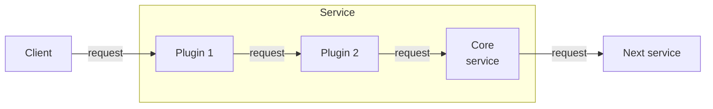
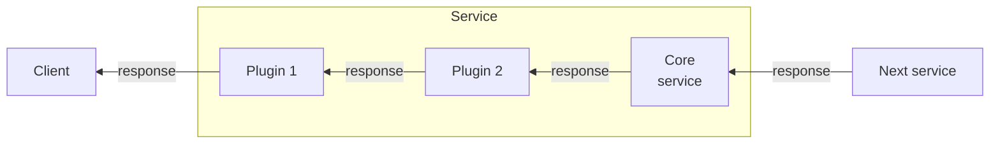

import RequestLifecycleOverviewDiagram from '../../../shared/diagrams/router-request-lifecycle-overview.mdx';

You can create **customizations** for the GraphOS Router or Apollo Router Core to add functionality that isn't available via built-in [configuration options](/router/configuration/overview/). For example, you can make an external call to fetch authentication data for each incoming request.

## Customization types

The GraphOS Router supports the following customization types:

- [**Rhai scripts**](/graphos/routing/customization/rhai/)
  - The [Rhai scripting language](https://rhai.rs/book/) lets you add functionality directly to your stock router binary by hooking into different phases of the router's request lifecycle.
- [**External co-processing**](/router/customizations/coprocessor/) ([Licensed feature](/router/enterprise-features/))
  - If your organization has a [GraphOS plan](https://www.apollographql.com/pricing/), you can write custom request-handling code in any language. This code can run in the same container as your router or separately.
  - The router calls your custom code via HTTP, passing it the details of each incoming client request.

The Apollo Router Core supports customization only through [Rhai scripts](/graphos/routing/customization/rhai/).

Because [Rhai scripts](/graphos/routing/customization/rhai/) are easier to deploy, we recommend using them if they support your use case. Use external co-processing if your customization needs to do any of the following (which Rhai scripts _don't_ support):

- Read or write to disk
- Make network requests
- Use libraries from a particular language or framework

## Customizations along the request lifecycle

Customizations intervene at specific points of the [request lifecycle](/graphos/routing/request-lifecycle), depending on the task you want to perform. Each point is represented by a specific service with its own request and response objects.

<RequestLifecycleOverviewDiagram />

<Tip>

Understand the entire request lifecycle by following flowcharts of its [request path](/graphos/routing/request-lifecycle#request-path) and [response path](/graphos/routing/request-lifecycle#response-path), starting from a client request to your subgraphs, and all the way back from subgraph responses to a client response.

</Tip>

### Request lifecycle plugins

Each service can have a set of plugins. For requests, the router executes plugins _before_ the service.

For responses, the router executes the plugins _after_ the service.

Each request and response object contains a `Context` object, which is carried throughout the entire process. Each request's `Context` object is unique. You can use it to store plugin-specific information between the request and response or to communicate between different hook points. (A plugin can be called at multiple steps of the request lifecycle.)

### Request and response buffering

<Note>

This guidance applies if you are:
 - Modifying the router
 - Creating a native Rust plugin
 - Creating a custom binary

</Note>

The router expects to execute on a stream of data. In order to work correctly and provide high performance, the following expectations must be met:

* **Request Path**: No buffering before the end of the `router_service` processing step
* **Response Path**: No buffering

<Tip>

In general, it's best to avoid buffering where possible. If necessary, it is ok to do so on the request path once the `router_service` step is complete.

</Tip>

### Request Context

The router makes several values available in the request context, which is shared across stages of the processing pipeline.

See the [Coprocessor Reference documentation](/graphos/routing/customization/coprocessor/reference#context-key-reference) for a complete list of available context keys.

## Creating customizations

To learn how to hook into the various lifecycle stages, including examples customizations, refer to the [Rhai scripts](/graphos/routing/customization/rhai/) and [external coprocessing](/router/customizations/coprocessor/) docs.
