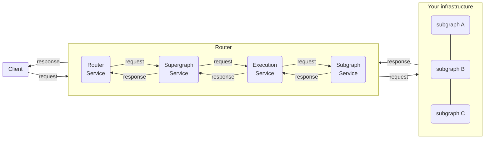
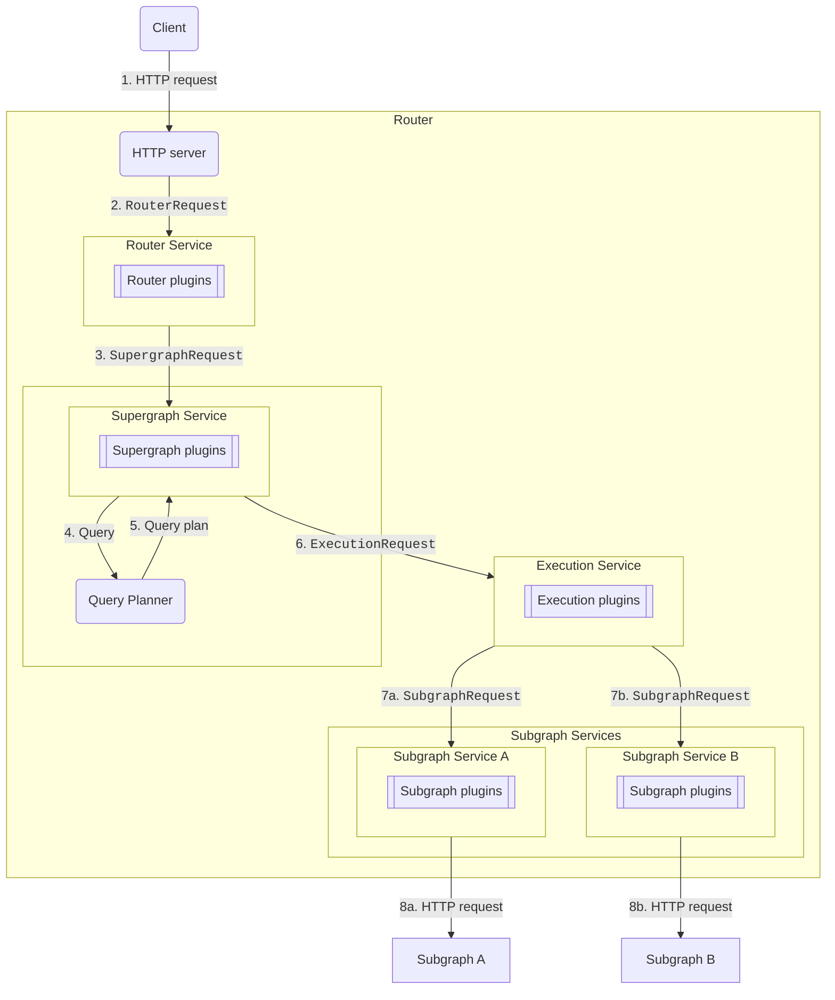
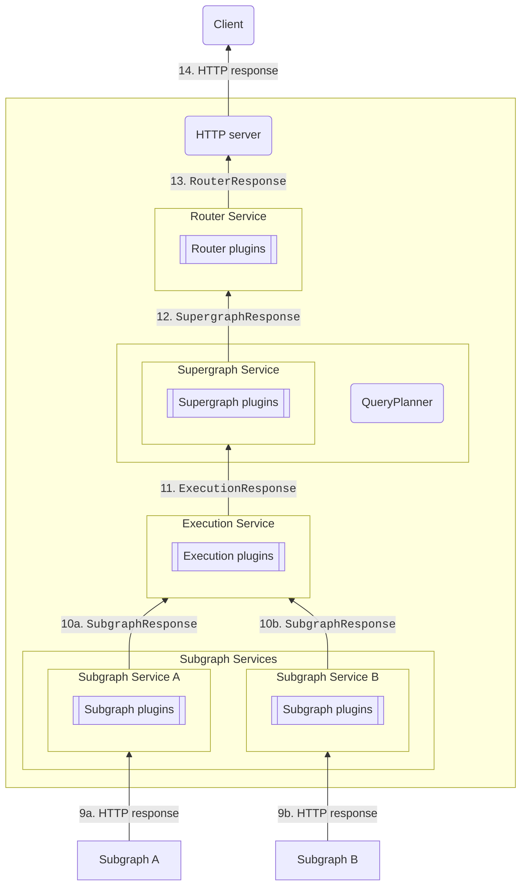
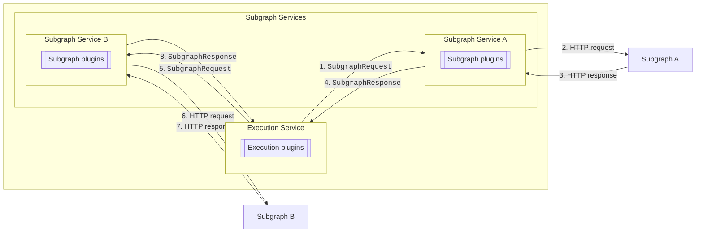

You can create **customizations** for the GraphOS Router or Apollo Router Core to add functionality that isn't available via built-in [configuration options](/router/configuration/overview/). For example, you can make an external call to fetch authentication data for each incoming request.

## Customization types

The GraphOS Router supports the following customization types:

- [**Rhai scripts**](/graphos/routing/customization/rhai/)
  - The [Rhai scripting language](https://rhai.rs/book/) lets you add functionality directly to your stock router binary by hooking into different phases of the router's request lifecycle.
- [**External co-processing**](/router/customizations/coprocessor/) ([Enterprise feature](/router/enterprise-features/))
  - If your organization has a [GraphOS Enterprise plan](https://www.apollographql.com/pricing/), you can write custom request-handling code in any language. This code can run in the same container as your router or separately.
  - The router calls your custom code via HTTP, passing it the details of each incoming client request.

The Apollo Router Core supports customization only through [Rhai scripts](/graphos/routing/customization/rhai/).

Because [Rhai scripts](/graphos/routing/customization/rhai/) are easier to deploy, we recommend using them if they support your use case. Use external co-processing if your customization needs to do any of the following (which Rhai scripts _don't_ support):

- Read or write to disk
- Make network requests
- Use libraries from a particular language or framework

## The request lifecycle

Customizations intervene at specific points of the request lifecycle, depending on the task you want to perform. Each point is represented by a specific service with its own request and response objects.

Each service can have a set of plugins. For requests, the router executes plugins _before_ the service.

For responses, the router executes the plugins _after_ the service.

Each request and response object contains a `Context` object, which is carried throughout the entire process. Each request's `Context` object is unique. You can use it to store plugin-specific information between the request and response or to communicate between different hook points. (A plugin can be called at multiple steps of the request lifecycle.)

The following flowcharts diagram the entire request lifecycle.
The first details the path of a request from a client, through the parts of the router, all the way to your subgraphs.
The second details the path of a response from your subgraphs back to the client.

### Request path

1. The router receives a client request at an HTTP server.
2. The HTTP server transforms the HTTP request into a `RouterRequest` containing HTTP headers and the request body as a stream of byte arrays.
3. The router service receives the `RouterRequest`. It handles Automatic Persisted Queries (APQ), parses the GraphQL request from JSON, and calls the supergraph service with the resulting `SupergraphRequest`.
4. The supergraph service calls the query planner with the GraphQL query from the `SupergraphRequest`.
5. The query planner returns a query plan for most efficiently executing the query.
6. The supergraph service calls the execution service with an `ExecutionRequest`, made up of `SupergraphRequest` and the query plan.
7. For each fetch node of the query plan, the execution service creates a `SubgraphRequest` and then calls the respective subgraph service.
8. Each subgraph has its own subgraph service, and each service can have its own subgraph plugin configuration. The subgraph service transforms the `SubgraphRequest` into an HTTP request to its subgraph. The `SubgraphRequest` contains:
   - the (read-only) `SupergraphRequest`
   - HTTP headers
   - the subgraph request's operation type (query, mutation, or subscription)
   - a GraphQL request object as the request body

Once your subgraphs provide a response, the response follows the path outlined below.

### Response path

9. Each subgraph provides an HTTP response to the subgraph services.
10. Each subgraph service creates a `SubgraphResponse` containing the HTTP headers and a GraphQL response.
11. Once the execution service has received all subgraph responses, it formats the GraphQL responses—removing unneeded data and propagating nulls—before sending it back to the supergraph plugin as the `ExecutionResponse`.
12. The `SupergraphResponse` has the same content as the `ExecutionResponse`. It contains headers and a stream of GraphQL responses. That stream only contains one element for most queries—it can contain more if the query uses the `@defer` directive or subscriptions.
13. The router service receives the `SupergraphResponse` and serializes the GraphQL responses to JSON.
14. The HTTP server sends the JSON in an HTTP response to the client.

### Request and response nuances

For simplicity's sake, the preceding diagrams show the request and response sides separately and sequentially. In reality, some requests and responses may happen simultaneously and repeatedly.

For example, `SubgraphRequest`s can happen both in parallel _and_ in sequence: one subgraph's response may be necessary for another's `SubgraphRequest`. (The query planner decides which requests can happen in parallel vs. which need to happen in sequence). To match subgraph requests to responses in customizations, the router exposes a `subgraph_request_id` field that will hold the same value in paired requests and responses.

##### Requests run in parallel

##### Requests run sequentially

Additionally, some requests and responses may happen multiple times for the same operation. With subscriptions, for example, a subgraph sends a new `SubgraphResponse` whenever data is updated. Each response object travels through all the services in the response path and interacts with any customizations you've created.

### Request and Response buffering

The router expects to execute on a stream of data. In order to work correctly and provide high performance, the following expectations must be met:

- **Request Path**: No buffering before the end of the `router_service` processing step
- **Response Path**: No buffering

> In general, it's best to avoid buffering where possible. If necessary, it is ok to do so on the request path once the `router_service` step is complete.

This guidance applies if you are:

- Modifying the router
- Creating a native Rust plugin
- Creating a custom binary

### Request Context

The router makes several values available in the request context, which is shared across stages of the processing pipeline.

- `apollo_authorization::authenticated::required`: true if the query covers type of fields marked with `@authenticated`
- `apollo_authentication::JWT::claims`: claims extracted from a JWT if present in the request
- `apollo_authorization::policies::required`: if the query covers type of fields marked with `@policy`, it contains a map of `policy name -> Option<bool>`. A coprocessor or rhai script can edit this map to mark `true` on authorization policies that succeed or `false` on ones that fail
- `apollo_authorization::scopes::required`: if the query covers type of fields marked with `@requiresScopes`, it contains the list of scopes used by those directive applications
- `apollo::entity_cache::cached_keys_status`: a map of cache control statuses for cached entities, keyed by subgraph request id; populated by the entity caching plugin when `expose_keys_in_context` is turned on in the router configuration
- `apollo_operation_id`: contains the usage reporting stats report key
- `apollo_override::labels_to_override`: used in progressive override, list of labels for which we need an override
- `apollo_override::unresolved_labels`: used in progressive override, contains the list of unresolved labels
- `apollo_router::supergraph::first_event`: false if the current response chunk is not the first response in the stream, nonexistent otherwise
- `apollo_telemetry::client_name`: client name extracted from the client name header
- `apollo_telemetry::client_version`: client version extracted from the client version header
- `apollo::telemetry::contains_graphql_error`: true if the response contains at least one error
- `cost.actual`: calculated cost of the responses returned by the subgraphs; populated by the demand control plugin
- `cost.estimated`: estimated cost of the requests to be sent to the subgraphs; populated by the demand control plugin
- `cost.result`: `COST_OK` if allowed, and `COST_TOO_EXPENSIVE` if rejected due to cost limits; populated by the demand control plugin
- `cost.strategy`: the name of the cost calculation strategy used by the demand control plugin
- `experimental::expose_query_plan.plan`: contains the query plan serialized as JSON (editing it has no effect on execution)
- `experimental::expose_query_plan.formatted_plan`: query plan formatted as text
- `operation_name`: name of the operation (according to the query and the operation_name field in the request)
- `operation_kind`: can be `Query`, `Mutation` or `Subscription`
- `persisted_query_hit`: present if the request used APQ, true if we got a cache hit for the query id, false otherwise
- `persisted_query_register`: true if the request registered a query in APQ

## Customization creation

To learn how to hook in to the various lifecycle stages, including examples customizations, refer to the [Rhai scripts](/graphos/routing/customization/rhai/) and [external coprocessing](/router/customizations/coprocessor/) docs.
