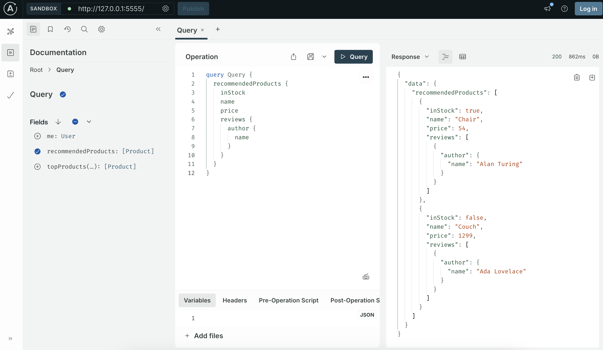

import ElasticNotice from "../../shared/elastic-notice.mdx";

Hello! Let's run Apollo Router for the first time, using the simple scenario of developing locally.

In this guide, you will:

- Download and run the router as a binary.
- Create a supergraph schema.
- Create a router YAML configuration file.
- Run the router in development mode.
- Make a query to the running router.

## 1. Download the router

Let's start by downloading and running the router locally.

1. Download the latest version of the router binary with a single command line:

    ```bash showLineNumbers=false
    curl -sSL https://router.apollo.dev/download/nix/latest | sh
    ```

    <ExpansionPanel title="Download a specific router version">

    To download and install a specific version of router, set the version in the download URL path.

    For example, to download router v2.0.0:

    ```bash showLineNumbers=false
    curl -sSL https://router.apollo.dev/download/nix/v2.0.0 | sh
    ```

    </ExpansionPanel>

    Optionally, go to [router releases](https://github.com/apollographql/router/releases) in GitHub to download and extract a bundle.

1. Check that your router downloaded successfully by running the `router` binary from your project's root directory:

    ```bash showLineNumbers=false
    ./router --version
    ```


## 2. Create a supergraph schema

A router needs a schema for the federated graph, or _supergraph_, that it's orchestrating. This guide uses an example supergraph schema, which you download and provide to the router. 

The example supergraph schema is composed of four subgraphs: `accounts`, `inventory`, `products`, and `reviews`. It outlines the types (`Query`, `Mutation`, `Product`, `Review`, `User`) and their fields, and it specifies which subgraph is responsible for resolving each piece of data using Apollo Federation directives (`@join__*`, `@link`).

1. From your project's root directory, run the following to download and save an example supergraph schema:

  ```bash showLineNumbers=false
  curl -sSL https://supergraph.demo.starstuff.dev/ > supergraph.graphql
  ```

<ExpansionPanel title="Example supergraph schema contents">

```graphql title="supergraph.graphql"
schema
  @link(url: "https://specs.apollo.dev/link/v1.0")
  @link(url: "https://specs.apollo.dev/join/v0.3", for: EXECUTION) {
  query: Query
  mutation: Mutation
}

directive @join__enumValue(graph: join__Graph!) repeatable on ENUM_VALUE

directive @join__field(
  graph: join__Graph
  requires: join__FieldSet
  provides: join__FieldSet
  type: String
  external: Boolean
  override: String
  usedOverridden: Boolean
) repeatable on FIELD_DEFINITION | INPUT_FIELD_DEFINITION

directive @join__graph(name: String!, url: String!) on ENUM_VALUE

directive @join__implements(
  graph: join__Graph!
  interface: String!
) repeatable on OBJECT | INTERFACE

directive @join__type(
  graph: join__Graph!
  key: join__FieldSet
  extension: Boolean! = false
  resolvable: Boolean! = true
  isInterfaceObject: Boolean! = false
) repeatable on OBJECT | INTERFACE | UNION | ENUM | INPUT_OBJECT | SCALAR

directive @join__unionMember(
  graph: join__Graph!
  member: String!
) repeatable on UNION

directive @link(
  url: String
  as: String
  for: link__Purpose
  import: [link__Import]
) repeatable on SCHEMA

scalar join__FieldSet

enum join__Graph {
  ACCOUNTS
    @join__graph(name: "accounts", url: "https://accounts.demo.starstuff.dev/")
  INVENTORY
    @join__graph(
      name: "inventory"
      url: "https://inventory.demo.starstuff.dev/"
    )
  PRODUCTS
    @join__graph(name: "products", url: "https://products.demo.starstuff.dev/")
  REVIEWS
    @join__graph(name: "reviews", url: "https://reviews.demo.starstuff.dev/")
}

scalar link__Import

enum link__Purpose {
  """
  `SECURITY` features provide metadata necessary to securely resolve fields.
  """
  SECURITY

  """
  `EXECUTION` features provide metadata necessary for operation execution.
  """
  EXECUTION
}

type Mutation @join__type(graph: PRODUCTS) @join__type(graph: REVIEWS) {
  createProduct(upc: ID!, name: String): Product @join__field(graph: PRODUCTS)
  createReview(upc: ID!, id: ID!, body: String): Review
    @join__field(graph: REVIEWS)
}

type Product
  @join__type(graph: ACCOUNTS, key: "upc", extension: true)
  @join__type(graph: INVENTORY, key: "upc")
  @join__type(graph: PRODUCTS, key: "upc")
  @join__type(graph: REVIEWS, key: "upc") {
  upc: String!
  weight: Int
    @join__field(graph: INVENTORY, external: true)
    @join__field(graph: PRODUCTS)
  price: Int
    @join__field(graph: INVENTORY, external: true)
    @join__field(graph: PRODUCTS)
  inStock: Boolean @join__field(graph: INVENTORY)
  shippingEstimate: Int @join__field(graph: INVENTORY, requires: "price weight")
  name: String @join__field(graph: PRODUCTS)
  reviews: [Review] @join__field(graph: REVIEWS)
  reviewsForAuthor(authorID: ID!): [Review] @join__field(graph: REVIEWS)
}

type Query
  @join__type(graph: ACCOUNTS)
  @join__type(graph: INVENTORY)
  @join__type(graph: PRODUCTS)
  @join__type(graph: REVIEWS) {
  me: User @join__field(graph: ACCOUNTS)
  recommendedProducts: [Product] @join__field(graph: ACCOUNTS)
  topProducts(first: Int = 5): [Product] @join__field(graph: PRODUCTS)
}

type Review @join__type(graph: REVIEWS, key: "id") {
  id: ID!
  body: String
  author: User @join__field(graph: REVIEWS, provides: "username")
  product: Product
}

type User
  @join__type(graph: ACCOUNTS, key: "id")
  @join__type(graph: REVIEWS, key: "id") {
  id: ID!
  name: String @join__field(graph: ACCOUNTS)
  username: String
    @join__field(graph: ACCOUNTS)
    @join__field(graph: REVIEWS, external: true)
  reviews: [Review] @join__field(graph: REVIEWS)
}
```

</ExpansionPanel>

## 3. Create a router config

The router's many features are configurable via a YAML configuration file. You set your options declaratively in YAML, then point your router to it at startup.

Let's customize a common setting: the router's _supergraph listen address_. It's the network address and port on which the router receives client requests. By default the address is `127.0.0.1:4000`. As an exercise, let's change the port to `5555`.

1. In your same working directory, create a file named `router.yaml`. Open it for editing.
1. Add the following configuration that sets `supergraph.listen` to `127.0.0.1:5555`:

  ```yaml title="router.yaml"
  supergraph:
    listen: 127.0.0.1:5555
  ```

## 4. Run the router


Let's run the router in dev mode, using both the supergraph schema and YAML configuration files you created: 

1. Run the router with these command-line options:
    - `--dev` enables dev mode
    - `--config` provides the path to your YAML configuration file
    - `--supergraph` provides the path to your supergraph schema

    ```sh showLineNumbers=false
    ./router --dev --config router.yaml --supergraph supergraph.graphql
    ```

    <ExpansionPanel title="About dev mode">

    Running router with `--dev` is the same as using the following configuration:

    ```yaml title="Same configuration as --dev"
    sandbox:
      enabled: true
    homepage:
      enabled: false
    supergraph:
      introspection: true
    include_subgraph_errors:
      all: true
    plugins:
      # Enable with the header, Apollo-Expose-Query-Plan: true
      experimental.expose_query_plan: true
    ```

    [Learn more](/graphos/routing/configuration/cli#development-mode) about router dev mode.

    </ExpansionPanel>

1. Check that your router is running, with output similar to the example: 

    <ExpansionPanel title="Example router output">

    ```sh showLineNumbers=false disableCopy=true
    2025-04-25T21:54:05.910202Z INFO  Running with *development* mode settings which facilitate development experience (e.g., introspection enabled)
    2025-04-25T21:54:05.981114Z INFO  Apollo Router v2.1.3 // (c) Apollo Graph, Inc. // Licensed as ELv2 (https://go.apollo.dev/elv2)
    2025-04-25T21:54:05.981141Z INFO  Anonymous usage data is gathered to inform Apollo product development.  See https://go.apollo.dev/o/privacy for details.
    2025-04-25T21:54:05.985764Z INFO  state machine transitioned event="UpdateLicense(Unlicensed)" state=Startup previous_state="Startup"
    2025-04-25T21:54:05.987948Z INFO  state machine transitioned event="UpdateConfiguration(<redacted>)" state=Startup previous_state="Startup"
    2025-04-25T21:54:05.988144Z INFO  state machine transitioned event="NoMoreLicense" state=Startup previous_state="Startup"
    2025-04-25T21:54:06.010232Z INFO  Health check exposed at http://127.0.0.1:8088/health
    2025-04-25T21:54:06.010717Z WARN  Connector debugging is enabled, this may expose sensitive information.
    2025-04-25T21:54:06.405064Z INFO  GraphQL endpoint exposed at http://127.0.0.1:5555/ 🚀
    2025-04-25T21:54:06.405628Z INFO  You're using some "experimental" features of the Apollo Router (those which have their configuration prefixed by "experimental_").
    We may make breaking changes in future releases. To help us design the stable version we need your feedback.
    Here is a list of links where you can give your opinion:

        - experimental_response_trace_id: https://github.com/apollographql/router/discussions/2147

    For more information about launch stages, please see the documentation here: https://www.apollographql.com/docs/resources/product-launch-stages/
    2025-04-25T21:54:06.406568Z INFO  state machine transitioned event="UpdateSchema(<redacted>)" state=Running previous_state="Startup"
    2025-04-25T21:54:06.406591Z INFO  state machine transitioned event="NoMoreConfiguration" state=Running previous_state="Running"
    ```

    </ExpansionPanel>

## 5. Make a query

When the router runs in dev mode, it hosts an [Apollo Sandbox](/graphos/explorer/sandbox/) automatically. Sandbox has a browser-based IDE, Explorer, that you can use to write and send real GraphQL queries to your graph. 


1. Go to the URL your router is running at, [`http://127.0.0.1:5555`](http://127.0.0.1:5555). Sandbox should be running there.

1. Copy and paste the example query into the **Operation** pane of Explorer:

    ```graphql
    query Query {
      recommendedProducts {
        inStock
        name
        price
        reviews {
          author {
            name
          }
        }
      }
    }
    ```

1. Click **Query** to run the query, then check for its response in the **Response** pane.

    

That's it! You've successfully sent a query to a router running a development graph and received a response.


## Next steps

Now that you've run the router locally, explore more about deployment and configuration:

- Deploy the router [in your own infrastructure](/graphos/routing/self-hosted) with containers and/or Helm.
- [Configure runtime features](/router/configuration/overview) of the router.
