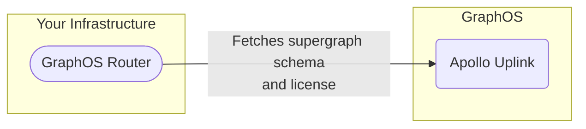

## The GraphOS license

Whenever your instance of GraphOS Router starts up and connects to GraphOS, it fetches a __license__, which is the credential that authorizes its use of GraphOS features:

A router instance retains its license for the duration of its execution. If you stop a router instance and then later start a new instance on the same machine, it must fetch a new license. 

Licenses are served via [Apollo Uplink](/graphos/routing/uplink), the same multi-cloud endpoint that your router uses to fetch its supergraph schema from GraphOS. Because of this, licenses introduce no additional network dependencies, meaning your router's uptime remains unaffected. To learn more about multi-cloud Uplink, read the [Apollo blog post](https://www.apollographql.com/blog/announcement/backend/introducing-multi-cloud-support-for-apollo-uplink).




A router instance's license is valid for the duration of your organization's current subscription billing period (plus a [grace period](#grace-period-for-expired-plans)), even if the router temporarily becomes disconnected from GraphOS.

## Licenses with local development

You might also need to run an GraphOS Router instance on your local machine, such as with the [`rover dev`](/graphos/graphs/local-development) command. It's likely that your local router instance doesn't connect to GraphOS to get its supergraph schema from Uplink. For example, you can run `rover dev` to perform composition locally.

**You _can_ use GraphOS Router features with a locally composed supergraph schema!** To do so, your router must still connect to GraphOS to obtain its [license](#the-graphos-license).

### Set up local development

These steps work both for running the router executable directly (`./router`) and for running it via `rover dev`:

1. [Create a new variant](/graphos/graphs/federated-graphs/#adding-a-variant-via-the-rover-cli) for your supergraph that you'll use _only_ to fetch GraphOS licenses.
    - Give the variant a name that clearly distinguishes it from variants that track schemas and metrics.
    - Every team member that runs a router locally can use this same variant.
    - When you create this variant, publish a dummy subgraph schema like the following (your router won't use it):

    ```graphql
    type Query {
      hello: String
    }
    ```

2. Create a [graph API key](/graphos/platform/access-management/api-keys#graph-api-keys) for your supergraph and assign it the __Contributor__ role.
    - We recommend creating a separate graph API key for _each team member_ that will run the router locally.

3. When you start up your local router with your usual command, set the `APOLLO_GRAPH_REF` and `APOLLO_KEY` environment variables for that command:

    ```bash
    APOLLO_GRAPH_REF="..." APOLLO_KEY="..." ./router --supergraph schema.graphql
    ```

    - The value of `APOLLO_GRAPH_REF` is the graph ref for the new, license-specific variant you created (for example, `docs-example-graph@local-licenses`).
    - The value of `APOLLO_KEY` is the graph API key you created.

4. Your router will fetch an GraphOS license while using its locally composed supergraph schema.

## Offline license

<MinVersionBadge version="Router v1.37.0" />

<Tip>

Offline license support is available on an as-needed basis to Enterprise organizations. Send a request to your Apollo contact to enable it for your GraphOS Studio organization.

</Tip>

<Caution>

An offline license is valid for the lesser of your **enterprise contract term, plus a 28-day grace period**, you must rotate and replace the license file after every contract renewal.  
**Be alert** that if the license expires and GraphOS features remain enabled, the Router **will stop processing requests** after the grace period!  
**Remind to check:** [Grace period for expired plans](/graphos/routing/configuration/yaml) and [Turning off offline license for the GraphOS Router](/graphos/routing/configuration/yaml).

</Caution>

Running your GraphOS Router fleet while fully connected to GraphOS is the best choice for  most Apollo users. However, some scenarios can prevent your routers from connecting to GraphOS for an extended period, ranging from disasters that break connectivity to isolated sites operating with air-gapped networks. If you need to restart or rapidly scale your entire router fleet, but you're unable to communicate with Apollo Uplink, new router instances won't be able to serve traffic.

To support long-term disconnection scenarios, GraphOS supports __offline licenses__ for the GraphOS Router. An offline license enables routers to start and serve traffic without a persistent connection to GraphOS. Instead of fetching its supergraph schema from Apollo Uplink, an offline router gets its supergraph schema from a local supergraph schema file.

<Note>

You can use the GraphOS [schema delivery pipeline](/graphos/platform/schema-management#schema-delivery) for supergraph CI (schema checks, linting, contracts, etc.) in an online environment to manage the local supergraph schema file provided to your offline router.

</Note>

An offline license can be retrieved from GraphOS with the [`rover license fetch`](/rover/commands/license) command.

With an offline license, a router can either be fully disconnected from GraphOS or configured to connect to GraphOS on a best-effort basis so that it can send graph usage metrics. Apollo recommends configuring your router to report graph usage metrics to GraphOS whenever possible. Since your router sends metrics in a best-effort fashion, it incurs no performance or uptime penalties while enabling several powerful GraphOS features, such as operation checks, field insights, operation traces, and contracts.

<Note>

A router using an offline license requires [the use of local manifests](/graphos/routing/security/persisted-queries#local_manifests) when using [safelisting with persisted queries](/graphos/routing/security/persisted-queries), without local manifests, the Router cannot retrieve persisted query metadata from Uplink, and safelisting will not work as intended in disconnected environments.  
Also, when operating offline, local manifests are the supported way to supply Persisted Query Lists and must be delivered through your own **CI/CD or deployment process**.

</Note>

An offline license is valid for the lesser of the duration of your contract with Apollo, or one year, with an added grace period of 28 days. You are responsible for keeping your offline license files up to date within your infrastructure by rerunning `rover license fetch` to fetch updated license files.

### Set up offline license for the GraphOS Router

Follow these steps to configure an GraphOS Router to use an offline license:

1. Fetch an offline license by running [`rover license fetch`](/rover/commands/license/#license-fetch) with the ID of the graph from which you want to fetch a license:

    ```bash
    rover license fetch --graph-id <apollo-graph-id>
    ```

1. Provide the offline license to your router on startup. The router accepts an offline license in a few ways:
    1. [`--license <license_path>`](/graphos/reference/router/configuration#--license) CLI option, with an argument containing an absolute or relative path to an offline license file
    When operating with an offline license, the Router does not poll Uplink for schema updates. If you provide a supergraph schema using the --supergraph (-s) CLI option with a local file path (absolute or relative), the Router will only load that schema from the specified source and will not attempt to fetch newer versions from GraphOS.
    1. [`APOLLO_ROUTER_LICENSE_PATH`](/graphos/reference/router/configuration#--license) environment variable, containing an absolute or relative path to an offline license file 
    1. [`APOLLO_ROUTER_LICENSE`](/graphos/reference/router/configuration#--license) environment variable, containing the stringified contents of an offline license file

    <Note>

    - The router checks the CLI option and environment variables in the listed order, then it uses the value of the first option or variable that is set.
    - The `--license <license_path>` option is only available when running the router binary. When running a router with `rover dev`, you must use environment variables to provide your offline license.
    
    </Note>

1. Configure the router to use a local supergraph schema by setting one of the following:

    * [`--s/-supergraph`](/graphos/reference/router/configuration#-s----supergraph) CLI option, with an argument containing an absolute or relative path to supergraph schema file

    <Note>
    Remember to always distribute updated supergraph schema files through your own **CI/CD or deployment pipeline**.  
    Failing to propagate schema changes manually can lead to schema drift, unexpected errors, or outages.
    </Note>

    * [`APOLLO_SUPERGRAPH_PATH`](/graphos/reference/router/configuration#-s----supergraph) environment variable, containing an absolute or relative path to supergraph schema file
    * [`APOLLO_SUPERGRAPH_URLS`](/graphos/reference/router/configuration#-s----supergraph) environment variable, containing URLs to supergraph schemas

1. Configure the router to report usage metrics to GraphOS in a best-effort basis by setting both the [`APOLLO_KEY`](/graphos/reference/router/configuration#apollo_key) and [`APOLLO_GRAPH_REF`](/graphos/reference/router/configuration#apollo_graph_ref) environment variables. 

    These metrics are necessary for several important GraphOS features (operations checks, field insights, operation traces, contracts). Sending them best-effort incurs no performance or uptime penalties. 

### Renew an offline license

Because the router does not auto-fetch updated licenses, you need to keep license files current across all deployments.  

Failure to rotate licenses before they expire will cause the router to have degraded behaviour. See [Grace period for expired plans](/graphos/routing/license#grace-period-for-expired-plans).

**To maintain uninterrupted service (License rotation process):**

1. Schedule a (`rover license fetch --graph-id…`) as part of every subscription renewal cycle.
2. Securely distribute the newly generated license file to **all Router instances**.
3. Replace the existing license file immediately **after the contract is renewed**.
4. Ensure your CI/CD or configuration management system **includes this rotation step** as a standard operational procedure.

### Stop Using an Offline License

If you no longer want the Router to rely on an offline license, you can transition back to online validation through Uplink or disable GraphOS features entirely to avoid license enforcement. This is typically done when Routers regain reliable connectivity, when you want to eliminate manual license rotation, or when Apollo Support has confirmed that your account should no longer operate in offline-licensed mode.

**How to return to online license validation:**

To resume online mode and allow the Router to obtain its license directly from Uplink:

* Remove any (`--license`) flags and unset all (`APOLLO_ROUTER_LICENSE*`) environment variables.
* Ensure that (`APOLLO_KEY`) and (`APOLLO_GRAPH_REF`) are set correctly so the Router can authenticate with Uplink and retrieve entitlements automatically.
* Once online, license renewal is handled through GraphOS without the need to manually rotate files.

**Alternative:** operate without license enforcement by disabling GraphOS features
If you prefer not to reconnect to Uplink and do not plan to renew the offline license, you must disable all GraphOS features that require entitlements before the grace period ends. Otherwise, once the license expires, the Router will stop processing requests.

## Turning off GraphOS features

To turn off an GraphOS feature, remove all of its associated configuration keys from your router's [YAML config file](/graphos/reference/router/configuration#yaml-config-file).

## Grace period for expired plans

If your organization terminates its GraphOS subscription, your router's license is considered expired at the end of your final paid subscription period. GraphOS provides a grace period for expired licenses so that you can turn off GraphOS features before they produce breaking errors in your router.

If your router has an expired GraphOS license, its behavior degrades according to the following schedule, _if_ any GraphOS features are still enabled:

- **For the first 14 days after your license expires,** your router continues to behave as though it has a valid license.
- **After 14 days,** your router begins a **soft outage**: it continues processing client requests, but it emits logs and metrics that indicate it's experiencing an outage.
- **After 28 days,** your router begins a **hard outage**. It no longer processes incoming client requests and continues emitting logs and metrics from the soft outage.

Your router resumes normal functioning whenever you renew your GraphOS subscription or turn off all [GraphOS features](/graphos/routing/graphos-features).

## Troubleshooting

**If your router doesn't successfully connect to GraphOS,** it logs an error that begins with one of the following strings if any GraphOS features are enabled:

| Error Message               | Description |
|-----------------------------|-------------|
| `Not connected to GraphOS.` | At least one of the `APOLLO_KEY` and `APOLLO_GRAPH_REF` environment variables wasn't set on router startup. |
| `License not found.`        | The router connected to GraphOS with credentials that are not associated with a GraphOS plan. |
| `License has expired.`      | Your organization's GraphOS subscription has ended. **Your router will stop processing incoming requests at the end of the standard [grace period](#grace-period-for-expired-plans).** |
