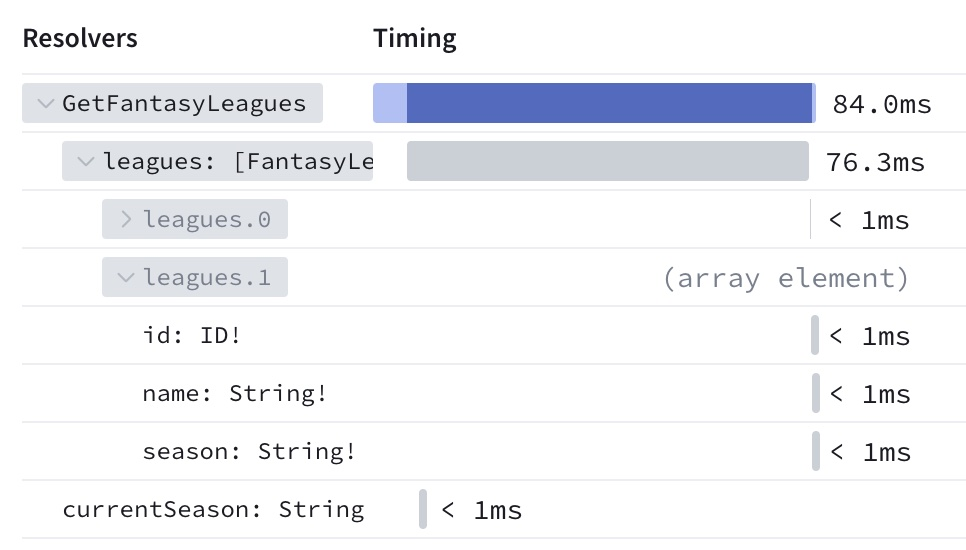

import OTelEnvVarsCaution from '../../../../shared/otel-envvars-caution.mdx';

The GraphOS Router and Apollo Router Core can report operation usage metrics to [GraphOS](/graphos/) that you can then visualize in GraphOS Studio. These metrics also enable powerful GraphOS features like [schema checks](/graphos/delivery/schema-checks/).

## Enabling usage reporting

You enable usage reporting in the router by setting the following environment variables:

```bash
export APOLLO_KEY=<YOUR_GRAPH_API_KEY>
export APOLLO_GRAPH_REF=<YOUR_GRAPH_ID>@<VARIANT_NAME>
```

<a id="usage-reporting-via-opentelemetry-protocol-otlp"></a>

### GraphOS tracing via OpenTelemetry Protocol (OTLP)

<MinVersionBadge version="Router v1.49.0" />

Prior to router v1.49.0, all GraphOS reporting was performed using a [private tracing format](/graphos/metrics/sending-operation-metrics#reporting-format) called Apollo Usage Reporting protocol.

As the ecosystem around OpenTelemetry (OTel) has rapidly expanded, Apollo evaluated migrating its internal tracing system to use an OTel-based protocol.

Starting in v1.49.0, the router can use OpenTelemetry Protocol (OTLP) to report traces to GraphOS. The benefits of reporting via OTLP include:

- A comprehensive way to visualize the router execution path in GraphOS Studio.
- Additional spans that were previously not included in Studio traces, such as query parsing, planning, execution, and more.
- Additional metadata such as subgraph fetch details, router idle / busy timing, and more.

Usage metrics are still using the Apollo Usage Reporting protocol.

<a id="configuring-usage-reporting-via-otlp"></a>
#### Trace reporting via OTLP

The router always exports traces to GraphOS via OTLP.

In router v1.x and v2.x, traces could also be sent via the legacy Apollo Usage Reporting protocol, with the split between the two transports controlled by the `otlp_tracing_sampler` option (`experimental_otlp_tracing_sampler` in v1.49-1.60). In router v3.x, the legacy trace transport and the `otlp_tracing_sampler` option have been removed.

To control trace volume, use the common tracing sampler for all exporters and the GraphOS exporter sampler for GraphOS-specific traces:

```yaml title="router.yaml"
telemetry:
  apollo:
    # Send 10% of all requests to GraphOS. This is an absolute fraction of all
    # traffic and must not exceed the common sampler below.
    sampler: 0.1

  exporters:
    tracing:
      common:
        # Trace `50%` of all requests globally, across every exporter
        sampler: 0.5
```

Whatever these samplers let through is then subject to a safeguard that further reduces GraphOS trace volume — see [Configuring the Apollo Studio sampling rate](#configuring-the-apollo-studio-sampling-rate).

<OTelEnvVarsCaution />

#### Configuring the transport protocol

<MinVersionBadge version="Router v2.13.0" />

By default, the router sends GraphOS OTLP data over gRPC. To switch to HTTP protobuf, set `experimental_otlp_tracing_protocol` and `experimental_otlp_metrics_protocol`:

```yaml title="router.yaml"
telemetry:
  apollo:
    experimental_otlp_tracing_protocol: http   # grpc (default) | http
    experimental_otlp_metrics_protocol: http   # grpc (default) | http
```

Use HTTP when your network or proxy infrastructure handles HTTP traffic but not gRPC. For proxy routing, see [HTTP proxy support](#http-proxy-support).

#### Configuring the Apollo Studio sampling rate

You can set an independent sampling rate for traces sent to Apollo Studio using `telemetry.apollo.sampler`. This lets you send a different fraction of traces to Studio than to other exporters:

```yaml title="router.yaml"
telemetry:
  exporters:
    tracing:
      common:
        sampler: 0.1   # 10% of requests are traced globally
  apollo:
    sampler: 0.05      # only 5% of requests reach Apollo Studio
```

The value uses the same trace-ID-based algorithm as `telemetry.exporters.tracing.common.sampler`, so it's an absolute fraction of all requests. It must not exceed `telemetry.exporters.tracing.common.sampler`; the router returns an error at startup if it does.

#### Apollo trace throttling

<MinVersionBadge version="Router v3.0.0" />

To keep trace volume manageable for high-traffic graphs, the router applies a throttle that further reduces the number of traces it sends to GraphOS. This runs after the `telemetry.apollo.sampler` and `telemetry.exporters.tracing.common.sampler` head samplers, so it only ever affects the traces those samplers already selected. This helps to avoid the processing and transfer of traces that would be dropped by GraphOS at ingestion time anyway, and it affects only the GraphOS pipeline — traces sent to your own OTLP collector or to Datadog are unaffected.

The strategy of the throttle can be configured with `telemetry.apollo.tracing.throttle`:

```yaml title="router.yaml"
telemetry:
  apollo:
    tracing:
      throttle: representative_traces   # representative_traces (default) | rate_limited
```

- `representative_traces` (default): Sends at most one representative trace per minute for each distinct combination of operation, client, latency bucket, error status, and operation type. Tre router drops traces that duplicate a combination already seen within the current minute. Error traces are sampled at a higher rate so that failures remain visible. This gives broad coverage of distinct behaviors while significantly reducing volume for repetitive traffic.
- `rate_limited`: Sends every trace but caps the export rate at a fixed maximum of 100 traces per second, per router instance. This is cheaper in CPU and memory than `representative_traces` and is a good fallback if you find that representative sampling is too resource-intensive for your workload. The rate is not configurable.

Independently of the throttle, the router always drops any individual trace larger than 10MB before sending it to GraphOS. GraphOS rejects oversized traces at ingestion anyway, so exporting them would only waste CPU and bandwidth. Oversized traces are most often caused by pathologically large field-level (FTV1) trace data on subgraph spans. This limit is fixed and can't be configured.

## Reporting field-level traces

In their responses to your router, your subgraphs can include [field-level traces](/federation/metrics) that indicate how long the subgraph took to resolve each field in an operation. By analyzing this data in GraphOS Studio, you can identify and optimize your slower fields:



Your subgraph libraries must support federated tracing (also known as FTV1 tracing) to provide this data.

- To confirm support, check the `FEDERATED TRACING` entry for your library on [this page](/federation/building-supergraphs/supported-subgraphs).
- Consult your library's documentation to learn how to enable federated tracing.
  - If you use Apollo Server with `@apollo/subgraph`, federated tracing support is enabled automatically.

### Subgraph trace sampling

By default, the router requests subgraph trace data from operations with a 1% sampling probability per operation. In most cases, this provides a sufficient sample size while minimizing latency for most operations (traces can affect latency because they increase the size of subgraph response payloads).

You can customize your router's trace sampling probability by setting the following options in your [YAML config file](/router/configuration/telemetry/overview/#yaml-config-file):

```yaml title="router.yaml"
telemetry:
  apollo:
    # In this example, the trace sampler is configured
    # with a 50% probability of sampling a request.
    # This value can't exceed the value of tracing.common.sampler.
    field_level_instrumentation_sampler: 0.5

  exporters:
    tracing:
      common:
        # FTV1 uses the same trace sampling as other tracing options,
        # so this value is also required.
        sampler: 0.5
```

<Note>

Because field-level instrumentation is dependent on general-purpose [OpenTelemetry tracing](/router/configuration/telemetry/exporters/tracing/overview), the value of `telemetry.apollo.field_level_instrumentation_sampler` cannot exceed the value of `telemetry.exporters.tracing.common.sampler`.

</Note>

### Disabling field-level traces

To completely disable requesting and reporting subgraph trace data, set `field_level_instrumentation_sampler` to `always_off`:

```yaml title="router.yaml"
telemetry:
  apollo:
    field_level_instrumentation_sampler: always_off
```

### Experimental local field metrics

Apollo Router can send field-level metrics to GraphOS without using FTV1 tracing. This feature is experimental and is not yet displayable in GraphOS Studio.
To enable this feature, set the `experimental_local_field_metrics` option to `true` in your router configuration:

```yaml title="router.yaml"
telemetry:
  apollo:
    experimental_local_field_metrics: true
```

## Advanced configuration

### `send_headers`

Provide this field to configure which request header names and values are included in trace data that's sent to GraphOS. By default, _no_ header information is sent to GraphOS as a security measure.

<Note>

`send_headers` applies only to incoming client request headers. Subgraph response headers aren't captured by this option, even if they're forwarded to the client response.

</Note>

```yaml title="router.yaml"
telemetry:
  apollo:
    field_level_instrumentation_sampler: 0.01 # (default)
    #highlight-start
    send_headers:
      only: # Include only headers with these names
        - referer
    #highlight-end
```

**Supported values:**

<table class="field-table api-ref">
  <thead>
    <tr>
      <th>Value / Type</th>
      <th>Description</th>
    </tr>
  </thead>

<tbody>
<tr>
<td>

##### `none`

`string`

</td>
<td>

Set `send_headers` to the string value `none` to include _no_ header information in reported traces.

```yaml
send_headers: none
```

This is the default behavior.

</td>
</tr>

<tr>
<td>

##### `all`

`string`

</td>
<td>

Set `send_headers` to the string value `all` to include _all_ header information in reported traces.

```yaml
send_headers: all
```

**⚠️ Use with caution!** Headers might contain sensitive data (such as access tokens) that should _not_ be reported to GraphOS.

</td>
</tr>

<tr>
<td>

##### `only`

`array`

</td>
<td>

An array of names for the headers that the router _will_ report to GraphOS. All other headers are _not_ reported. See the example above.

</td>
</tr>

<tr>
<td>

##### `except`

`array`

</td>
<td>

An array of names for the headers that the router _will not_ report to GraphOS. All other headers _are_. Uses the same format as the `only` example above.

</td>
</tr>

</tbody>
</table>

### `send_variable_values`

Provide this field to configure which GraphQL variable values are included in trace data that's sent to GraphOS. By default, _no_ variable information is sent to GraphOS as a security measure.

```yaml title="router.yaml"
telemetry:
  apollo:
    field_level_instrumentation_sampler: 0.01 # (default)
    #highlight-start
    send_variable_values:
      except: # Send all variables EXCEPT ones with these names
        - first
    #highlight-end
```

**Supported values:**

<table class="field-table api-ref">
  <thead>
    <tr>
      <th>Value / Type</th>
      <th>Description</th>
    </tr>
  </thead>

<tbody>
<tr>
<td>

##### `none`

`string`

</td>
<td>

Set `send_variable_values` to the string value `none` to include _no_ variable information in reported traces.

```yaml
send_variable_values: none
```

This is the default behavior.

</td>
</tr>

<tr>
<td>

##### `all`

`string`

</td>
<td>

Set `send_variable_values` to the string value `all` to include _all_ variable information in reported traces.

```yaml
send_variable_values: all
```

**⚠️ Use with caution!** GraphQL variables might contain sensitive data that should _not_ be reported to GraphOS.

</td>
</tr>

<tr>
<td>

##### `only`

`array`

</td>
<td>

An array of names for the variables that the router _will_ report to GraphOS. All other variables are _not_ reported. Uses the same format as the `except` example above.

</td>
</tr>

<tr>
<td>

##### `except`

`array`

</td>
<td>

An array of names for the variables that the router _will not_ report to GraphOS. All other variables _are_ reported. See the example above.

</td>
</tr>

</tbody>
</table>

```yaml title="router.yaml"
telemetry:
  apollo:
    # The percentage of requests that will include HTTP request headers in traces sent to Studio.
    # This is expensive and should be left at a low value.
    # This cannot be higher than tracing->common->sampler
    field_level_instrumentation_sampler: 0.01 # (default)

    # Include HTTP request headers in traces sent to Studio.
    send_headers: # other possible values are all, only (with an array), except (with an array), none (by default)
      except: # Send all headers except referer
        - referer

    # Include variable values in Apollo in traces sent to GraphOS Studio
    send_variable_values: # other possible values are all, only (with an array), except (with an array), none (by default)
      except: # Send all variable values except for variable named first
        - first
  exporters:
    tracing:
      common:
        sampler: 0.5 # The percentage of requests that will generate traces (a rate or `always_on` or `always_off`)
```

### `errors`

You can configure whether the router reports GraphQL error information to GraphOS, and whether the details of those errors are redacted. You can customize this behavior globally and override that global behavior on a per-subgraph basis.

By default, your router _does_ report error information, and it _does_ redact the details of those errors.

- To prevent your router from reporting error information at all, you can set the `send` option to `false`.
- To include all error details in your router's reports to GraphOS, you can set the `redact` option to `false`.

Your subgraph libraries must support federated tracing (also known as FTV1 tracing) to provide errors to GraphOS. If you use Apollo Server with `@apollo/subgraph`, federated tracing support is enabled automatically.

To confirm support:

- Check the `FEDERATED TRACING` entry for your library on [the supported subgraphs page](/federation/building-supergraphs/supported-subgraphs).
- If federated tracing isn't enabled automatically for your library, consult its documentation to learn how to enable it.
- Note that federated tracing can also be sampled (see above) so error messages might not be available for all your operations if you have sampled to a lower level.

See the example below:

```yaml title="router.yaml"
telemetry:
  apollo:
    errors:
      subgraph:
        all:
          # By default, subgraphs should report errors to GraphOS
          send: true # (default: true)
          redact: false # (default: true)
        subgraphs:
          account: # Override the default behavior for the "account" subgraph
            send: false
```

#### Enabling extended error reporting

<div className="flex flex-row items-start gap-2 mt-2">
  <MinVersionBadge version="Router v2.1.2" />
  <PreviewFeatureBadge />
</div>

Enable richer error reporting via `preview_extended_error_metrics` and `redaction_policy` router configurations.

```yaml title="router.yaml"
telemetry:
  apollo:
    errors:
      preview_extended_error_metrics: enabled # (default: disabled)
      subgraph:
        all:
          # By default, subgraphs should report errors to GraphOS
          send: true # (default: true)
          redaction_policy: extended # (default: strict)
        subgraphs:
          account: # Override the default behavior for the "account" subgraph
            send: false
```

When enabled, the router sends metrics to Studio
with additional attributes including the `service` and `code` found in [GraphQL error extensions](https://spec.graphql.org/October2021/#sec-Errors.Error-result-format) (`errors[].extensions.service` and `errors[].extensions.code`, respectively).

Additional diagnostic capabilities available in Studio now support viewing errors by `service` or `code`. The `service` dimension refers to the subgraph or connector where the error originated from.
The `code` refers to the specific type of error that was raised by the router, federated subgraphs, or connectors.

#### Cardinality limitations

At scale, some metrics are known to hit cardinality limitations in the OTel reporting agent. When this happens, some of the metrics' attributes may no longer
be visible in Studio. To reduce cardinality warnings in your logs, adjust the Apollo metrics OTLP batch processor configuration to send reports more frequently. You can lower the `scheduled_delay` to reduce the cardinality stored in the router before the metric is flushed, as shown in the example:

```yaml title="router.yaml"
telemetry:
  apollo:
    metrics:
      otlp:
        batch_processor:
          scheduled_delay: 1s # default is 5s
```

### HTTP proxy support

<MinVersionBadge version="Router v2.14.0" />

The router's GraphOS OTLP exporters respect the standard `HTTP_PROXY`, `HTTPS_PROXY`, and `NO_PROXY` environment variables. For full setup instructions, including TLS certificate configuration for inspecting proxies, see [HTTP proxy configuration](/graphos/routing/self-hosted/containerization/proxy-certificates).

<Note>

HTTP proxy routing applies to the HTTP transport. Set `experimental_otlp_tracing_protocol` and `experimental_otlp_metrics_protocol` to `http` to route GraphOS OTLP traffic through a proxy. See [Configuring the transport protocol](#configuring-the-transport-protocol) for details.

</Note>
