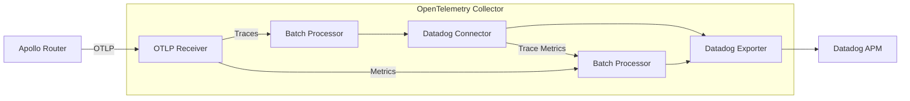
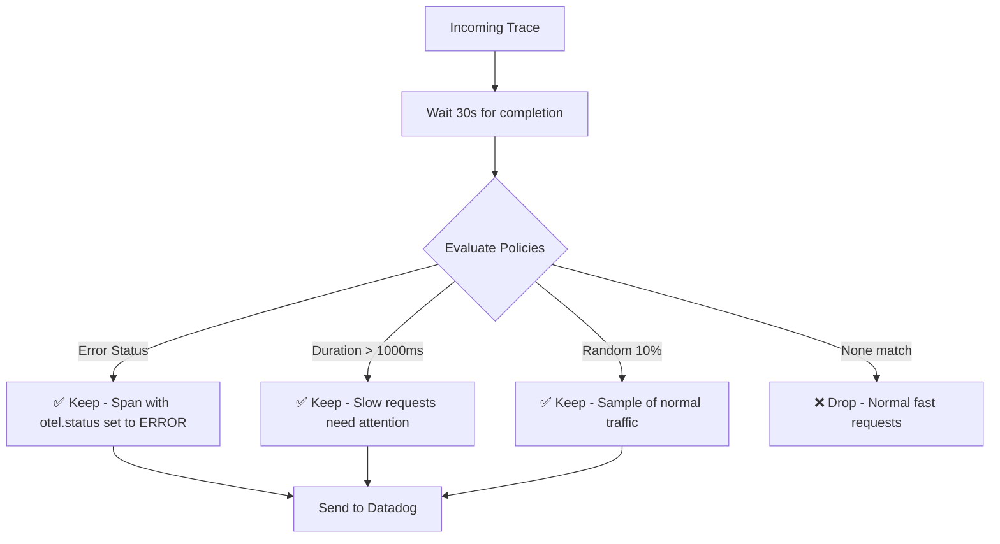

This guide walks through configuring the Apollo Router to send telemetry data to Datadog via the OpenTelemetry Collector.
For an overview of all available connection methods, see [Connecting to Datadog](/graphos/routing/observability/router-telemetry-otel/apm-guides/datadog/connecting-to-datadog).

For general metrics and tracing configuration, refer to [Router Metrics Configuration](/router/configuration/telemetry/exporters/metrics/overview) and [Router Tracing Configuration](/router/configuration/telemetry/exporters/tracing/overview).

For router instrumentation with Datadog-specific attributes, see the [Router Instrumentation guide](/graphos/routing/observability/router-telemetry-otel/apm-guides/datadog/router-instrumentation).


## Prerequisites

- [Apollo Router](/graphos/routing/self-hosted) deployed
- [OpenTelemetry collector](https://opentelemetry.io/docs/collector/installation/) installed 
- [Datadog account](https://docs.datadoghq.com/account_management/api-app-keys/) with an API key
- [OpenTelemetry integration installed in Datadog](https://app.datadoghq.com/integrations?search=otel&integrationId=otel)

<Note>

If you're using the [Apollo Runtime container](https://github.com/apollographql/apollo-runtime), see the [Datadog example configuration](https://github.com/apollographql/apollo-runtime/tree/main/examples/datadog/otel-collector) for ready-to-use configuration that implements this guide.

</Note>

## Configure the router

Configure your router to send telemetry to the OpenTelemetry Collector using OTLP.


Add telemetry exporters to your existing `router.yaml`. This configuration follows [Datadog's unified service tagging](https://docs.datadoghq.com/getting_started/tagging/unified_service_tagging/) approach:

```yaml title="router.yaml"
telemetry:
  exporters:
    # Send metrics to the collector
    metrics:
      otlp:
        enabled: true
        endpoint: 0.0.0.0:4317
        protocol: grpc
        temporality: delta  # Required for Datadog
      common:
        resource:
          service.name: "apollo-router"
          deployment.environment: "dev"

    # Send traces to the collector
    tracing:
      otlp:
        enabled: true
        endpoint: 0.0.0.0:4317
        protocol: grpc
      common:
        sampler: 1.0  # Send all traces to collector for intelligent sampling
        resource:
          service.name: "apollo-router"
          deployment.environment: "dev"
```

## Configure the OpenTelemetry collector

The collector uses a pipeline architecture with four key components:
- **Receivers**: Collect telemetry from sources (in this case, the router via OTLP)
- **Processors**: Transform and modify data (batching, sampling, filtering)
- **Connectors**: Generate new telemetry from existing data (the Datadog connector creates trace metrics)
- **Exporters**: Send data to backends (Datadog in this configuration)



For detailed configuration options, see [configuration basics](https://opentelemetry.io/docs/collector/configuration/) and [Datadog's collector exporter documentation](https://docs.datadoghq.com/opentelemetry/setup/collector_exporter/).


Create `otel-collector.yaml` with this minimal configuration. Before starting the collector, you'll need to set a `DD_API_KEY` environment variable to your Datadog API key:

```yaml title="otel-collector.yaml"
receivers:
  otlp:
    protocols:
      grpc:
        endpoint: 0.0.0.0:4317

processors:
  batch:
    # Datadog APM Intake limit is 3.2MB.
    send_batch_max_size: 1000
    send_batch_size: 100
    timeout: 10s
  memory_limiter:
    check_interval: 1s
    limit_mib: 1000

connectors:
  # Required for APM trace metrics
  datadog/connector:

exporters:
  datadog/exporter:
    api:
      key: ${env:DD_API_KEY}
      # site: datadoghq.eu # Uncomment for EU site

service:
  pipelines:
    traces:
      receivers: [otlp]
      processors: [batch]
      exporters: [datadog/connector, datadog/exporter]

    metrics:
      receivers: [otlp, datadog/connector]
      processors: [batch]
      exporters: [datadog/exporter]
```

## Verify the connection

With both the router and OpenTelemetry collector running, verify that telemetry data is flowing to Datadog:

1. **Send test queries** to your router to generate telemetry data

2. **View your data in Datadog**:
   - **Service**: Go to [APM > Services](https://app.datadoghq.com/apm/services) and look for the `apollo-router` service
   - **Metrics**: Go to [Metrics > Explorer](https://app.datadoghq.com/metric/explorer) and search for `http.server.request.duration` filtered by `service:apollo-router`

## Enhance your configuration

After you verify the basic setup, you can enhance your configuration with additional features.

### Router enhancements

Add [router instrumentation](/graphos/routing/observability/router-telemetry-otel/apm-guides/datadog/router-instrumentation) for Datadog-optimized span attributes, error tracking, and better APM organization.

### Collector enhancements

Enhance the collector pipeline with advanced processing capabilities. This configuration is designed for non-containerized environments - see [Datadog's OpenTelemetry integrations](https://docs.datadoghq.com/opentelemetry/integrations/) for Kubernetes and container examples:

```yaml title="otel-collector.yaml"
receivers:
  otlp:
    protocols:
      grpc:
        endpoint: 0.0.0.0:4317
      http:
        endpoint: 0.0.0.0:4318

  # Collect host metrics
  hostmetrics:
    collection_interval: 10s
    scrapers:
      cpu:
        metrics:
          system.cpu.utilization:
            enabled: true
      memory:
      network:
      disk:
      filesystem:
        metrics:
          system.filesystem.utilization:
            enabled: true

  # Collector self-monitoring
  prometheus/internal:
    config:
      scrape_configs:
        - job_name: 'otelcol'
          scrape_interval: 10s
          static_configs:
            - targets: ['0.0.0.0:8888']

processors:
  batch:
    # Datadog APM Intake limit is 3.2MB.
    send_batch_max_size: 1000
    send_batch_size: 100
    timeout: 10s
  memory_limiter:
    check_interval: 1s
    limit_mib: 1000

  # Detect resource attributes
  resourcedetection:
    detectors: [env, system]
    system:
      hostname_sources: [os]

  tail_sampling:
    decision_wait: 30s
    num_traces: 50000
    policies:
      # Always sample errors
      - name: errors
        type: status_code
        status_code:
          status_codes: [ERROR]

      # Sample slow requests
      - name: slow_requests
        type: latency
        latency:
          threshold_ms: 1000

      # Random sampling for everything else
      - name: random_sampling
        type: probabilistic
        probabilistic:
          sampling_percentage: 10

connectors:
  datadog/connector:

exporters:
  datadog/exporter:
    api:
      key: ${env:DD_API_KEY}

service:
  pipelines:
    traces:
      receivers: [otlp]
      processors: [resourcedetection, batch]
      exporters: [datadog/connector]

    traces/sampling:
      receivers: [datadog/connector]
      processors: [tail_sampling, batch]
      exporters: [datadog/exporter]

    metrics:
      receivers: [hostmetrics, otlp, prometheus/internal, datadog/connector]
      processors: [resourcedetection, batch]
      exporters: [datadog/exporter]
```

#### Host metrics collection

Add host metrics to monitor your infrastructure alongside router telemetry. See [Datadog's host metrics guide](https://docs.datadoghq.com/opentelemetry/integrations/host_metrics/?tab=host) for detailed configuration including CPU, memory, disk, network, and filesystem metrics.

For additional examples across different environments (Kubernetes, Docker, host metrics, etc.), see the [Datadog exporter example configurations](https://github.com/open-telemetry/opentelemetry-collector-contrib/tree/main/exporter/datadogexporter/examples).

#### Container and orchestration metrics

Extend monitoring to containerized environments with Docker and Kubernetes metrics. See [Datadog's Docker metrics guide](https://docs.datadoghq.com/opentelemetry/integrations/docker_metrics/?tab=host) for container resource usage, networking, and orchestration data alongside your router telemetry.

#### Intelligent sampling

Add tail sampling to keep all errors and slow requests while sampling normal traffic:




<ExpansionPanel title="Tail sampling configuration">

```yaml title="otel-collector.yaml"
processors:
  batch:
    send_batch_max_size: 1000
    send_batch_size: 100
    timeout: 10s
  memory_limiter:
    check_interval: 1s
    limit_mib: 1000

  tail_sampling:
    decision_wait: 30s
    num_traces: 50000
    policies:
      # Always sample errors (HTTP and GraphQL)
      - name: errors
        type: status_code
        status_code:
          status_codes: [ERROR]

      # Sample slow requests
      - name: slow_requests
        type: latency
        latency:
          threshold_ms: 1000

      # Random sampling for normal traffic
      - name: random_sampling
        type: probabilistic
        probabilistic:
          sampling_percentage: 10

service:
  pipelines:
    traces:
      receivers: [otlp]
      processors: [batch]
      exporters: [datadog/connector]

    # Use a separate pipeline for sampling to maintain accurate trace metrics
    traces/sampling:
      receivers: [datadog/connector]
      processors: [tail_sampling, batch]
      exporters: [datadog/exporter]
```

</ExpansionPanel>

#### Collector health metrics

Monitor the health and performance of the OpenTelemetry Collector itself. See [Datadog's collector health metrics guide](https://docs.datadoghq.com/opentelemetry/integrations/collector_health_metrics/) for configuration to track collector throughput, dropped data, and resource usage. For detailed information about collector internal telemetry, see the [OpenTelemetry internal telemetry documentation](https://opentelemetry.io/docs/collector/internal-telemetry/).

## Troubleshooting

### No data in Datadog

- Verify your API key is set correctly: `echo $DD_API_KEY`
- Check collector logs for authentication errors
- Ensure the correct Datadog site is configured (US vs EU)
- Check router logs for OTLP export errors or connection failures to the collector

For comprehensive troubleshooting guidance, see the [OpenTelemetry Collector troubleshooting documentation](https://opentelemetry.io/docs/collector/troubleshooting/).

## Learn more

### OpenTelemetry collector resources

<ExpansionPanel title="Additional collector documentation and resources">

- [Quick start guide](https://opentelemetry.io/docs/collector/quick-start/) - Get started with the collector
- [Configuration basics](https://opentelemetry.io/docs/collector/configuration/) - Deep dive into collector configuration
- [Deployment patterns](https://opentelemetry.io/docs/collector/deployment/agent/) - Agent vs Gateway deployment models
- [Transforming telemetry](https://opentelemetry.io/docs/collector/transforming-telemetry/) - Processing and enriching data
- [Architecture overview](https://opentelemetry.io/docs/collector/architecture/) - Understanding collector internals
- [Component registry](https://opentelemetry.io/ecosystem/registry/?language=collector) - Available receivers, processors, and exporters
- [Collector health checks](https://opentelemetry.io/docs/collector/management/#health-check) - HTTP health check endpoints
- [zPages diagnostic pages](https://opentelemetry.io/docs/collector/management/#zpages) - Internal debugging and metrics pages
- [Collector internal telemetry](https://opentelemetry.io/docs/collector/internal-telemetry/) - Self-monitoring configuration

</ExpansionPanel>

### Next steps

- [Configure router instrumentation](/graphos/routing/observability/router-telemetry-otel/apm-guides/datadog/router-instrumentation) for Datadog-optimized telemetry
- [Configure Datadog dashboards](/graphos/routing/observability/apm-guides/datadog/observing-and-monitoring/dashboard-template) for router monitoring
- Learn about [advanced sampling strategies](https://opentelemetry.io/docs/concepts/sampling/)
- Explore [collector processors](https://github.com/open-telemetry/opentelemetry-collector-contrib/tree/main/processor) for data transformation