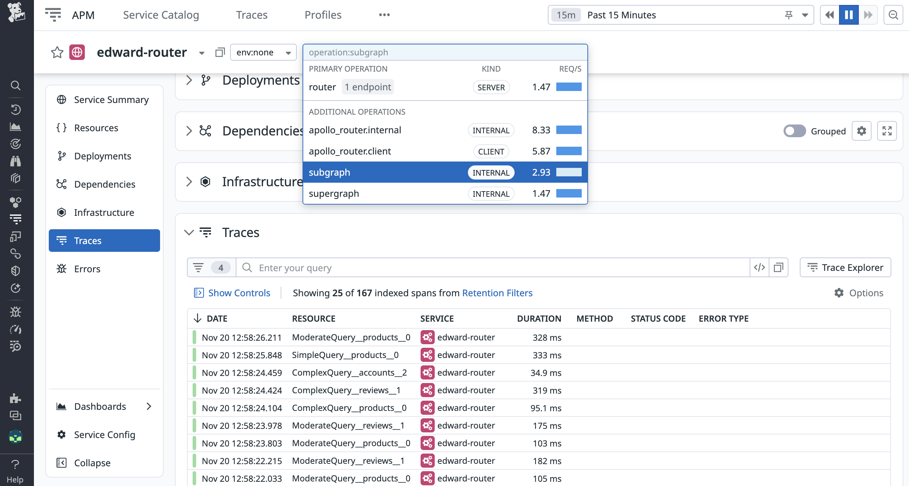

This guide shows how to configure Apollo Router telemetry for optimal integration with Datadog APM.


## Complete configuration

Copy this configuration into your router.yaml to get started with Datadog-optimized telemetry:

```yaml title="router.yaml"
telemetry:
  instrumentation:
    spans:
      default_attribute_requirement_level: recommended

      router:
        attributes:
          otel.name: router
          operation.name: "router"
          resource.name:
            request_method: true

      supergraph:
        attributes:
          otel.name: supergraph
          operation.name: "supergraph"
          resource.name:
            operation_name: string
          # Error tracking
          otel.status_code:
            static: ERROR
            condition:
              eq:
                - true
                - on_graphql_error: true
          error.message:
            response_errors: $[0].message

      subgraph:
        attributes:
          otel.name: subgraph
          operation.name: "subgraph"
          resource.name:
            subgraph_operation_name: string
          otel.status_code:
            static: ERROR
            condition:
              eq:
                - true
                - subgraph_on_graphql_error: true
          error.message:
            subgraph_response_errors: $[0].message

    instruments:
      default_requirement_level: required

      router:
        http.server.request.duration:
          attributes:
            graphql.errors:
              on_graphql_error: true

      subgraph:
        http.client.request.duration:
          attributes:
            subgraph.name: true
            graphql.errors:
              subgraph_on_graphql_error: true
```

<Caution>

**High Cardinality Warning**: The `operation_name` and `subgraph_operation_name` attributes can create high cardinality if your GraphQL operations have many unique names. This affects APM views and trace metrics because Datadog creates metrics for each unique `resource.name` value.

For high-traffic APIs, consider using `operation_kind` (query/mutation/subscription) or `subgraph_name` instead, or remove `resource.name` entirely and let Datadog auto-generate it. See [Resource naming best practices](#resource-naming) below.

</Caution>

## Understanding the configuration

The sections below explain what each part of the configuration does.

### Operation and resource names

Datadog uses `operation.name` and `resource.name` to organize APM views. This configuration sets these attributes for the `router`, `supergraph`, and `subgraph` stages of your request lifecycle.

**What it does:**
- `otel.name`: Sets the span name in OpenTelemetry
- `operation.name`: Groups related spans in Datadog APM (use static values like "router", "supergraph", "subgraph")
- `resource.name`: Provides detailed grouping within each operation (e.g., by GraphQL operation name or HTTP method)

**Example - How it appears in Datadog:**



Learn more:
- [OpenTelemetry semantic mapping in Datadog](https://docs.datadoghq.com/opentelemetry/mapping/semantic_mapping/?tab=datadogexporter)
- [Operation name mapping logic](https://docs.datadoghq.com/opentelemetry/migrate/migrate_operation_names/?tab=opentelemetrycollector#new-mapping-logic)

### Error tracking

The error tracking configuration surfaces GraphQL errors in [Datadog APM Error Tracking](https://docs.datadoghq.com/tracing/error_tracking/).

**Error tracking in spans:**

```yaml title="router.yaml"
telemetry:
  instrumentation:
    spans:
      supergraph:
        attributes:
          # Mark span as error when GraphQL errors occur
          otel.status_code:
            static: ERROR
            condition:
              eq:
                - true
                - on_graphql_error: true
          # Capture the error message
          error.message:
            response_errors: $[0].message

      subgraph:
        attributes:
          otel.status_code:
            static: ERROR
            condition:
              eq:
                - true
                - subgraph_on_graphql_error: true
          error.message:
            subgraph_response_errors: $[0].message
```

**What it does:**
- `otel.status_code`: Marks the span as an error when GraphQL errors occur
- `error.message`: Captures the error message from your GraphQL response

<Note>

The configuration assumes errors are returned as an array with a `message` field. Adjust the JSONPath expression (`$[0].message`) to match your specific error response structure.

</Note>

**Error tracking in metrics:**

The `instruments` section adds error tracking to metrics, allowing you to correlate errors between spans and metrics:

```yaml
instruments:
  router:
    http.server.request.duration:
      attributes:
        graphql.errors:
          on_graphql_error: true
```

## Best practices

### Resource naming

You can omit the `resource.name` attribute entirely and let Datadog auto-generate it from other span attributes, or you can explicitly set it using available [selectors](/graphos/routing/observability/router-telemetry-otel/enabling-telemetry/selectors) for each span type (router, supergraph, subgraph).

If you choose to set `resource.name` explicitly, the goal is to find names that meaningfully group similar operations while keeping the total number of unique resource names manageable (typically hundreds).

- **Good (low cardinality):**
  - `query`, `mutation`, `subscription` (via `operation_kind`)
  - `GET`, `POST` (via `request_method`)
  - `users`, `products`, `reviews` (via `subgraph_name`)
- **Moderate (acceptable for many use cases):**
  - `GetUser`, `CreateProduct`, `UpdateReview` (via `operation_name`, assuming controlled, named operations)
  - `GetUser_users-subgraph_2`, `CreateProduct_products-subgraph_1`, `UpdateReview_reviews-subgraph_3` (via `subgraph_operation_name`)
- **Bad (high cardinality - avoid):**
  - `query_user_posts_comments`, `GetUser_req_12345`, `GetUser_userId_789`

**Key consideration:**
For high-traffic APIs with many unique operation names, use `operation_kind` or `subgraph_name` instead of `operation_name` to avoid high cardinality.

### Operation naming

Keep `operation.name` consistent and low-cardinality:
- Use static values like "router", "supergraph", "subgraph"
- Don't include dynamic data in operation names
- Use `resource.name` to provide the detailed grouping

### Error tracking

Ensure errors are properly tracked:
- Set `otel.status_code` to `ERROR` for GraphQL errors
- Include `error.message` with the actual error text
- Track errors in both spans and metrics for correlation


## Next steps

- [Configure Datadog dashboards](/graphos/routing/observability/router-telemetry-otel/apm-guides/datadog/observing-and-monitoring/dashboard-template) for router monitoring
- [Customize router spans](/graphos/routing/observability/router-telemetry-otel/enabling-telemetry/spans) to learn more about customizing span attributes
- [Customize router metrics](/graphos/routing/observability/router-telemetry-otel/enabling-telemetry/instruments) to learn more about customizing metric attributes
- [Customize router events](/graphos/routing/observability/router-telemetry-otel/enabling-telemetry/events) to learn more about customizing event attributes
- [Enable router logs](/graphos/routing/observability/router-telemetry-otel/telemetry-pipelines/log-exporters/overview) to learn more about exporting logs