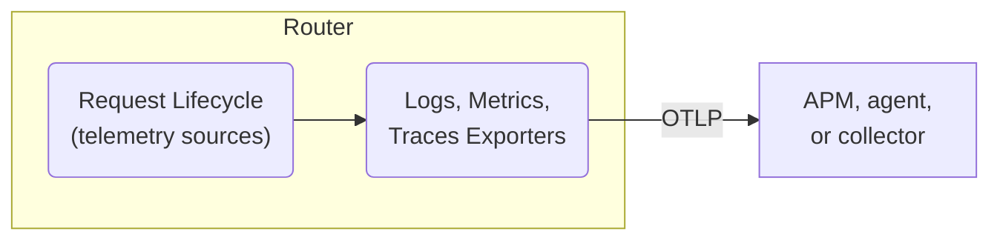
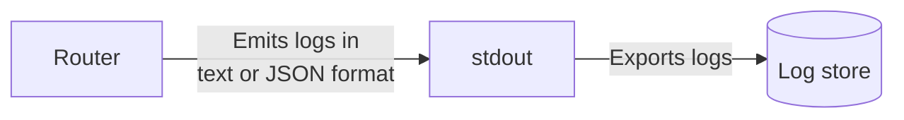
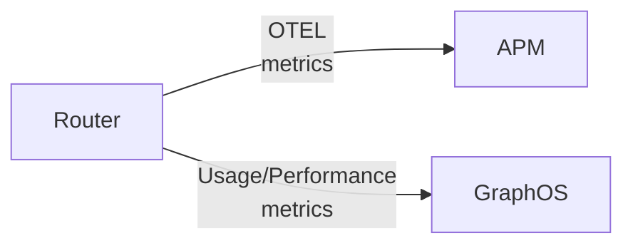
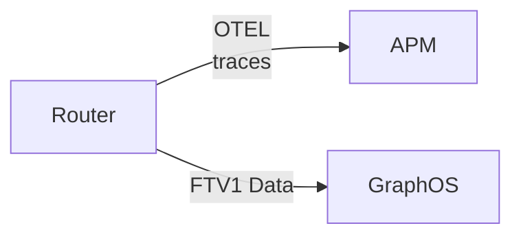

import TelemetryPerformanceNote from '../../../../shared/telemetry-performance.mdx';

Since the router is the single access point for all traffic to and from your graph, router telemetry is the most comprehensive way to observe your supergraph. By implementing telemetry, you can:

- Monitor your supergraph's health and performance
- Diagnose issues and deduce root causes
- Optimize resource usage and system reliability

To understand how router telemetry fits into the broader set of GraphOS observability tooling, see the [observability overview](/graphos/routing/observability).

## How router telemetry works

By default, the router doesn't collect or export any telemetry beyond [the operation](/graphos/platform/insights/sending-operation-metrics#from-the-apollo-router-or-apollo-server) and [field usage metrics](/graphos/platform/insights/sending-operation-metrics#from-the-apollo-router) it sends to GraphOS. You configure which additional telemetry data to collect and where to export it via your router's configuration file.

The router request lifecycle is the primary data source for telemetry data or _signals_. Telemetry signals include _logs_, _metrics_, and _traces_. The section on [router telemetry signals](#router-telemetry-signals) explains these data types and gives basic configuration examples. _Exporters_ are responsible for sending telemetry data to your application performance monitoring (APM) and observability tools for storage, visualization, and analysis.



### Telemetry exporters

The router emits telemetry in the industry-standard OpenTelemetry Protocol (OTLP) format and is therefore compatible with many APM tools, including:

- Prometheus
- OpenTelemetry Collector
- Datadog
- New Relic
- Jaeger
- Zipkin

### Attributes and selectors

Attributes and selectors are key-value pairs that add contextual information from the router request lifecycle to telemetry data. You can use attributes and selectors to annotate events, metrics, and spans so they can help you filter and group data in your APMs.

The router supports a set of standard attributes from [OpenTelemetry semantic conventions](https://opentelemetry.io/docs/specs/semconv/). Example attributes include:

- HTTP status code  
- GraphQL operation name  
- Subgraph name

Selectors allow you to define custom data points based on the router's request lifecycle. 

|  | Description |
| ----- | ----- |
| **Attribute** | Standard data points that can be attached to spans, instruments, and events. |
| **Selector** | Custom data points extracted from the router's request lifecycle, tailored to specific needs. |

## Router telemetry signals

The router supports three signal types for collecting and exporting telemetry:

<table>
  <thead>
    <tr>
      <th>Signal</th>
      <th>Description</th>
    </tr>
  </thead>
  <tbody>
    <tr>
      <td>Logs and events</td>
      <td>
        <ul>
          <li>Capture and export logs in text or JSON format.</li>
          <li>Trigger custom events to log critical actions during the router request lifecycle.</li>
        </ul>
      </td>
    </tr>
    <tr>
      <td>Metrics and instruments</td>
      <td>
        <ul>
          <li>Export standard metrics for Router operations.</li>
          <li>Leverage OpenTelemetry (OTEL) metrics to capture HTTP lifecycle data.</li>
          <li>Define custom metrics using attributes and selectors.</li>
        </ul>
      </td>
    </tr>
    <tr>
      <td>Traces and spans</td>
      <td>
        <ul>
          <li>Export traces of router transactions.</li>
          <li>Use spans to monitor specific actions within traces and attach attributes or selectors for deeper insights.</li>
        </ul>
      </td>
    </tr>
  </tbody>
</table>


These mechanisms let you collect data about the inner workings of your router and graph and export them accordingly. 

### Logs and events

Logs record events in the router's request lifecycle. Examples of logged events include:

- Information about the router lifecycle  
- Warnings about misconfiguration  
- Errors that occurred during a request

#### Log exporters

You can log events to standard output in either text or JSON format. Logs can also be consumed by [logging exporters](/router/configuration/telemetry/exporters/logging/overview) and as part of [spans](/graphos/routing/observability/telemetry#traces-and-spans) via [tracing exporters](/router/configuration/telemetry/exporters/tracing/overview).



#### Example log configuration

This configuration snippet enables stdout logging in JSON:

```yaml title="router.yaml"
telemetry:
  exporters:
    logging:
      stdout:
        enabled: true
        format: json
```

### Metrics and instruments

Metrics are measurements of the router's behavior that are collected and often analyzed over time to identify trends. Examples of router metrics include the number of incoming HTTP requests and the time spent processing a request. 

Instruments define _how_ to collect and report metrics. Different kinds of instruments include counters, gauges, and histograms. For example, given the metric "number of incoming HTTP requests," a counter records the total number of requests, a histogram captures the distribution of request counts over time, and a gauge provides a snapshot of the current request count at a given moment.

#### Instrument types

Metric instruments fall into three categories:

<table>
  <thead>
    <tr>
      <th>Instrument Type</th>
      <th>Description</th>
    </tr>
  </thead>
  <tbody>
    <tr>
      <td><strong>OTEL instruments</strong></td>
      <td>
        Standard OpenTelemetry instruments around the HTTP lifecycle, including:
        <ul>
          <li>The number of HTTP requests by HTTP status</li>
          <li>A histogram of HTTP router request duration</li>
          <li>The number of active requests in flight</li>
          <li>A histogram of request body sizes</li>
        </ul>
      </td>
    </tr>
    <tr>
      <td><strong>Router instruments</strong></td>
      <td>
        Standard instruments for the router request life cycle, including:
        <ul>
          <li>Count of GraphQL errors in responses</li>
          <li>Time spent loading the schema in seconds</li>
          <li>Number of entries in the router's cache</li>
          <li>Time spent warming up the query planner queries in seconds</li>
        </ul>
      </td>
    </tr>
    <tr>
      <td><strong>Custom instrument</strong></td>
      <td>
        Custom instruments defined in the router request life cycle.
      </td>
    </tr>
  </tbody>
</table>

#### Example instrument configuration

This configuration snippet enables OTEL instrumentation for a histogram of request body sizes:

```yaml title="router.yaml"
telemetry:
  instrumentation:
    instruments:
      router:
        http.server.request.body.size: true
```

See [Instruments](/router/configuration/telemetry/instrumentation/instruments) for an overview of available instruments and a guide for configuring and customizing instruments.

#### Metric exporters

In addition to the [operation metrics](/graphos/platform/insights/sending-operation-metrics#from-the-apollo-router-or-apollo-server) and [field usage metrics](/graphos/platform/insights/sending-operation-metrics#from-the-apollo-router) that GraphOS Router sends to GraphOS, you can configure the router with metric exporters for other observability tools and APMs.



This configuration snippet enables exporting metrics to Prometheus:

```yaml title="router.yaml"
telemetry:
  exporters:
     metrics:
       prometheus:
         enabled: true
         listen: 127.0.0.1:9090
         path: /metrics
```

Learn more about [sending metrics to Prometheus](/graphos/reference/router/telemetry/metrics-exporters/prometheus) and [metric exporters](/graphos/reference/router/telemetry/metrics-exporters/overview) in general.

### Traces and spans

Traces help you monitor the flow of a request through the router. A trace is composed of [spans](/router/configuration/telemetry/instrumentation/spans). A span captures a request's duration as it flows through the router request lifecycle. Spans may include contextual information about the request, such as the HTTP status code or the name of the subgraph being queried.

Examples of spans include:

- router \- Wraps an entire request from the HTTP perspective  
- supergraph \- Wraps a request once GraphQL parsing has taken place  
- subgraph \- Wraps a request to a subgraph.

#### Tracing exporters

If you've enabled federated tracing (also known as FTV1 tracing) in your subgraph libraries, the router [sends field-level traces to GraphOS](/graphos/routing/graphos-reporting#reporting-field-level-traces). Additionally, trace exporters can consume and report traces to your APM.



This configuration snippet enables
- setting attributes that Datadog uses to organize its APM view
- exporting traces to a Datadog agent:

```yaml title="router.yaml"
telemetry:
  instrumentation:
    spans:
      mode: spec_compliant
      router:
        attributes:
          otel.name: router
          operation.name: "router"
          resource.name:
            request_method: true
      supergraph:
        attributes:
          otel.name: supergraph
          operation.name: "supergraph"
          resource.name:
            operation_name: string
      subgraph:
        attributes:
          otel.name: subgraph
          operation.name: "subgraph"
          resource.name:
            subgraph_operation_name: string
  exporters:
    tracing:
      otlp:
        enabled: true
        endpoint: "${env.DATADOG_AGENT_HOST}:4317"
```

Learn more about [sending traces to DataDog](/graphos/reference/router/telemetry/trace-exporters/datadog) and [trace exporters](/graphos/reference/router/telemetry/trace-exporters/overview) in general.

## Best practices

### Collecting exactly the telemetry you need

Effective telemetry provides just the right amount and granularity of information to maintain your graph. Too much data can overwhelm your system, for example, with high cardinality metrics. Too little may not provide enough information to debug issues.

Specific events that need to be captured—and the conditions under which they need to be captured—can change as client applications and graphs change. Different environments, such as production and development, can have different observability requirements.

Router telemetry is customizable to meet the observability needs of different graphs. Keep in mind your particular environments' and graphs' requirements when configuring your telemetry.

#### Setting conditions for collecting telemetry

You can set [conditions](/graphos/reference/router/telemetry/instrumentation/conditions) for instruments and events to only collect telemetry data when necessary. This configuration snippet enables only collecting the configured telemetry data when the `request_header` is equal to "example-value":

```yaml
eq:
  - "example-value"
  - request_header: x-req-header
```
#### Dropping metrics using views

You can use metric exporters' [`view`](/graphos/reference/router/telemetry/metrics-exporters/overview#views) property with the `drop` aggregation to remove certain metrics from being sent to your APM. This configuration snippet removes all instruments that begin with `apollo_router`:

```yaml title="router.yaml"
telemetry:
  exporters:
    metrics:
      common:
        service_name: apollo-router
        views:
          - name: apollo_router*
            aggregation: drop
```

### Balancing telemetry and router performance

<TelemetryPerformanceNote/>

## Next steps

Consult the following documentation for details on how to configure the various telemetry mechanisms and exporters:

- [Log Exporters Overview](/graphos/reference/router/telemetry/log-exporters/overview)  
- [Trace Exporters Overview](/graphos/reference/router/telemetry/trace-exporters/overview)  
- [Metrics Exporters Overview](/graphos/reference/router/telemetry/metrics-exporters/overview)  
- [Attributes and Selectors](/graphos/reference/router/telemetry/instrumentation/selectors)  
- [Conditions](/graphos/reference/router/telemetry/instrumentation/conditions)
