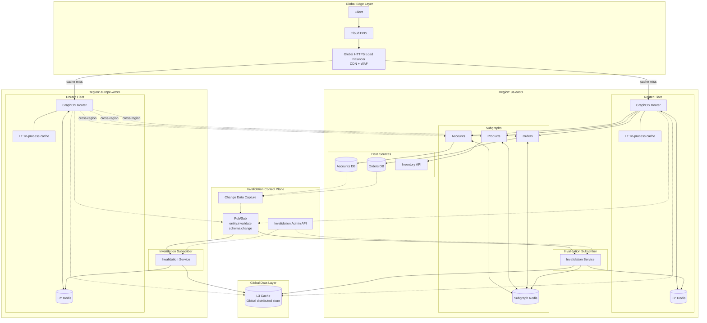
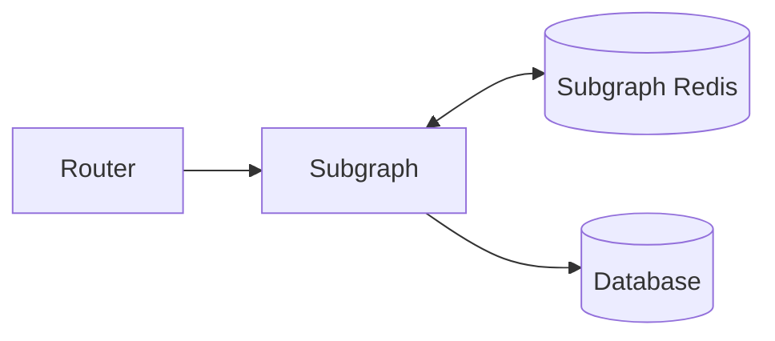
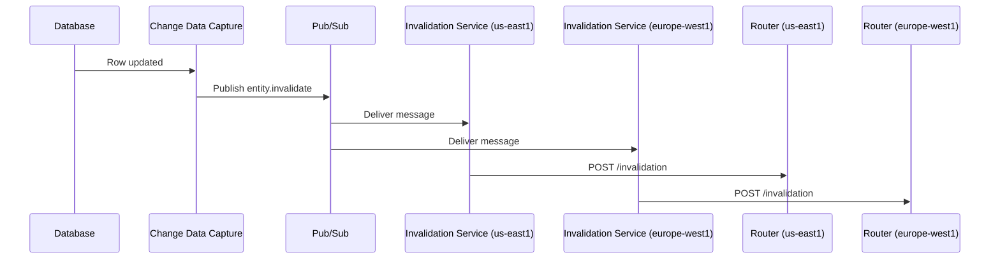

This guide describes a reference architecture for deploying GraphOS Router with Redis as part of a globally distributed edge caching system. Use this pattern when you need low-latency GraphQL responses across multiple geographic regions with consistent cache invalidation.

## When to use this architecture

Consider this architecture when you need:

- **Global low-latency responses**: Serve users from the nearest region with cached data
- **High availability**: Regional failures don't take down your entire GraphQL API
- **Shared cache across router instances**: Multiple router replicas in a region share cached data
- **Consistent invalidation**: Changes propagate to all regions quickly

This pattern is more complex than a single-region deployment. For simpler use cases, see the [Response Caching Quickstart](/graphos/routing/performance/caching/response-caching/quickstart).

## Architecture overview

The following diagram shows a multi-region deployment with tiered caching:



### Architecture components

| Layer | Component | Purpose |
|-------|-----------|---------|
| Edge | Global Load Balancer + CDN | Route requests to nearest region, cache GET responses at edge |
| Edge | WAF (Web Application Firewall) | Protect against malicious requests |
| L1 | In-process cache | Query plan caching, hot data with microsecond latency |
| L2 | Regional Redis | Shared response cache across router replicas in a region |
| L3 | Global distributed store | Optional cross-region cache for expensive computations |
| Control | Pub/Sub | Broadcast invalidation events to all regions |
| Control | Change Data Capture | Trigger invalidations from database changes |

## Cache tiers

### L1: In-process cache

Each router instance maintains an in-process cache for:
- **Query plans**: Avoid re-planning identical queries
- **APQ (Automatic Persisted Queries)**: Map query hashes to full query text

This cache is local to each router instance and provides microsecond-level latency. Configure query plan caching:

```yaml title="router.yaml"
supergraph:
  query_planning:
    cache:
      in_memory:
        limit: 512 # Number of query plans to cache
```

For high-traffic deployments, you can also back the query plan cache with Redis for sharing across instances. See [Query Plan Caching](/graphos/routing/query-planning/caching).

### L2: Regional Redis

Regional Redis provides a shared cache for all router instances in a region. This is where [response caching](/graphos/routing/performance/caching/response-caching/overview) stores cached subgraph responses.

```yaml title="router.yaml"
response_cache:
  enabled: true
  subgraph:
    all:
      enabled: true
      ttl: 3600s # 1 hour default TTL
      redis:
        urls: ["redis://redis.us-east1.internal:6379"]
        pool_size: 10
        namespace: "router:response_cache"
```

For multi-region deployments, configure each region's routers to use the regional Redis instance:

```yaml title="router.yaml (us-east1)"
response_cache:
  subgraph:
    all:
      redis:
        urls: ["redis://redis.us-east1.internal:6379"]
```

```yaml title="router.yaml (europe-west1)"
response_cache:
  subgraph:
    all:
      redis:
        urls: ["redis://redis.europe-west1.internal:6379"]
```

<Tip>

Use environment variables to configure region-specific Redis URLs:

```yaml title="router.yaml"
response_cache:
  subgraph:
    all:
      redis:
        urls: ["${env.REDIS_URL}"]
```

</Tip>

#### Redis high availability

For production deployments, use Redis with high availability:

- **Redis Cluster**: Horizontal scaling with automatic sharding
- **Redis Sentinel**: Automatic failover for single-primary setups
- **Managed Redis**: Cloud provider managed services (AWS ElastiCache, GCP Memorystore, Azure Cache for Redis)

```yaml title="router.yaml (Redis Cluster)"
response_cache:
  subgraph:
    all:
      redis:
        urls: ["redis-cluster://node1:6379?node=node2:6379&node=node3:6379"]
```

See [Redis URL Configuration](/router/configuration/distributed-caching#redis-url-configuration) for connection string formats.

### L3: Global distributed store (optional)

For data that's expensive to compute and rarely changes, you can add a global L3 cache tier using a distributed database like Cloud Bigtable, DynamoDB Global Tables, or CockroachDB.

The L3 tier is **not a built-in router feature**. You would implement it as:
- A [coprocessor](/graphos/routing/customization/coprocessor) that checks L3 before forwarding to subgraphs
- Custom logic in your subgraphs that checks L3 before querying origin databases

This tier is only necessary for specific use cases where cross-region cache sharing provides significant cost savings.

## Subgraph caching

Subgraphs can maintain their own Redis cache, independent of the router's response cache. This is useful when:

- Subgraphs have expensive data fetching operations
- Multiple fields share the same underlying data
- You want caching at the resolver level



The router's response cache and subgraph caches serve different purposes:

| Cache | What it caches | Invalidation |
|-------|---------------|--------------|
| Router response cache | Subgraph HTTP responses (entity representations) | Via router invalidation API |
| Subgraph cache | Resolver-level data, database query results | Subgraph-specific logic |

## Event-driven invalidation

In a multi-region deployment, cache invalidation must propagate to all regions. Use a pub/sub system to broadcast invalidation events.

### Invalidation flow



### Router invalidation endpoint

Configure each router to expose an invalidation endpoint:

```yaml title="router.yaml"
response_cache:
  enabled: true
  invalidation:
    listen: "0.0.0.0:4000"
    path: "/invalidation"
  subgraph:
    all:
      enabled: true
      redis:
        urls: ["${env.REDIS_URL}"]
      invalidation:
        enabled: true
        shared_key: "${env.INVALIDATION_SHARED_KEY}"
```

<Caution>

Only expose the invalidation endpoint to internal networks. Use network policies or service mesh to restrict access.

</Caution>

### Invalidation service

Create an invalidation service in each region that:
1. Subscribes to the pub/sub topic
2. Transforms events into router invalidation requests
3. Calls the router's invalidation endpoint

Example invalidation request:

```bash
curl --request POST \
  --header "Authorization: ${INVALIDATION_SHARED_KEY}" \
  --header "Content-Type: application/json" \
  --url http://router:4000/invalidation \
  --data '[{
    "kind": "cache_tag",
    "subgraphs": ["products"],
    "cache_tag": "product-42"
  }]'
```

See [Cache Invalidation](/graphos/routing/performance/caching/response-caching/invalidation) for all invalidation methods.

### Change data capture

Use change data capture (CDC) to automatically trigger invalidations when database records change:

- **Debezium**: Open source CDC for various databases
- **Cloud-native CDC**: AWS DMS, GCP Datastream, Azure Data Factory

CDC captures database changes and publishes them to your pub/sub system, which then triggers cache invalidation across all regions.

## Edge layer integration

### CDN caching

A CDN can cache GraphQL responses at the edge for read-heavy workloads. This works best for:

- **GET requests**: Queries sent as GET requests with query parameters
- **Public data**: Responses without user-specific content
- **High cache hit rates**: Popular queries requested by many users

Configure your CDN to:
1. Cache responses based on the full URL (including query parameters)
2. Respect `Cache-Control` headers from the router
3. Forward cache misses to the nearest router region

The router includes `Cache-Control` headers in responses based on the minimum TTL of cached entities.

### APQ with GET requests

[Automatic Persisted Queries (APQ)](/graphos/routing/operations/apq) enable sending queries as GET requests, making them cacheable by CDNs:

```yaml title="router.yaml"
apq:
  enabled: true
  router:
    cache:
      redis:
        urls: ["${env.REDIS_URL}"]
```

With APQ, clients send a query hash instead of the full query text. The CDN can cache responses by hash, and the router resolves hashes to full queries from Redis.

## Multi-region deployment

### Regional router configuration

Each region needs routers configured with:
- Regional Redis URL
- Regional subgraph endpoints (or cross-region if subgraphs aren't deployed locally)

Use environment variables or a configuration management system to manage region-specific settings.

### Cross-region subgraph routing

In the architecture diagram, `europe-west1` doesn't have local subgraphs—it routes to `us-east1` subgraphs cross-region. This is a valid pattern when:

- Some regions only need router + cache (read-heavy, latency-tolerant)
- Subgraph deployment is expensive or complex
- Data residency requirements allow it

Configure cross-region routing with longer timeouts to account for network latency:

```yaml title="router.yaml"
traffic_shaping:
  all:
    timeout: 30s # Longer timeout for cross-region calls
  subgraphs:
    products:
      timeout: 45s # Even longer for slow subgraphs
```

## Monitoring

Monitor cache effectiveness across regions:

```yaml title="router.yaml"
telemetry:
  instrumentation:
    instruments:
      cache:
        apollo.router.operations.response_cache:
          attributes:
            subgraph.name:
              subgraph_name: true
```

Key metrics to track:

| Metric | What it tells you |
|--------|-------------------|
| `apollo.router.operations.response_cache.hit` | Cache hit rate by subgraph |
| `apollo.router.operations.response_cache.miss` | Requests hitting origin |
| `apollo.router.cache.storage.estimated_size` | Cache memory usage |
| Redis latency | Network overhead for cache operations |

See [Response Cache Observability](/graphos/routing/performance/caching/response-caching/observability) for detailed monitoring guidance.

## Implementation checklist

Use this checklist when implementing the architecture:

- [ ] **Redis per region**: Deploy Redis with high availability in each region
- [ ] **Router fleet**: Deploy multiple router replicas per region behind a load balancer
- [ ] **Invalidation endpoint**: Configure and secure the invalidation endpoint
- [ ] **Pub/Sub**: Set up pub/sub topics for invalidation events
- [ ] **Invalidation services**: Deploy subscribers in each region
- [ ] **CDC (optional)**: Configure change data capture for automatic invalidation
- [ ] **CDN**: Configure CDN caching rules for GET requests
- [ ] **Monitoring**: Set up dashboards for cache metrics across regions
- [ ] **Alerting**: Alert on cache hit rate drops, Redis connectivity issues

## Related documentation

- [Response Caching Overview](/graphos/routing/performance/caching/response-caching/overview)
- [Response Cache Configuration](/graphos/routing/performance/caching/response-caching/customization)
- [Cache Invalidation](/graphos/routing/performance/caching/response-caching/invalidation)
- [Query Plan Caching](/graphos/routing/query-planning/caching)
- [Distributed Caching Configuration](/router/configuration/distributed-caching)
- [Kubernetes Deployment](/graphos/routing/self-hosted/containerization/kubernetes/quickstart)
