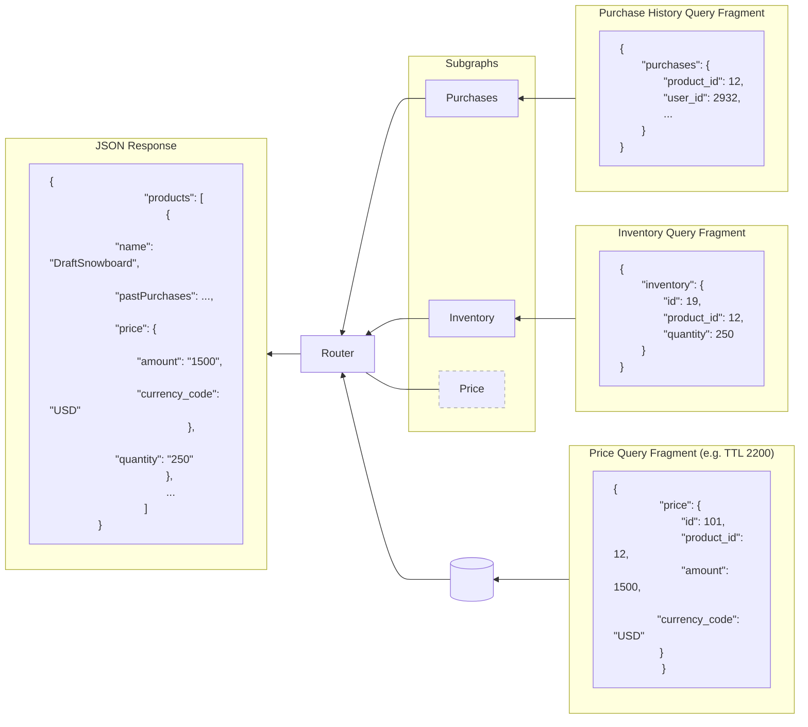
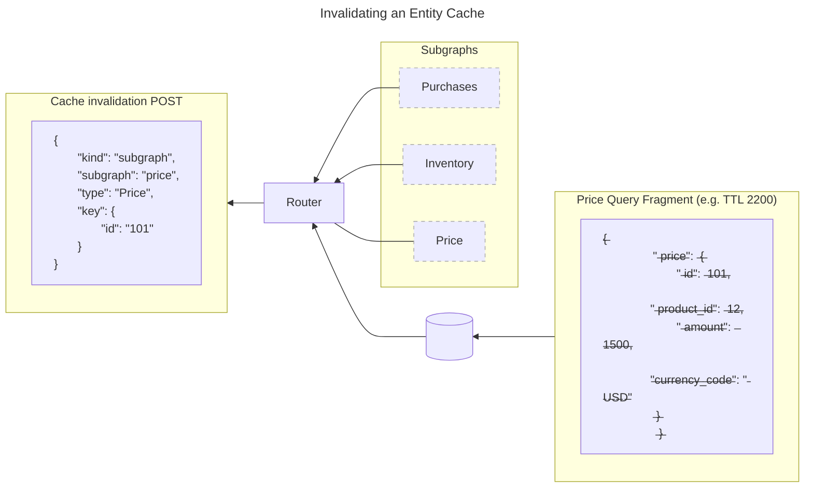

<EnterpriseFeature />

<PreviewFeature />

Learn how the GraphOS Router can cache subgraph query responses using Redis to improve your query latency for entities in the supergraph.

## Overview

An entity gets its fields from one or more subgraphs. To respond to a client request for an entity, the GraphOS Router must make multiple subgraph requests. Different clients requesting the same entity can make redundant, identical subgraph requests. 

Entity caching enables the router to respond to identical subgraph queries with cached subgraph responses. The router uses Redis to cache data from subgraph query responses. Because cached data is keyed per subgraph and entity, different clients making the same client query&mdash;with the same or different query arguments&mdash;hit the same cache entries of subgraph response data.

### Benefits of entity caching

Compared to caching entire client responses, entity caching supports finer control over:
- the time to live (TTL) of cached data
- the amount of data being cached 

When caching an entire client response, the router must store it with a shorter TTL because application data can change often. Real-time data needs more frequent updates.

A client-response cache might not be shareable between users, because the application data might contain personal and private information. A client-response cache might also duplicate a lot of data between client responses.

For example, consider the `Products` and `Inventory` subgraphs from the [Entities guide](/federation/entities):

<CodeColumns>

```graphql title="Products subgraph" disableCopy=true
type Product @key(fields: "id") {
  id: ID!
  name: String!
  price: Int
}
```

```graphql title="Inventory subgraph" disableCopy=true
type Product @key(fields: "id") {
  id: ID!
  inStock: Boolean!
}
```

</CodeColumns>

Assume the client for a shopping cart application requests the following for each product in the cart:
- The product's name and price from the `Products` subgraph.
- The product's availability in inventory from the `Inventory` subgraph.

If caching the entire client response, it would require a short TTL because the cart data can change often and the real-time inventory has to be up to date. A client-response cache couldn't be shared between users, because each cart is personal.  A client-response cache might also duplicate data because the same products might appear in multiple carts.

With entity caching enabled for this example, the router can:
- Store each product's description and price separately with a long TTL.
- Minimize the number of subgraph requests made for each client request, with some client requests fetching all product data from the cache and requiring no subgraph requests.
- Share the product cache between all users.
- Cache the cart per user, with a small amount of data.
- Cache inventory data with a short TTL or not cache it at all.

For example, the diagram below shows how a price entity can be cached and then combined with purchase and inventory fragments to serve a `products` query. Because price data is subject to change less often than inventory data, it makes sense to cache it with a different TTL.



## Use entity caching

Follow this guide to enable and configure entity caching in the GraphOS Router.

### Prerequisites

To use entity caching in the GraphOS Router, you must set up:

- A Redis instance or cluster that your router instances can communicate with
- A [GraphOS Enterprise plan](https://www.apollographql.com/pricing/) that [connects your router to GraphOS](/router/configuration/overview/#environment-variables).

### Configure router for entity caching

In `router.yaml`, configure `preview_entity_cache`:
- Enable entity caching globally.
- Configure Redis using the same conventions described in [distributed caching](/router/configuration/distributed-caching#redis-url-configuration).
- Configure entity caching per subgraph, with overrides per subgraph for disabling entity caching and TTL.

For example:

```yaml title="router.yaml"
# Enable entity caching globally
preview_entity_cache:
  enabled: true
  subgraph:
    all:
      enabled: true
      # Configure Redis
      redis:
        urls: ["redis://..."]
        timeout: 2s # Optional, by default: 500ms
        ttl: 24h # Optional, by default no expiration
    # Configure entity caching per subgraph, overrides options from the "all" section
    subgraphs:
      products:
        ttl: 120s # overrides the global TTL
      inventory:
        enabled: false # disable for a specific subgraph
      accounts:
        private_id: "user_id"
```


<Note>

In router v1.51 and earlier, Redis and per-subgraph caching configurations are set directly on `preview_entity_cache`, for example `preview_entity_cache.redis`.

This configuration may change while the feature is in [preview](/resources/product-launch-stages/#product-launch-stages).

</Note>

### Configure time to live (TTL)

Besides configuring a global TTL for all the entries in Redis, the GraphOS Router also honors the [`Cache-Control` header](https://developer.mozilla.org/en-US/docs/Web/HTTP/Headers/Cache-Control) returned with the subgraph response. It generates a `Cache-Control` header for the client response by aggregating the TTL information from all response parts.
A TTL has to be configured for all subgraphs using entity caching, either defined in the per subgraph configuration or inherited from the global configuration, in case the subgraph returns a `Cache-Control` header without a `max-age`.

### Customize Redis cache key

If you need to store data for a particular request in different cache entries, you can configure the cache key through the `apollo_entity_cache::key` context entry.

This entry contains an object with the `all` field to affect all subgraph requests under one client request, and fields named after subgraph operation names to affect individual subgraph queries. The field's value can be any valid JSON value (object, string, etc).

```json
{
    "all": 1,
    "subgraph_operation1": "key1",
    "subgraph_operation2": {
      "data": "key2"
    }
}
```

### Entity cache invalidation



When existing cache entries need to be replaced, the router supports a couple of ways for you to invalidate entity cache entries:
- [**Invalidation endpoint**](#invalidation-http-endpoint) - the router exposes an invalidation endpoint that can receive invalidation requests from any authorized service. This is primarily intended as an alternative to the extensions mechanism described below. For example a subgraph could use it to trigger invalidation events "out of band" from any requests received by the router or a platform operator could use it to invalidate cache entries in response to events which aren't directly related to a router.
- **Subgraph response extensions** - you can send invalidation requests via subgraph response extensions, allowing a subgraph to invalidate cached data right after a mutation.

One invalidation request can invalidate multiple cached entries at once. It can invalidate:
- All cached entries for a specific subgraph
- All cached entries for a specific type in a specific subgraph
- All cached entries for a specific entity in a specific subgraph

To process an invalidation request, the router first sends a `SCAN` command to Redis to find all the keys that match the invalidation request. After iterating over the scan cursor, the router sends a `DEL` command to Redis to remove the matching keys.

#### Configuration

You can configure entity cache invalidation globally with `preview_entity_cache.invalidation`. You can also override the global setting for a subgraph with `preview_entity_cache.subgraph.subgraphs.invalidation`. The example below shows both:

```yaml title="router.yaml"
preview_entity_cache:
  enabled: true

  # global invalidation configuration
  invalidation:
    # address of the invalidation endpoint
    # this should only be exposed to internal networks
    listen: "127.0.0.1:3000"
    path: "/invalidation"
    scan_count: 1000

  subgraph:
    all:
      enabled: true
      redis:
        urls: ["redis://..."]
      invalidation:
        # base64 string that will be provided in the `Authorization: Basic` header value
        shared_key: "agm3ipv7egb78dmxzv0gr5q0t5l6qs37"
    subgraphs:
      products:
        # per subgraph invalidation configuration overrides global configuration
        invalidation:
          # whether invalidation is enabled for this subgraph
          enabled: true
          # override the shared key for this particular subgraph. If another key is provided, the invalidation requests for this subgraph's entities will not be executed
          shared_key: "czn5qvjylm231m90hu00hgsuayhyhgjv"
```

##### `listen`

The address and port to listen on for invalidation requests.

##### `path`

The path to listen on for invalidation requests.

##### `shared_key`

A string that will be used to authenticate invalidation requests.

##### `scan_count`

The number of keys to scan in a single `SCAN` command. This can be used to reduce the number of requests to Redis.

#### Invalidation request format

Invalidation requests are defined as JSON objects with the following format:

- Subgraph invalidation request:

```json
{
  "kind": "subgraph",
  "subgraph": "accounts"
}
```

- Subgraph type invalidation request:

```json
{
  "kind": "subgraph",
  "subgraph": "accounts",
  "type": "User"
}
```

- Subgraph entity invalidation request:

```json
{
  "kind": "subgraph",
  "subgraph": "accounts",
  "type": "User",
  "key": {
    "id": "1"
  }
}
```

<Note>

The key field is the same argument as defined in the subgraph's `@key` directive. If a subgraph has multiple keys defined and the entity is being invalidated, it is likely you'll need to send a request for each key definition. 

</Note>


#### Invalidation HTTP endpoint

The invalidation endpoint exposed by the router expects to receive an array of invalidation requests and will process them in sequence. For authorization, you must provide a shared key in the request header. For example, with the previous configuration you should send the following request:

```
POST http://127.0.0.1:3000/invalidation
Authorization: agm3ipv7egb78dmxzv0gr5q0t5l6qs37
Content-Length:96
Content-Type:application/json
Accept: application/json

[{
    "kind": "type",
    "subgraph": "invalidation-subgraph-type-accounts",
    "type": "Query"
}]
```

The router would send the following response:

```
HTTP/1.1 200 OK
Content-Type: application/json

{
  "count": 300
}
```

The `count` field indicates the number of keys that were removed from Redis.

#### Invalidation through subgraph response extensions

A subgraph can return an `invalidation` array with invalidation requests in its response's `extensions` field. This can be used to invalidate entries in response to a mutation.

```json
{
  "data": { "invalidateProductReview": 1 },
  "extensions": {
      "invalidation": [{
          "kind": "entity",
          "subgraph": "invalidation-entity-key-reviews",
          "type": "Product",
          "key": {
              "upc": "1"
          }
      }]
  }
}
```

#### Observability

Invalidation requests are instrumented with the following metrics:
- `apollo.router.operations.entity.invalidation.event` - counter triggered when a batch of invalidation requests is received. It has a label `origin` that can be either `endpoint` or `extensions`.
- `apollo.router.operations.entity.invalidation.entry` - counter measuring how many entries are removed per `DEL` call. It has a label `origin` that can be either `endpoint` or `extensions`, and a label `subgraph.name` with the name of the receiving subgraph.
- `apollo.router.cache.invalidation.keys` - histogram measuring the number of keys that were removed from Redis per invalidation request.
- `apollo.router.cache.invalidation.duration` - histogram measuring the time spent handling one invalidation request.

Invalidation requests are also reported under the following spans:
- `cache.invalidation.batch` - span covering the processing of a list of invalidation requests. It has a label `origin` that can be either `endpoint` or `extensions`.
- `cache.invalidation.request` - span covering the processing of a single invalidation request.

#### Failure cases

Entity caching will greatly reduce traffic to subgraphs. Should there be an availability issue with a Redis cache, this could cause traffic to subgraphs to increase to a level where infrastructure becomes overwhelmed. To avoid such issues, the router should be configured with [rate limiting for subgraph requests](/router/configuration/traffic-shaping/#rate-limiting-1) to avoid overwhelming the subgraphs. It could also be paired with [subgraph query deduplication](/router/configuration/traffic-shaping/#query-deduplication) to further reduce traffic.

#### Scalability and performance

The scalability and performance of entity cache invalidation is based on its implementation with the Redis [`SCAN` command](https://redis.io/docs/latest/commands/scan/). The `SCAN` command provides a cursor for iterating over the entire key space and returns a list of keys matching a pattern. When executing an invalidation request, the router first runs a series of `SCAN` calls and then it runs [`DEL`](https://redis.io/docs/latest/commands/del/) calls for any matching keys. 

The time complexity of a single invalidation request grows linearly with the number of entries, as each entry requires `SCAN` to iterate over. The router can also execute multiple invalidation requests simultaneously. This lowers latency but might increase the load on Redis instances.

To help tune invalidation performance and scalability, you should benchmark the ratio of the invalidation rate against the number of entries that will be recorded. If it's too low, you can tune it with the following:
- Increase the number of pooled Redis connections.
- Increasing the `SCAN` count option. This shouldn't be too large, with 1000 as a generally reasonable value, because larger values will reduce the operation throughput of the Redis instance.
- Use separate Redis instances for some subgraphs.

### Private information caching

A subgraph can return a response with the header `Cache-Control: private`, indicating that it contains user-personalized data. Although this usually forbids intermediate servers from storing data, the router may be able to recognize different users and store their data in different parts of the cache.

To set up private information caching, you can configure the `private_id` option. `private_id` is a string pointing at a field in the request context that contains data used to recognize users (for example, user id, or `sub` claim in JWT).

As an example, if you are using the router's JWT authentication plugin, you can first configure the `private_id` option in the `accounts` subgraph to point to the `user_id` key in context, then use a Rhai script to set that key from the JWT's `sub` claim:

```yaml title="router.yaml"
preview_entity_cache:
  enabled: true
  subgraph:
    all:
      enabled: true
      redis:
        urls: ["redis://..."]
    subgraphs:
      accounts:
        private_id: "user_id"
authentication:
  router:
    jwt:
      jwks:
        - url: https://auth-server/jwks.json
```

```rhai title="main.rhai"
fn supergraph_service(service) {
  let request_callback = |request| {
    let claims = request.context[Router.APOLLO_AUTHENTICATION_JWT_CLAIMS];

    if claims != () {
      let private_id = claims["sub"];
      request.context["user_id"] = private_id;
    }
  };

  service.map_request(request_callback);
}
```

The router implements the following sequence to determine whether a particular query returns private data:

- Upon seeing a query for the first time, the router requests the cache as if it were a public-only query.
- When the subgraph returns the response with private data, the router recognizes it and stores the data in a user-specific part of the cache.
- The router stores the query in a list of known queries with private data.
- When the router subsequently sees a known query:
  - If the private id isn't provided, the router doesn't interrogate the cache, but it instead transmits the subgraph response directly.
  - If the private id is provided, the router queries the part of the cache for the current user and checks the subgraph if nothing is available.

### Observability

The router supports a [`cache` selector](/router/configuration/telemetry/instrumentation/selectors#subgraph) in telemetry for the subgraph service. The selector returns the number of cache hits or misses by an entity for a subgraph request.

## Spans

You can add a new attribute on the subgraph span for the number of cache hits. For example:

```yaml title="router.yaml"
telemetry:
  instrumentation:
    spans:
      subgraph:
        attributes:
          cache.hit:
            cache: hit
```

## Metrics

The router provides the `telemetry.instrumentation.instruments.cache` instrument to enable cache metrics:

```yaml title="router.yaml"
telemetry:
  instrumentation:
    instruments:
      cache: # Cache instruments configuration
        apollo.router.operations.entity.cache: # A counter which counts the number of cache hit and miss for subgraph requests
          attributes:
            graphql.type.name: true # Include the entity type name. default: false
            subgraph.name: # Custom attributes to include the subgraph name in the metric
              subgraph_name: true
            supergraph.operation.name: # Add custom attribute to display the supergraph operation name
              supergraph_operation_name: string
            # You can add more custom attributes using subgraph selectors
```

You can use custom instruments to create metrics for the subgraph service. The following example creates a custom instrument to generate a histogram that measures the subgraph request duration when there's at least one cache hit for the "inventory" subgraph:

```yaml title="router.yaml"
telemetry:
  instrumentation:
    instruments:
      subgraph:
        only_cache_hit_on_subgraph_inventory:
          type: histogram
          value: duration
          unit: hit
          description: histogram of subgraph request duration when we have cache hit on subgraph inventory
          condition:
            all:
            - eq:
              - subgraph_name: true # subgraph selector
              - inventory
            - gt: # If the number of cache hit is greater than 0
              - cache: hit
              # entity_type: Product # Here you could also only check for the entity type Product, it's `all` by default if we don't specify this config.
              - 0

```


## Implementation notes

### Cache-Control header requirement

The Router currently cannot know which types or fields should be cached, so it requires the subgraph to set a `Cache-Control` header in its response to indicate that it should be stored.

### Responses with errors not cached

To prevent transient errors from affecting the cache for a long duration, subgraph responses with errors are not cached.

### Cached entities with unavailable subgraph

If some entities were obtained from the cache, but the subgraphs that provided them are unavailable, the router will return a response with the cached entities, and the other entities nullified (schema permitting), along with an error message for the nullified entities.

### Authorization and entity caching

When used alongside the router's [authorization directives](/router/configuration/authorization), cache entries are separated by authorization context. If a query contains fields that need a specific scope, the requests providing that scope have different cache entries from those not providing the scope. This means that data requiring authorization can still be safely cached and even shared across users, without needing invalidation when a user's roles change because their requests are automatically directed to a different part of the cache.

### Schema updates and entity caching

On schema updates, the router ensures that queries unaffected by the changes keep their cache entries. Queries with affected fields need to be cached again to ensure the router doesn't serve invalid data from before the update.
