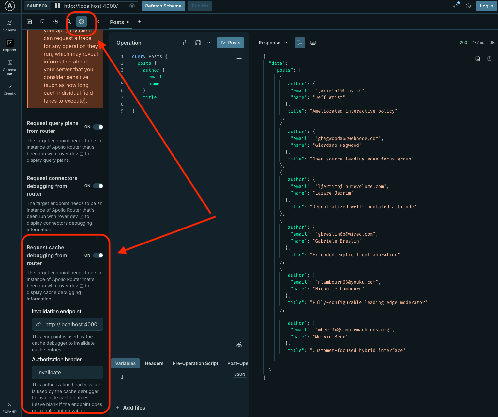
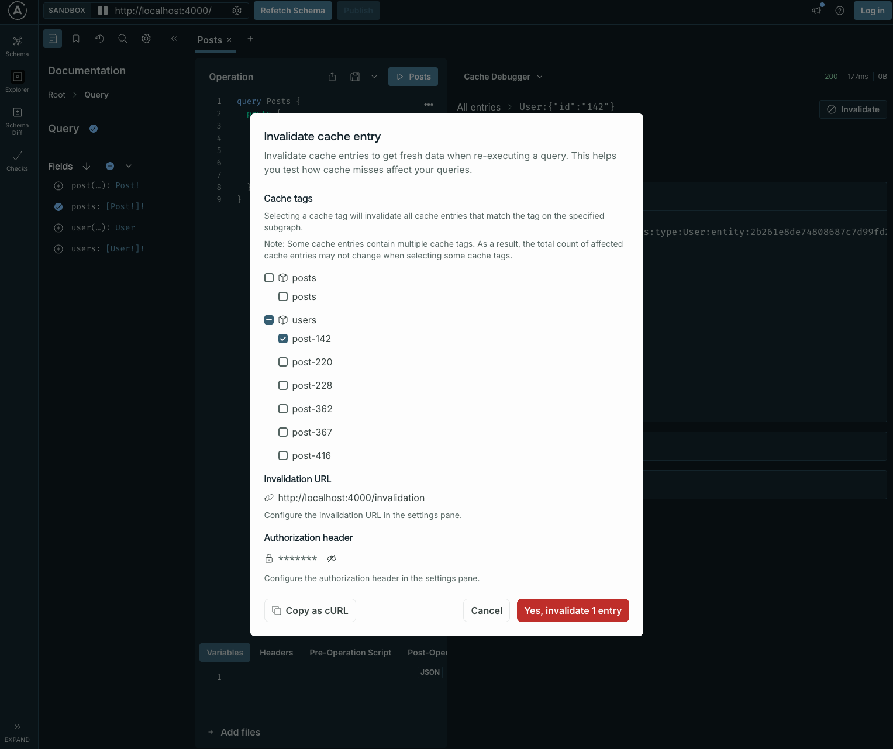

## Debug response caching

### Debugger

To help you debug this feature, Apollo includes a debugger in Apollo Sandbox. To use it, run the router with the following minimal configuration:

```yaml title="router.yaml"
supergraph:
  introspection: true
  path: /
  listen: 0.0.0.0:4000
homepage:
  enabled: false
sandbox: # Enabled sandbox
  enabled: true
# Enable response caching globally
preview_response_cache:
  enabled: true
  #highlight-start
  debug: true # Enable the ability to return debugging data for caching debugger. It's better to not enable this in production.
  #highlight-end
  invalidation:
    listen: 0.0.0.0:4000
    path: /invalidation
  subgraph:
    all:
      enabled: true
      # Configure Redis for all subgraphs
      redis:
        urls: ["redis://localhost:6379"]
      invalidation:
        enabled: true
        shared_key: ${env.INVALIDATION_SHARED_KEY} # Use environment variable INVALIDATION_SHARED_KEY
```

- Go to your router instance at its root URL to see Apollo Sandbox:


- In Sandbox, enable the cache debugger. Click the settings button in the top left and scroll to the bottom to enable it:



- In the right panel, open the dropdown at the top of the response data panel and select **Cache debugger**:


- A list of cached or potentially cached entries appears. This list helps you understand the cache status of your data: - If the `Created at` column contains data, the value has been stored in the cache. - If the `source` column is `products`, the data for this call was fetched from the `products` subgraph, even if it is now cached. - If the `Created at` column is empty, the entry hasn't been cached. This might happen for several reasons (see [Troubleshoot](#Troubleshoot)). In this example, the `accounts` subgraph entry isn't cached because it contains private, uncacheable data.


- If you click on one of these entries you can now have details about it. Like what was the value of `Cache-control` header returned by the subgraph, what response data is coming from this entry, the entity key and also the corresponding cache tags if you want to invalidate it.


- You can also go in request pane to have details about the request originally sent to the subgraph to get the data. You'll be able to see the query and variables.


- Finally if you want to generate a curl command to invalidate this specific data you can click on the invalidate button and it will open a modal to see what you want to invalidate.



## Troubleshoot

### Common reasons for cache misses

- If your subgraph doesn't return a `Cache-control` header or returns it containing the directive `no-store` we won't cache it.

- If your subgraph returns a `Cache-control` header containing the directive `private` it means it's private data and at the router level we have to know how to differentiate this private data between users. That's why we need to get a `private_id` to include in the primary cache key to not serve this data for other users but only for the current one. So if in your response cache configuration you didn't specify a context key where the router can get this `private_id` or if this context entry is empty it won't be able to cache it properly.

- If you disabled response caching in router's configuration for a specific subgraph or for all subgraphs.

- If your Redis is not available or timeout (cf [telemetry page](./telemetry) if you want to measure errors in metrics/traces/logs).

### Slow latencies

- Your Redis is slow or timeout is triggered you won't benefit from caching (cf [telemetry page](./telemetry) if you want to measure errors in metrics/traces/logs).
- If your TTLs are too low you'll probably don't have a lot of cache hits and then the latencies won't improve a lot.
- If you invalidate your data too often you won't benefit from caching
