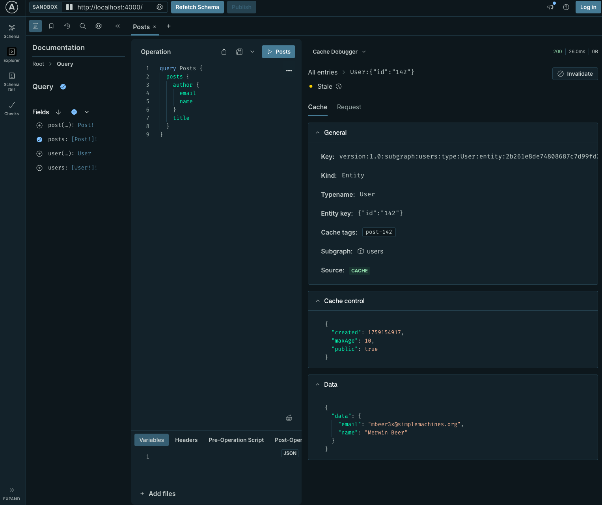

## Debugging

### Debugger

In order to make this feature easy to debug we developed a debugger for it and it's included in Apollo Sandbox if you run the router with this minimal configuration for example:

```yaml title="router.yaml"
homepage:
  enabled: false
sandbox: # Enabled sandbox
  enabled: true
# Enable response caching globally
preview_response_cache:
  enabled: true
  #highlight-start
  debug: true # Enable the ability to return debugging data for caching debugger. It's better to not enable this in production.
  #highlight-end
  invalidation:
    listen: 0.0.0.0:4000
    path: /invalidation
  subgraph:
    all:
      enabled: true
      # Configure Redis for all subgraphs
      redis:
        urls: ["redis://localhost:6379"]
      invalidation:
        enabled: true
        shared_key: ${env.INVALIDATION_SHARED_KEY} # Use environment variable INVALIDATION_SHARED_KEY
```

+ You'll be able to go to your router instance at root URL and see the Apollo Sandbox:


+ Make sure the cache debugger is also enabled in Sandbox, you'll have to click on the settings button (top left) and scroll down to the bottom to enable it:


+ On the right panel when you have the response data you can open the dropdown at the top of this panel to select `Cache debugger`:


+ You'll now have a list of cached or potential cached entries, in this screenshot we can see both entries coming from subgraph and from the cache. If you have data in `Created at` column that means the value has been put in cache, and if you have the source set to `products` for example that means for this specific call, even if it's now in cache it has been fetched from the `products` subgraph. If the `Created at` column is empty it means it hasn't been cached. The reason might be different (cf [troubleshoot](#Troubleshoot)) but in this case for subgraph `acccounts` it's because it contains private data that is uncacheable.


+ If you click on one of these entries you can now have details about it. Like what was the value of `Cache-control` header returned by the subgraph, what response data is coming from this entry, the entity key and also the corresponding cache tags if you want to invalidate it.



+ You can also go in request pane to have details about the request originally sent to the subgraph to get the data. You'll be able to see the query and variables.


+ Finally if you want to generate a curl command to invalidate this specific data you can click on the invalidate button and it will open a modal to see what you want to invalidate.


## Troubleshoot

### Common reasons for cache misses or passes

+ Private data and no private_id set or available
+ no cache-control header
+ cache-control header set to no-store
+ cache control maxage very low
+ too much invalidations happening on data

### Slow latencies

+ Redis config ?
+ Invalidation or TTL ?
