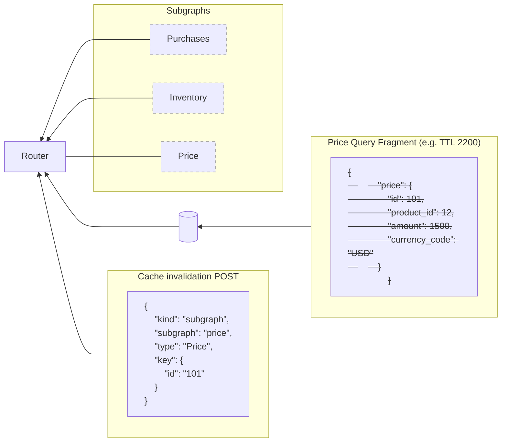

## Active invalidation

You can invalidate response cache entries with a [specifically formatted request](#invalidation-request-format) once you [configure your router](#configuration) appropriately. For example, if price data changes before a price entity's TTL expires, you can send an invalidation request.



[**Invalidation endpoint**](#invalidation-http-endpoint) - the router exposes an invalidation endpoint that can receive invalidation requests from any authorized service. For example a subgraph could use it to trigger invalidation events "out of band" from any requests received by the router or a platform operator could use it to invalidate cache entries in response to events which aren't directly related to a router.

One invalidation request can invalidate multiple cached entries at once. It can invalidate:
- All cached entries for a specific subgraph
- All cached entries for a specific type in a specific subgraph
- All cached entries marked with a [cache tag](#cache-tag) in specific subgraphs

### Configuration

You can configure entity cache invalidation globally with `preview_response_cache.invalidation`. You can also override the global setting for a subgraph with `preview_response_cache.subgraph.subgraphs.SUBGRAPH_NAME.invalidation`. The example below shows both:

```yaml title="router.yaml"
preview_response_cache:
  enabled: true

  # global invalidation configuration
  invalidation:
    # address of the invalidation endpoint
    # this should only be exposed to internal networks
    listen: "127.0.0.1:3000"
    path: "/invalidation"
    scan_count: 1000

  subgraph:
    all:
      enabled: true
      redis:
        urls: ["redis://..."]
      invalidation:
        enabled: true
        # base64 string that will be provided in the `Authorization` header value
        shared_key: "agm3ipv7egb78dmxzv0gr5q0t5l6qs37"
    subgraphs:
      products:
        # per subgraph invalidation configuration overrides global configuration
        invalidation:
          # whether invalidation is enabled for this subgraph
          enabled: true
          # override the shared key for this particular subgraph. If another key is provided, the invalidation requests for this subgraph's entities will not be executed
          shared_key: "czn5qvjylm231m90hu00hgsuayhyhgjv"
```

#### `listen`

The address and port to listen on for invalidation requests.

#### `path`

The path to listen on for invalidation requests.

#### `shared_key`

A string that will be used to authenticate invalidation requests.


### Invalidation

Consider we have this subgraph schema which is part of our federated schema:

```graphql title=accounts.graphql
extend schema
  @link(
    url: "https://specs.apollo.dev/federation/v2.12"
    import: ["@key", "@requires", "@external", "@cacheTag"]
  )

type Query {
  user(id: ID!): User @cacheTag(format: "profile")
  users: [User!]! @cacheTag(format: "profile") @cacheTag(format: "users-list")
  postsByUser(userId: ID!): [Post!]! @cacheTag(format: "posts-user-{$args.userId}")
}

type User @key(fields: "id") @cacheTag(format: "user-{$key.id}") {
  id: ID!
  name: String!
  email: String!
  posts: [Post!]! @external
}

type Post @key(fields: "id") {
  id: ID!
  content: String! @external
}

```

#### By subgraph

If you want to invalidate all cached data coming from subgraph `accounts`.

Invalidation requests for subgraphs are defined as JSON objects with the following format:

```json
[{
  "kind": "subgraph",
  "subgraph": "accounts"
}]
```

#### By entity type

Given the previous schema if you want to invalidate all cached data related to entity type `User` in subgraph `accounts`.

Invalidation requests for entity type are defined as JSON objects with the following format:

```json
[{
  "kind": "type",
  "subgraph": "accounts",
  "type": "User"
}]
```

#### By cache tag

Given the previous schema if you want to invalidate all cached data related to a cache tag `profile` in subgraph `accounts`.
For example imagine you have a profile page and you know you execute these 2 queries with root fields you can tag it with the cache tag `profile` and then make sure you invalidated all the data fetched for the profile page.

Invalidation requests for cache tag are defined as JSON objects with the following format:

```json
[{
  "kind": "cache_tag",
  "subgraphs": ["accounts"],
  "cache_tag": "profile"
}]
```

You could also potentially add a dynamic cache tag (specificied like this `@cacheTag(format: "user-{$key.id}")`) containing the entity key on entity type `User` and decide to invalidate the cached data containing `User` data with id `42`:

```json
[{
  "kind": "cache_tag",
  "subgraphs": ["accounts"],
  "cache_tag": "user-42"
}]
```

Invalidate a root field with parameters using dynamic cache tag. To set a cache tag on a root fields taking parameters we can interpolate parameters in the cacheTag format using `$args`, for example in our subgraph schema on root field `postsByUser` we set `@cacheTag(format: "posts-user-{$args.userId}")` which would become `posts-user-42` if we pass `42` as `userId` parameter. Example of payload request:

```json
[{
  "kind": "cache_tag",
  "subgraphs": ["accounts"],
  "cache_tag": "posts-user-42"
}]
```

<Note>
    There are existing limitations for `@cacheTag` directive in your schemas:
    + You can only set a `@cacheTag` directive on either root fields query or an entity. If you try to add this directive on an Interface or another Type that doesn't already contain `@key` directive it won't work.
    + When you set the `@cacheTag` directive on root fields it will allow for `{$args.XXX}` interpolation in the format, args is the map containing all the arguments on the corresponding root field. And for an entity it will be `{$key.XXX}`, containing a map of all entity keys for the corresponding type. Note that is you have `@key(fields: "id") @key(fields: "id name")` you'll only be able to have access to `{$key.id}` and not `name` because you can only use fields using in every `@key` directives.
    + For more details please check our [FAQ](./faq.mdx)
</Note>

If you want to set your cache tags programmatically because it doesn't depend neither on the arguments for root fields nor entity key for an entity you can create your own cache tags directly from your subgraph and set it in response extensions.

Example of response payload if you want to set cache tags for different entities returned by subgraph:

```json
{
   "data": {"_entities": [
       {"__typename": "User", "id": 42, ...},
       {"__typename": "User", "id": 1023, ...},
       {"__typename": "User", "id": 7, ...},
   ]},
   "extensions": {"apolloEntityCacheTags": [
       ["products", "product-42"],
       ["products", "product-1023"],
       ["products", "product-7"]
   ]}
}
```

Example of response payload if you want to set cache tags for root fields returned by subgraph:

```json
{
   "data": {
       "someField": {...}
   },
   "extensions": {"apolloEntityCacheTags": ["homepage", "user-9001-homepage"]}
}
```


#### Invalidation HTTP endpoint

The invalidation endpoint exposed by the router expects to receive an array of invalidation requests and will process them in sequence. For authorization, you must provide a shared key in the request header. For example, with the previous configuration you should send the following request:

```
curl --request POST \
	--header 'authorization: agm3ipv7egb78dmxzv0gr5q0t5l6qs37' \
	--header 'content-type: application/json' \
	--url http://localhost:4000/invalidation \
	--data '[{"kind":"type","subgraph":"invalidation-subgraph-type-accounts","type":"User"}]'
```

```
POST http://127.0.0.1:3000/invalidation
Authorization: agm3ipv7egb78dmxzv0gr5q0t5l6qs37
Content-Length:96
Content-Type:application/json
Accept: application/json

[{
    "kind": "type",
    "subgraph": "invalidation-subgraph-type-accounts",
    "type": "User"
}]
```

The router would send the following response:

```
HTTP/1.1 200 OK
Content-Type: application/json

{
  "count": 300
}
```

The `count` field indicates the number of keys that were removed from Redis.
