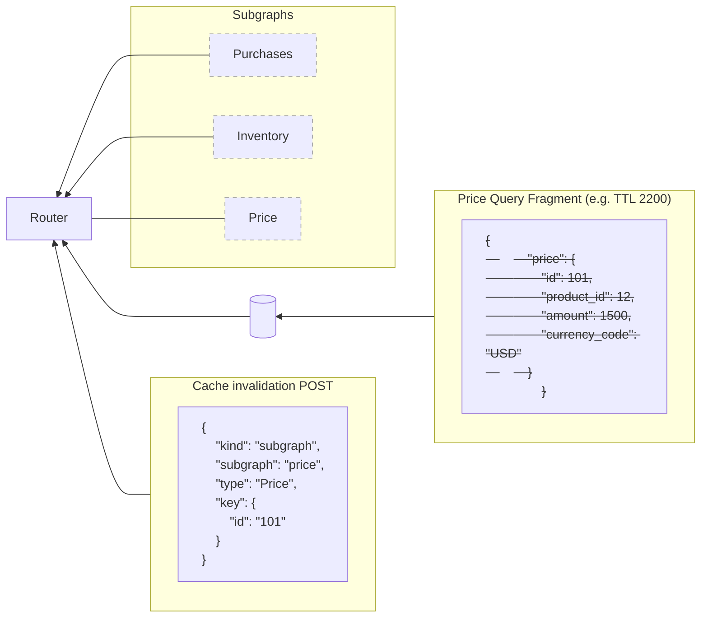

Cache invalidation ensures that cached data stays fresh. The router supports two approaches: passive TTL-based invalidation and active invalidation when you know data has changed.

## Passive vs. active invalidation

- **Passive (TTL-based)**: Data automatically expires after its configured TTL. This works well for data that changes predictably or where slightly stale data is acceptable.
- **Active (invalidation)**: You explicitly tell the router to remove cached data when you know it has changed. This works well for data that changes unpredictably or where stale data is unacceptable.

Combine both approaches by setting reasonable TTLs as a safety net and actively invalidating when you know data has changed.

## Time to live (TTL)

Time to live (TTL) determines how long the router keeps cached origin responses before fetching fresh data.

### How TTLs work

The router caches origin query responses—specifically, root query fields as complete units and entity representations as independent reusable units. To determine how long to cache each response, the router reads the [`Cache-Control` header](https://developer.mozilla.org/en-US/docs/Web/HTTP/Headers/Cache-Control) that the origin returns. The router uses the `max-age` value from this header as the TTL for that cached data.

The `Cache-Control` header itself is derived from `@cacheControl` directives in your origin schema. When an origin response contains multiple entity representations, the origin generates a `Cache-Control` header with the minimum TTL value across all representations in that response. (You can use the [cache debugger](/router/performance/caching/response-caching/observability#cache-debugger) to inspect these headers.)

When responding to client queries, the router:
1. Calculates the overall response TTL by taking the minimum TTL from all cached origin responses included in the client response
2. Generates a `Cache-Control` header for the client response reflecting this minimum TTL
3. Returns cached data as long as the TTL hasn't expired

This ensures that client responses never claim to be fresher than their least-fresh component.

### Configure default TTL

Set a default TTL for all sources using response caching. Define this in per-subgraph configuration or inherit it from global configuration. The router uses this default TTL if the source returns a `Cache-Control` header without a `max-age` directive:

```yaml title="router.yaml"
response_cache:
  enabled: true
  subgraph:
    all:
      enabled: true
      ttl: 60s  # Default TTL for all subgraphs
      redis:
        urls: ["redis://localhost:6379"]
```

### Control TTL with `@cacheControl`

For GraphQL origins that support the `@cacheControl` directive (such as Apollo Server), you can set field-level and type-level TTLs directly in your schema. The origin translates these directives into `Cache-Control` headers in its HTTP responses. The router reads those `Cache-Control` headers to determine TTLs—the directives themselves don't affect what the router caches, only the headers the source sends back.

#### Add the directive to your schema

First, add the `@cacheControl` directive definition to your subgraph schema:

```graphql
enum CacheControlScope {
  PUBLIC
  PRIVATE
}

directive @cacheControl(
  maxAge: Int
  scope: CacheControlScope
  inheritMaxAge: Boolean
) on FIELD_DEFINITION | OBJECT | INTERFACE | UNION
```

<Note>

Apollo Server recognizes this directive automatically. For other GraphQL servers, consult your server's documentation to determine if it supports `@cacheControl` or an equivalent mechanism for setting `Cache-Control` headers.

</Note>

#### Field-level TTLs

Apply `@cacheControl` to individual fields to set specific TTLs:

```graphql
type Post {
  id: ID!
  title: String
  author: Author
  votes: Int @cacheControl(maxAge: 30)
  readByCurrentUser: Boolean! @cacheControl(maxAge: 10, scope: PRIVATE)
}
```

These `@cacheControl` directives tell the GraphQL origin to include `Cache-Control` headers in its HTTP responses—that's all they do. The router reads those `Cache-Control` headers to determine TTLs.

When a query requests both the `votes` field (30-second TTL) and the `readByCurrentUser` field (10-second TTL), the origin returns a `Cache-Control` header with `max-age=10` (the minimum). The router then caches the data from that response for 10 seconds.

#### Type-level TTLs

Apply `@cacheControl` to types to set a default TTL for all fields returning that type:

```graphql
type Post @cacheControl(maxAge: 240) {
  id: Int!
  title: String
  author: Author
  votes: Int
}

type Comment {
  post: Post!  # Cached for up to 240 seconds
  body: String!
}
```

The `@cacheControl` directive on the `Post` type tells the GraphQL origin to include `Cache-Control: max-age=240` in responses that return `Post` data. When the router queries for a `Comment` that includes a `post` field, the origin sends back that header, and the router caches the data for up to 240 seconds.

Field-level settings override type-level settings:

```graphql
type Comment {
  post: Post! @cacheControl(maxAge: 120)  # Overrides the 240s type-level setting
  body: String!
}
```

Here, the origin sends `Cache-Control: max-age=120` instead of 240 when this field is queried.

#### Scope: PUBLIC vs PRIVATE

The `scope` argument controls whether cached data can be shared across users:

- `PUBLIC` (default): The data is identical for all users and can be shared in the cache
- `PRIVATE`: The data is user-specific and requires a `private_id` configuration to cache per-user

```graphql
type User {
  id: ID!
  name: String @cacheControl(maxAge: 3600)  # Public: same for all users
  cart: [Product!]! @cacheControl(maxAge: 60, scope: PRIVATE)  # Private: per-user
}
```

See the [Customization](/router/performance/caching/response-caching/customization#private-data-caching) page for details on caching private data.

#### Learn more about TTL

For complete details on cache control configuration in Apollo Server, including:
- Dynamic TTL setting in resolvers
- Default `maxAge` behavior for root fields vs. other fields
- Recommendations for TTL configuration

See the [Apollo Server caching documentation](https://www.apollographql.com/docs/apollo-server/performance/caching).

## Active invalidation

Active invalidation enables you to remove specific cached data before its TTL expires. This is useful when you know data has changed and want to ensure clients receive fresh data immediately.

Use active invalidation when:
- Changes happen infrequently and unpredictably (product updates, price changes)
- You need immediate cache updates when data changes
- The cost of serving stale data is high

### Configure invalidation

Configure response cache invalidation globally with `response_cache.invalidation`. You can also override the global setting for a subgraph with `response_cache.subgraph.subgraphs.SUBGRAPH_NAME.invalidation`.

<Note>

Before sending invalidation requests, set the `INVALIDATION_SHARED_KEY` environment variable (or store it in your secrets management system). This shared key authenticates invalidation requests and prevents unauthorized cache clearing.

</Note>

The following example shows both global and per-subgraph invalidation configuration:

```yaml title="router.yaml"
response_cache:
  enabled: true

  # global invalidation configuration
  invalidation:
    # address of the invalidation endpoint
    # this should only be exposed to internal networks
    listen: "127.0.0.1:3000"
    path: "/invalidation"

  subgraph:
    all:
      enabled: true
      redis:
        urls: ["redis://..."]
      invalidation:
        enabled: true
        # base64 string that will be provided in the `Authorization` header value
        shared_key: ${env.INVALIDATION_SHARED_KEY}
    subgraphs:
      products:
        # per subgraph invalidation configuration overrides global configuration
        invalidation:
          # whether invalidation is enabled for this subgraph
          enabled: true
          # override the shared key for this particular subgraph. If another key is provided, the invalidation requests for this subgraph's entities will not be executed
          shared_key: ${env.INVALIDATION_SHARED_KEY_PRODUCTS}
```

#### Configuration options

##### `listen`

The address and port to listen on for invalidation requests. Only expose this endpoint to internal networks.

##### `path`

The path to listen on for invalidation requests.

##### `shared_key`

A string that is used to authenticate invalidation requests. Store this securely and provide it in the `Authorization` header when making invalidation requests.

### Send invalidation requests

The invalidation endpoint accepts HTTP POST requests containing a JSON payload with an array of invalidation operations. For example, if price data changes before a price entity's TTL expires, you can send an invalidation request:



One invalidation request can invalidate multiple cached entries at the same time. It can invalidate:
- All cached entries for a specific subgraph
- All cached entries for a specific type in a specific subgraph
- All cached entries marked with a cache tag in specific subgraphs

### Invalidation methods

Consider the following subgraph schema, which is part of a federated schema:

```graphql title=accounts.graphql
extend schema
  @link(
    url: "https://specs.apollo.dev/federation/v2.12"
    import: ["@key", "@requires", "@external", "@cacheTag"]
  )

type Query {
  user(id: ID!): User @cacheTag(format: "profile")
  users: [User!]! @cacheTag(format: "profile") @cacheTag(format: "users-list")
  postsByUser(userId: ID!): [Post!]! @cacheTag(format: "posts-user-{$args.userId}")
}

type User @key(fields: "id") @cacheTag(format: "user-{$key.id}") {
  id: ID!
  name: String!
  email: String!
  posts: [Post!]! @external
}

type Post @key(fields: "id") {
  id: ID!
  content: String! @external
}

```

#### By subgraph

To invalidate all cached data from the `accounts` subgraph, send a request with the following format:

```json
[{
  "kind": "subgraph",
  "subgraph": "accounts"
}]
```

#### By entity type

To invalidate all cached data for entity type `User` in the `accounts` subgraph, send a JSON payload in this format:

```json
[{
  "kind": "type",
  "subgraph": "accounts",
  "type": "User"
}]
```

#### By cache tag

To invalidate all cached data with a specific cache tag `profile` in the `accounts` subgraph, use cache tags. For example, if you have a profile page that executes multiple queries, tag them with the `profile` cache tag. You can then invalidate all data fetched for the profile page with a single request.

Send a JSON payload in this format:

```json
[{
  "kind": "cache_tag",
  "subgraphs": ["accounts"],
  "cache_tag": "profile"
}]
```

You can also add a dynamic cache tag containing the entity key to the `User` entity type, specified like this: `@cacheTag(format: "user-{$key.id}")`. This enables you to invalidate cached data for a specific `User`, such as one with an ID of `42`:

```json
[{
  "kind": "cache_tag",
  "subgraphs": ["accounts"],
  "cache_tag": "user-42"
}]
```

Invalidate root fields with parameters using dynamic cache tags. Set a cache tag on root fields with parameters by interpolating parameters in the cache tag format using `$args`. For example, on the `postsByUser` root field, set `@cacheTag(format: "posts-user-{$args.userId}")`, which becomes `posts-user-42` when you pass `42` as the `userId` parameter:

```json
[{
  "kind": "cache_tag",
  "subgraphs": ["accounts"],
  "cache_tag": "posts-user-42"
}]
```

<Note>

The `@cacheTag` directive has the following constraints regarding its application:

- Only applies to root query fields or resolvable entities (types marked with `@key` directive where `resolvable` is unset or `true`)
- When set on a root field, the `format` string allows `{$args.XXX}` interpolation, where `args` is a map of all arguments for that root field
- When set on an entity, the format is `{$key.XXX}`, where `key` is a map of all entity keys for that type
  - If you have multiple `@key` directives (e.g., `@key(fields: "id")` and `@key(fields: "id name")`), you can only access fields present in _every_ `@key` directive (in this case, only `{$key.id}`)
- The `format` must always generate a valid string (not an object)

❌ Invalid example (field not in all keys):
```graphql
type Product
  @key(fields: "upc") @key(fields: "name")
  @cacheTag(format: "product-{$key.name}") {
# Error at composition: name isn't in all @key directives
  upc: String!
  name: String!
  price: Int
}
```

✅ Valid example (field in all keys):
```graphql
type Product
  @key(fields: "upc") @key(fields: "upc isbn")
  @cacheTag(format: "product-{$key.upc}") {
  upc: String!
  isbn: String!
  name: String!
  price: Int
}
```

❌ Invalid example (format generates an object):
```graphql
type Product
  @key(fields: "upc country { name }")
  @cacheTag(format: "product-upc-{$key.upc}-country-{$key.country}") { # Error: country is an object
  upc: String!
  name: String!
  price: Int
  country: Country!
}
```

✅ Valid example (format generates a string):
```graphql
type Product
  @key(fields: "upc country { name }")
  @cacheTag(format: "product-upc-{$key.upc}-country-{$key.country.name}") {
  upc: String!
  name: String!
  price: Int
  country: Country!
}

type Country {
  name: String!
}
```

</Note>

If you need to set cache tags programmatically (for example, if the tag depends on neither root field arguments nor entity keys), create the cache tags in your subgraph and set them in the response extensions.

For cache tags on _entities_, set `apolloEntityCacheTags` in `extensions`. The following example shows a response payload that sets cache tags for entities returned by a subgraph:

```json
{
   "data": {"_entities": [
       {"__typename": "User", "id": 42, ...},
       {"__typename": "User", "id": 1023, ...},
       {"__typename": "User", "id": 7, ...},
   ]},
   "extensions": {"apolloEntityCacheTags": [
       ["products", "product-42"],
       ["products", "product-1023"],
       ["products", "product-7"]
   ]}
}
```

For cache tags on _root fields_, set `apolloCacheTags` in `extensions`. The following example shows a response payload that sets cache tags for root fields returned by a subgraph:

```json
{
   "data": {
       "someField": {...}
   },
   "extensions": {"apolloCacheTags": ["homepage", "user-9001-homepage"]}
}
```

### Invalidation HTTP endpoint

The invalidation endpoint exposed by the router expects to receive an array of invalidation requests and processes them in sequence. For authorization, you must provide a shared key in the request header. For example, with the previous configuration, send the following request:

```
curl --request POST \
	--header 'authorization: ${INVALIDATION_SHARED_KEY}' \
	--header 'content-type: application/json' \
	--url http://localhost:4000/invalidation \
	--data '[{"kind":"type","subgraph":"invalidation-subgraph-type-accounts","type":"User"}]'
```

```
POST http://127.0.0.1:3000/invalidation
Authorization: ${INVALIDATION_SHARED_KEY}
Content-Length:96
Content-Type:application/json
Accept: application/json

[{
    "kind": "type",
    "subgraph": "invalidation-subgraph-type-accounts",
    "type": "User"
}]
```

The router would send the following response:

```
HTTP/1.1 201 OK
Content-Type: application/json

{
  "count": 300
}
```

The `count` field indicates the number of keys that were removed from Redis.

## Combining both approaches

You can use both `@cacheControl` (for TTL-based passive invalidation) and `@cacheTag` (for active invalidation) together on the same types and fields. This gives you the flexibility to set reasonable TTLs as a safety net while also having the ability to invalidate data immediately when needed.

Here's a simple example combining both directives:

```graphql
extend schema
  @link(
    url: "https://specs.apollo.dev/federation/v2.12"
    import: ["@key", "@cacheTag"]
  )

directive @cacheControl(
  maxAge: Int
  scope: CacheControlScope
) on FIELD_DEFINITION | OBJECT | INTERFACE | UNION

type User @key(fields: "id")
         @cacheControl(maxAge: 60)
         @cacheTag(format: "user-{$key.id}") {
  id: ID!
  name: String!
  email: String!
}
```

In this example:
- The `@cacheControl(maxAge: 60)` directive sets a 60-second TTL—data automatically expires after one minute
- The `@cacheTag(format: "user-{$key.id}")` directive enables immediate invalidation when user data changes

This combined approach means you get automatic passive invalidation after 60 seconds, but you can also actively invalidate specific users (like `user-42`) the moment their data changes in your backend.
