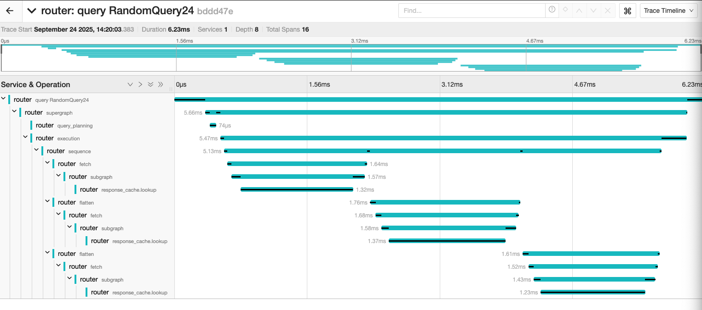
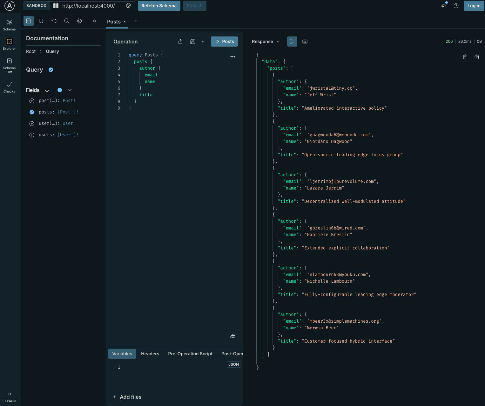
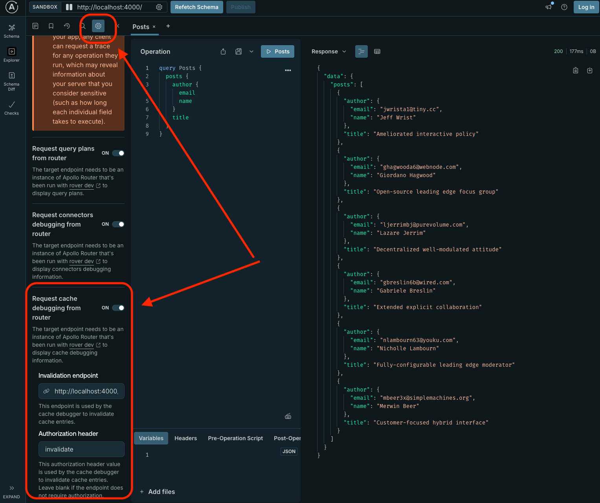
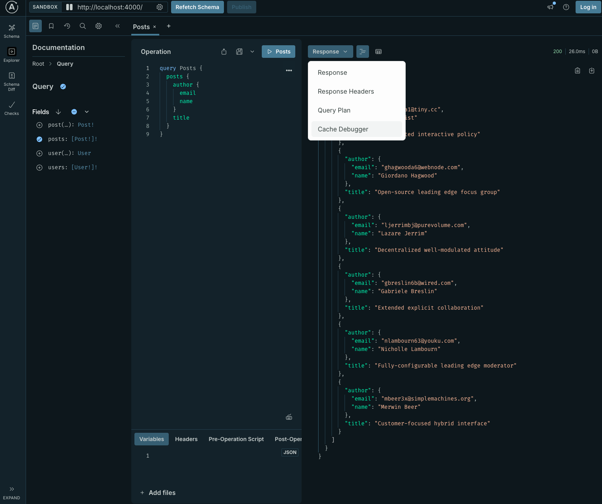
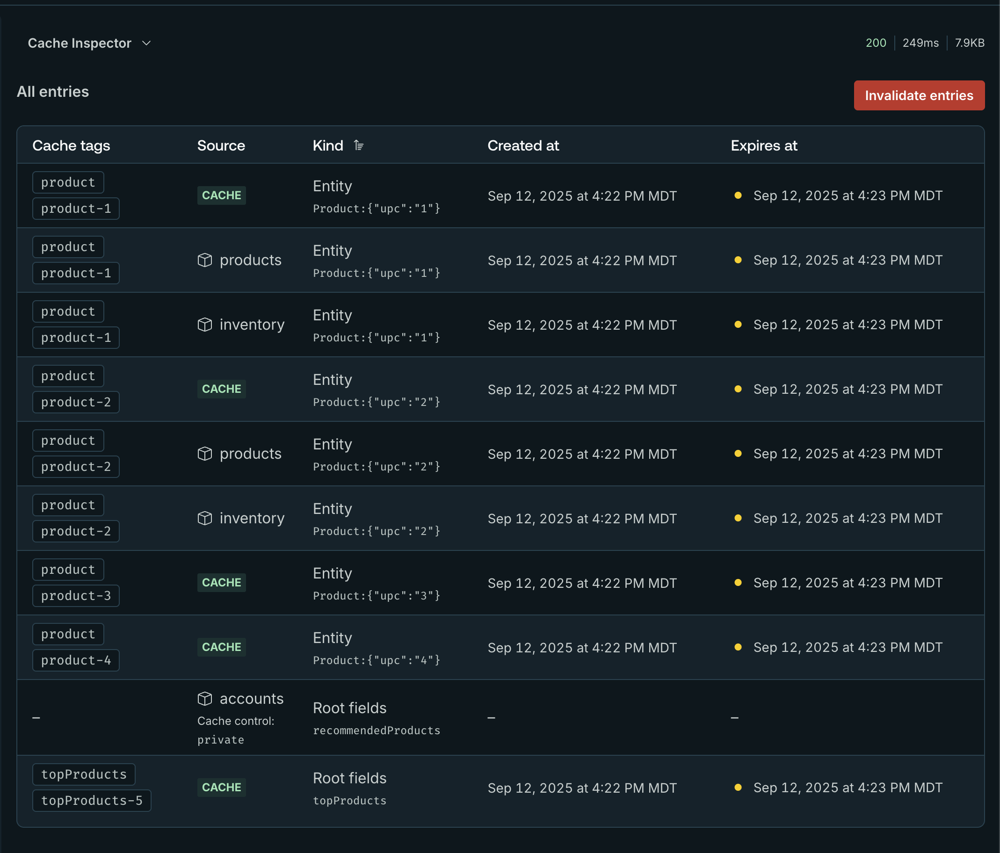
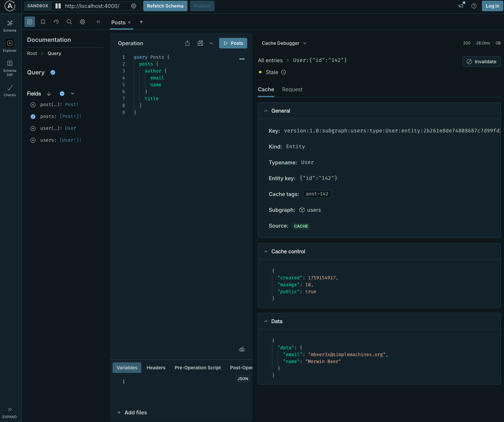
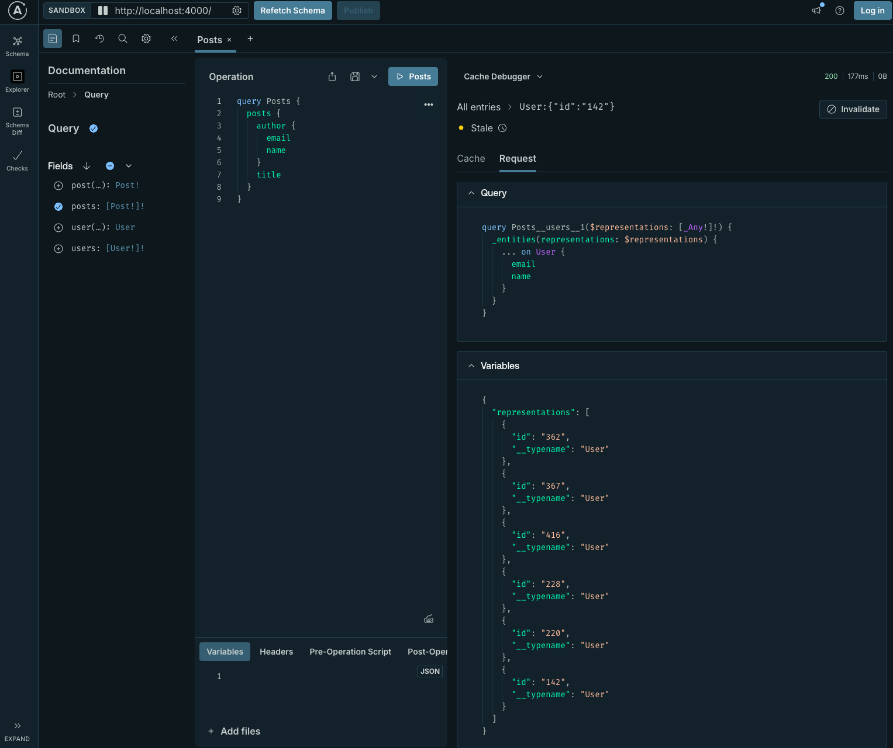
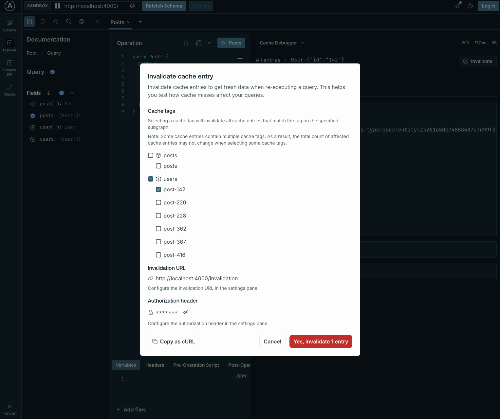

Response caching provides comprehensive observability through metrics, traces, and logs. You can also use the cache debugger in Apollo Sandbox to understand cache behavior during development.

## Metrics

### Instruments

The router provides the `telemetry.instrumentation.instruments.cache` instrument to enable cache metrics:

```yaml title="router.yaml"
telemetry:
  instrumentation:
    instruments:
      cache: # Cache instruments configuration
        apollo.router.operations.response.cache: # A counter which counts the number of cache hit and miss for subgraph requests
          attributes:
            graphql.type.name: true # Include the entity type name. default: false
            subgraph.name: # Custom attributes to include the subgraph name in the metric
              subgraph_name: true
            supergraph.operation.name: # Add custom attribute to display the supergraph operation name
              supergraph_operation_name: string
            # You can add more custom attributes using subgraph selectors
```

You can use custom instruments to create metrics for the subgraph service. The following example creates a custom instrument to generate a histogram that measures the subgraph request duration when there's at least one cache hit for the "inventory" subgraph:

```yaml title="router.yaml"
telemetry:
  instrumentation:
    instruments:
      subgraph:
        only_cache_hit_on_subgraph_inventory:
          type: histogram
          value: duration
          unit: hit
          description: histogram of subgraph request duration when we have cache hit on subgraph inventory
          condition:
            all:
            - eq:
              - subgraph_name: true # subgraph selector
              - inventory
            - gt: # If the number of cache hit is greater than 0
              - response_cache: hit
              # entity_type: Product # Here you could also only check for the entity type Product, it's `all` by default if we don't specify this config.
              - 0

```

### Fetch/insert

| Name | Description | Unit |
| --- | --- | --- |
| `apollo.router.operations.response_cache.fetch.error` | Errors when fetching data from cache | `{error}` |
| `apollo.router.operations.response_cache.fetch` | Time to fetch data from cache | `s` |
| `apollo.router.operations.response_cache.fetch.entity` | Number of entities per subgraph fetch node | `{entity}` |
| `apollo.router.operations.response_cache.insert.error` | Errors when inserting data in cache | `{error}` |
| `apollo.router.operations.response_cache.insert` | Time to insert new data in cache | `s` |

### Invalidation

| Name | Description | Unit |
| --- | --- | --- |
| `apollo.router.operations.response_cache.invalidation.event` | Response cache received a batch of invalidation requests | `{request}` |
| `apollo.router.operations.response_cache.invalidation.error` | Errors when invalidating data in cache | `{error}` |
| `apollo.router.operations.response_cache.invalidation.entry` | Response cache counter for invalidated entries | `{entry}` |
| `apollo.router.operations.response_cache.invalidation.request.entry` | Number of invalidated entries per invalidation request. | `{entry}` |
| `apollo.router.operations.response_cache.invalidation.duration` | Duration of the invalidation event execution, in seconds. | `s` |

### Internal
| Name | Description | Unit |
| --- | --- | --- |
| `apollo.router.response_cache.reconnection` | Number of reconnections to the cache storage | `{retry}` |
| `apollo.router.response_cache.private_queries.lru.size` | LRU cache size for private queries fetched | `{query}` |


### Redis
The latency metrics are marked as experimental because Apollo might change them if there is an upstream change in one of our dependencies.

#### Connection and performance metrics
  - `apollo.router.cache.redis.connections`: Number of active Redis connections
  - `apollo.router.cache.redis.command_queue_length`: Commands waiting to be sent to Redis
  - `apollo.router.cache.redis.commands_executed`: Total number of Redis commands executed
  - `apollo.router.cache.redis.redelivery_count`: Commands retried due to connection issues
  - `apollo.router.cache.redis.errors`: Redis errors by type (auth, timeout, io, etc.)

#### Experimental Redis performance metrics
  - `experimental.apollo.router.cache.redis.network_latency_avg`: Average network latency to Redis
  - `experimental.apollo.router.cache.redis.latency_avg`: Average Redis command execution time
  - `experimental.apollo.router.cache.redis.request_size_avg`: Average request payload size
  - `experimental.apollo.router.cache.redis.response_size_avg`: Average response payload size

## Traces

If you're looking at a trace when you have cache hits it looks like this:



The `response_cache.lookup` span shows how much time was spent fetching data from the cache.

The `response_cache.store` span shows how much time was spent inserting data into the cache.

For invalidation, look for the `invalidation_endpoint` span.

Available attributes on `response_cache.lookup`:
- `kind`: `root` or `entity`. Indicates whether the cache lookup is for a root field or an entity.
- `subgraph.name`: The subgraph name
- `graphql.type`: The type (or parent type for root fields)
- `debug`: Boolean indicating whether debug mode is enabled
- `private`: Boolean indicating whether the data is private
- `contains_private_id`: Boolean indicating whether a private ID was found in the context
- `cache.key`: The primary cache key
- `cache.status`: `hit`|`partial_hit`|`miss`


Available attributes on `response_cache.store`:
- `kind`: Either `root` or `entity` indicating whether data is for root fields or an entity
- `subgraph.name`: The subgraph name
- `ttl`: The TTL of this cache entry
- `batch.size`: The size of the batch when inserting entities (entities are often batched)

## Logs

The router supports a [`response_cache` selector](/router/configuration/telemetry/instrumentation/selectors#subgraph) in telemetry for the subgraph service. The selector returns either the number of cache hits or misses by an entity for a subgraph request or the cache status (`hit`|`partial_hit`|`miss`) for a subgraph request.

For example, display a log containing all subgraph response data that's not cached:

```yaml title="router.yaml"
telemetry:
  instrumentation:
    events:
      subgraph:
        response:
          level: info
          condition:
            all:
              - eq: # Only for subgraph posts
                  - subgraph_name: true
                  - static: posts
              - eq: # If there's no cache hit in this subgraph response
                  - response_cache: hit
                  - 0
```

## Selectors

A [_selector_](/router/configuration/telemetry/instrumentation/selectors) extracts data from the GraphOS Router's request lifecycle (pipeline) and attaches it to telemetry, such as spans, metrics, and logs. For response caching, the subgraph service provides selectors that you can use to create custom metrics or add custom attributes to your telemetry data.

| Selector                    | Defaultable | Values           | Description                                                                    |
|-----------------------------|-------------|------------------|--------------------------------------------------------------------------------|
| `response_cache`            | No          | `hit` \| `miss`    | Returns the number of cache hit or miss for this subgraph request              |
| `response_cache_status`    | No          | `hit` \| `partial_hit`\| `miss`\| `status`    | Indicates the cache status for the subgraph request: `hit` (all data from cache), `miss` (all data from subgraph), or `partial_hit` (some entities from cache).   |
| `response_cache_control`    | No          | `max_age` \| `scope`\| `no_store`    | Provides data from the computed `Cache-Control` header, such as `max_age`, `scope` (`public`/`private`), or `no_store` status.  |

### Example

- To create a metric that tracks the computed `max-age` (TTL) at the subgraph level, create a custom instrument using the `response_cache_control` selector. For an example, see the `subgraph.response.cache_control.max_age` instrument in the following configuration.

- To determine if a subgraph request was served from the cache, use the `response_cache_status` selector. Setting its value to `status` adds an attribute to the standard `http.client.request.duration` instrument that indicates a `hit`, `partial_hit`, or `miss`.

```yaml title="router.yaml"
telemetry:
  exporters:
    metrics:
      common:
        service_name: apollo-router
        views:
          - name: subgraph.response.cache_control.max_age # This is to make sure it will use the correct buckets for the max age histogram
            aggregation:
              histogram:
                buckets: # Override default buckets configured for this histogram
                - 10
                - 100
                - 1000
                - 10000
                - 100000
  #highlight-start
  instrumentation:
    instruments:
      subgraph:
        http.client.request.duration:
          attributes:
            subgraph.name: true
            response.cache.status: # Will be either `hit`, `partial_hit` or `miss`
              response_cache_status: status
        subgraph.response.cache_control.max_age:
          value:
            response_cache_control: max_age
          type: histogram
          unit: s # Seconds
          description: A histogram of the computed TTL for a subgraph response
  #highlight-end
```


## Cache debugger

The cache debugger in Apollo Sandbox helps you understand cache behavior during development.

To use it, run the router with the following minimal configuration:

```yaml title="router.yaml"
supergraph:
  introspection: true
  path: /
  listen: 0.0.0.0:4000
homepage:
  enabled: false
sandbox: # Enabled sandbox
  enabled: true
# Enable response caching globally
preview_response_cache:
  enabled: true
  #highlight-start
  debug: true # Enable debugging data for the cache debugger. Don't enable this in production.
  #highlight-end
  invalidation:
    listen: 0.0.0.0:4000
    path: /invalidation
  subgraph:
    all:
      enabled: true
      # Configure Redis for all subgraphs
      redis:
        urls: ["redis://localhost:6379"]
      invalidation:
        enabled: true
        shared_key: ${env.INVALIDATION_SHARED_KEY} # Use environment variable INVALIDATION_SHARED_KEY
```

- Go to your router instance at its root URL to see Apollo Sandbox:



- In Sandbox, enable the cache debugger. Click the settings button in the top left and scroll to the bottom to enable it:



- In the right panel, open the dropdown at the top of the response data panel and select **Cache debugger**:



- A list of cached or potentially cached entries appears. This list helps you understand the cache status of your data:
  - If the `Created at` column contains data, the value has been stored in the cache
  - If the `source` column is `products`, the data for this call was fetched from the `products` subgraph, even if it is now cached
  - If the `Created at` column is empty, the entry hasn't been cached. This might happen for multiple reasons (see [Troubleshoot](#troubleshoot)). In this example, the `accounts` subgraph entry isn't cached because it contains private, uncacheable data.



- Click any entry to see details about it, including:
  - The `Cache-Control` header value returned by the subgraph
  - Response data from this entry
  - The entity key
  - Corresponding cache tags for invalidation



- View the request pane for details about the original request sent to the subgraph to get the data, including the query and variables.



- Generate a `curl` command to invalidate specific data by clicking the **Invalidate** button, which opens a modal showing what you want to invalidate.



## Troubleshoot

### Common reasons for cache misses

- Your origin doesn't return a `Cache-Control` header or returns it with the `no-store` directive.

- Your origin returns an <code>Age</code> header with a value greater than the <code>max-age</code> in the <code>Cache-Control</code> header, or the default TTL from your router configuration if <code>max-age</code> isn't set.

- Your origin returns a `Cache-Control` header with the `private` directive, but you haven't configured a `private_id` in your response cache configuration. Private data requires a `private_id` to differentiate cache entries between users.

- You disabled response caching in the router configuration for a specific subgraph or all subgraphs.

- Redis is unavailable or times out. Use the [metrics](#metrics), [traces](#traces), and [logs](#logs) described earlier in this page to measure errors.

### Slow latencies

- Redis is slow or times out. Use the [metrics](#metrics), [traces](#traces), and [logs](#logs) described earlier in this page to measure errors.
- TTLs are too low, resulting in fewer cache hits and minimal latency improvements.
- Data is invalidated too frequently, reducing caching benefits.
