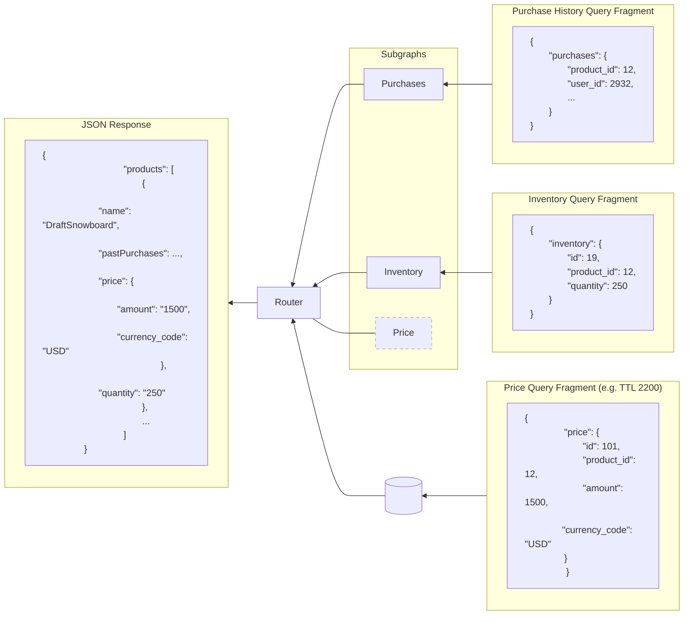

<PlanRequired plans={["Free", "Developer", "Standard", "Enterprise"]}>

Rate limits apply on the Free plan.
Performance pricing applies on Developer and Standard plans.
Developer and Standard plans require Router v2.6.0 or later.

</PlanRequired>

Learn how GraphOS Router can cache subgraph query responses using Redis to improve your query latency for entities in the supergraph.

## Overview

An entity gets its fields from one or more subgraphs. To respond to a client request for an entity, GraphOS Router must make multiple subgraph requests. Different clients requesting the same entity can make redundant, identical subgraph requests.

Response caching enables the router to respond to identical subgraph queries with cached subgraph responses. The router uses Redis to cache data from subgraph query responses. Because cached data is keyed per subgraph and entity, different clients making the same client query (with the same or different query arguments) hit the same cache entries of subgraph response data.

### Goals

The main goal of response caching is to reduce the load on your subgraphs and improve overall latencies for client requests. The router provides a GraphQL-aware cache, which offers advantages over a generic CDN. The router caches at the entity/query level, which is GraphQL-native and reusable across users and requests.

### The GraphQL caching challenge

GraphQL responses present unique caching challenges that traditional HTTP caching doesn't address well. A typical GraphQL response combines data from multiple sources with varying freshness requirements and visibility constraints:

- **Mixed TTLs**: A single response might include product prices (change weekly), inventory (change constantly), and user reviews (change occasionally). Traditional response caching forces you to use the shortest time to live (TTL)—the duration data remains valid in cache—for the entire response.
- **Personalized and public data**: Responses often mix public data (product details) with private data (user's cart, viewing history). This makes full-response caching either impossible or requires separate cache entries per user.
- **High duplication**: Different queries requesting similar entities result in duplicate cached data. For example, a product list query and a product detail query both cache the same product name and price.

Response caching solves these challenges by caching complete subgraph responses with flexible cache control. Different subgraph responses can have different TTLs and visibility settings, and you can actively invalidate cached data when you know it has changed.

### Benefits of response caching

Compared to caching entire client responses, response caching in the router supports finer control over:
- the time to live (TTL) and programmatic invalidation of cached data
- the amount of data being cached
- sharing cached data across users while maintaining privacy for personalized data

For example, consider the `Products` and `Inventory` subgraphs from the [Entities guide](/federation/entities):

<CodeColumns>

```graphql title="Products subgraph" disableCopy=true
type Product @key(fields: "id") {
  id: ID!
  name: String!
  price: Int
}
```

```graphql title="Inventory subgraph" disableCopy=true
type Product @key(fields: "id") {
  id: ID!
  inStock: Boolean!
}
```

</CodeColumns>

Assume the client for a shopping cart application requests the following for each product in the cart:
- The product's name and price from the `Products` subgraph.
- The product's availability in inventory from the `Inventory` subgraph.

If caching the entire client response, it would require a short TTL because the cart data can change often and the real-time inventory has to be up to date. A client-response cache couldn't be shared between users, because each cart is personal. A client-response cache might also duplicate data because the same products might appear in multiple carts.

With response caching enabled for this example, the router can:
- Store each product's description and price separately with a long TTL.
- Minimize the number of subgraph requests made for each client request, with some client requests fetching all product data from the cache and requiring no subgraph requests.
- Share the product cache between all users.
- Cache the cart per user, with a small amount of data.
- Cache inventory data with a short TTL or not cache it at all.

For example, the following diagram shows how a price entity can be cached and then combined with purchase and inventory fragments to serve a `products` query. Because price data is subject to change less often than inventory data, it makes sense to cache it with a different TTL.


