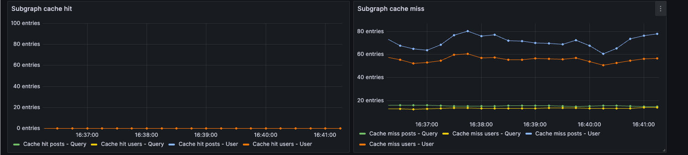
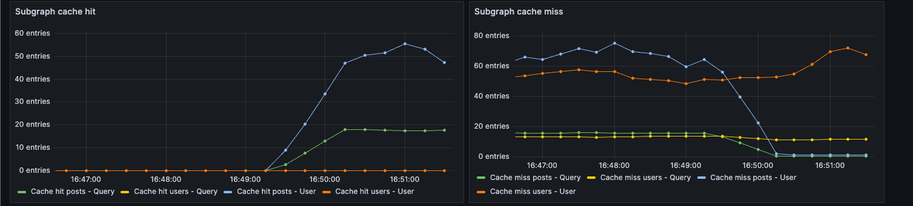
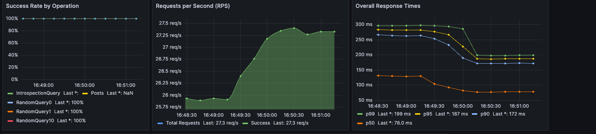

<PlanRequired plans={["Free", "Developer", "Standard", "Enterprise"]}>

Rate limits apply on the Free plan.
Performance pricing applies on Developer and Standard plans.
Developer and Standard plans require Router v2.6.0 or later.

</PlanRequired>

Learn how the GraphOS Router can cache subgraph query responses using Redis to improve your query latency for entities in the supergraph.

## Quickstart

Follow this guide to enable and add a minimal configuration for response caching in the GraphOS Router.

### Prerequisites

To use response caching in the GraphOS Router, you must set up:

- A Redis instance or cluster that your router instances can communicate with
- A router that [connects to GraphOS](/router/configuration/overview/#environment-variables)

### Configure router for response caching

In `router.yaml`, configure `preview_response_cache`:
- Enable response caching globally.
- Configure Redis using the same conventions described in [distributed caching](/router/configuration/distributed-caching#redis-url-configuration).
- Configure response caching per subgraph, with overrides per subgraph for disabling response caching and TTL.

For example:

```yaml title="router.yaml"
# Enable response caching globally
preview_response_cache:
  enabled: true
  debug: true # Enable the ability to return debugging data for caching debugger. It's better to not enable this in production.
  invalidation:
    listen: 0.0.0.0:4000
    path: /invalidation
  subgraph:
    all:
      enabled: true
      # Configure Redis for all subgraphs
      redis:
        urls: ["redis://localhost:6379"]
      invalidation:
        enabled: true
        shared_key: ${env.INVALIDATION_SHARED_KEY} # Use environment variable INVALIDATION_SHARED_KEY
    # Configure overrides for specific subgraphs
    subgraphs:
      inventory:
        enabled: false # Disable caching for inventory subgraph
      products:
        redis:
          urls: ["redis://products-cache:6379"] # Use different Redis for products
```


### Identify what data to cache

To identify which subgraphs would benefit most from caching, you can enable metrics and increase their granularity. Keep in mind that more granularity leads to higher metric cardinality, which may increase costs in your APM.

Configure this metric as follows:

```yaml title="router.yaml"
telemetry:
  instrumentation:
    instruments:
      cache: # Cache instruments configuration
        apollo.router.operations.response.cache: # A counter which counts the number of cache hit and miss for subgraph requests
          attributes:
            graphql.type.name: true # Include the entity type name. default: false
            subgraph.name: # Custom attributes to include the subgraph name in the metric
              subgraph_name: true
            # supergraph.operation.name: # Add custom attribute to display the supergraph operation name
            #   supergraph_operation_name: string
            # You can add more custom attributes using subgraph selectors
```

You can now use the `apollo.router.operations.response.cache` metric to create a dashboard like this example:



The left chart shows cache hits per subgraph and type. No cache hits appear because your subgraphs don't return any `Cache-Control` headers. The right chart shows cache misses and potential cache hits. In this example, caching the `User` type from the `posts` subgraph would be beneficial given the high number of cache misses.


### Schema integration
Consider an example with two subgraphs: users and posts.

```graphql title="users.graphql"
extend schema
  @link(
    url: "https://specs.apollo.dev/federation/v2.12"
    import: ["@key", "@external"]
  )

type Query {
  user(id: ID!): User
  users: [User!]!
}

type User @key(fields: "id") {
  id: ID!
  name: String!
  email: String!
  posts: [Post!]! @external
}

type Post @key(fields: "id") {
  id: ID!
  content: String! @external
}
```

```graphql title="posts.graphql"
extend schema
  @link(url: "https://specs.apollo.dev/federation/v2.12", import: ["@key"])

type Query {
  posts: [Post!]
  post(id: ID!): Post
}

type User @key(fields: "id") {
  id: ID!
  posts: [Post!]!
}

type Post @key(fields: "id") {
  id: ID!
  title: String!
  content: String!
  author: User!
  featuredImage: String
}
```

Based on the metrics, caching the `User` type on the `posts` subgraph would provide significant benefits. Enable this using the `@cacheControl` directive.

<Note>
    This example using `@cacheControl` only works if you're using Apollo Server as a subgraph. If you're using another server implementation, update your codebase to return the correct `Cache-Control` header.
</Note>

Here is the new version of the schema for subgraph `posts`:

```graphql title="posts.graphql"
extend schema
  @link(url: "https://specs.apollo.dev/federation/v2.12", import: ["@key"])

enum CacheControlScope {
  PUBLIC
  PRIVATE
}
directive @cacheControl(
  maxAge: Int
  scope: CacheControlScope
  inheritMaxAge: Boolean
) on FIELD_DEFINITION | OBJECT | INTERFACE | UNION

type Query {
  posts: [Post!] @cacheControl(maxAge: 60)
  post(id: ID!): Post
}

type User @key(fields: "id") @cacheControl(maxAge: 60) {
  id: ID!
  posts: [Post!]!
}

type Post @key(fields: "id") @cacheControl(maxAge: 60) {
  id: ID!
  title: String!
  content: String!
  author: User!
  featuredImage: String
}
```

The cache control is set with a TTL of 60 seconds, so both the `Post` and `User` types are cached for 60 seconds.
With caching enabled, you can see the difference in the dashboard: more cache hits and fewer cache misses.



Response times are also faster, as shown in the right panel of this screenshot:



### Invalidation

With cached data based on TTL, you might want to increase these TTLs and automatically invalidate specific data when you know it has changed. Response caching provides several ways to invalidate data. For more details, see [Cache Expiration](./cache-expiration). For this quickstart, we'll use cache tags, which work like surrogate cache keys for REST APIs. You can tag data in your schema to enable targeted invalidation.

Use the `@cacheTag` directive introduced in Federation v2.12. It takes a `format` argument to create your cache tag. For the `User` type and the `posts` root field, create different cache tags:


```graphql title="posts.graphql"
extend schema
  @link(url: "https://specs.apollo.dev/federation/v2.12", import: ["@key", "@cacheTag"])

enum CacheControlScope {
  PUBLIC
  PRIVATE
}
directive @cacheControl(
  maxAge: Int
  scope: CacheControlScope
  inheritMaxAge: Boolean
) on FIELD_DEFINITION | OBJECT | INTERFACE | UNION

type Query {
  posts: [Post!] @cacheControl(maxAge: 60) @cacheTag(format: "posts")
  post(id: ID!): Post
}

type User @key(fields: "id") @cacheControl(maxAge: 60) @cacheTag(format: "user-{$key.id}") @cacheTag(format: "user") {
  id: ID!
  posts: [Post!]!
}

type Post @key(fields: "id") @cacheControl(maxAge: 60) {
  id: ID!
  title: String!
  content: String!
  author: User!
  featuredImage: String
}
```

<Note>
    Re-compose or publish your schemas using `rover` after making these changes.
</Note>

The `User` type is tagged with a static cache tag format `user` and a dynamic one with variable interpolation using the entity key `id` to generate the cache tag. For example, if the fetched `User` has an `id` of `42`, it generates `user-42` as a cache tag.

With tagged data, you can invalidate it using a `curl` command to invalidate the user with id `42`:

```
curl --request POST \
	--header "authorization: $INVALIDATION_SHARED_KEY" \
	--header 'content-type: application/json' \
	--url http://localhost:4000/invalidation \
	--data '[{"kind":"cache_tag","subgraphs":["posts"],"cache_tag":"user-42"}]'
```

`INVALIDATION_SHARED_KEY` is an environment variable containing a token for authenticating requests to this endpoint. This was configured in the router setup at the beginning of this page.

The call returns the number of invalidated entries. For example, if only 1 entry was invalidated:

```json
{
  "count": 1
}
```

To explore response caching and see what data has been cached in a query, use the cache debugger documented [here](./observability#cache-debugger).
