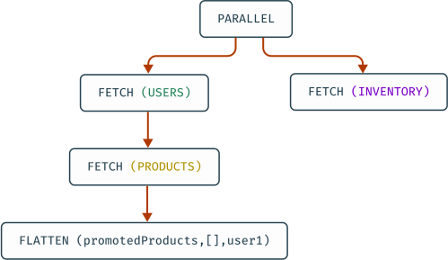
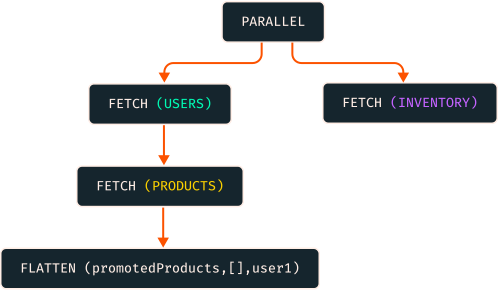
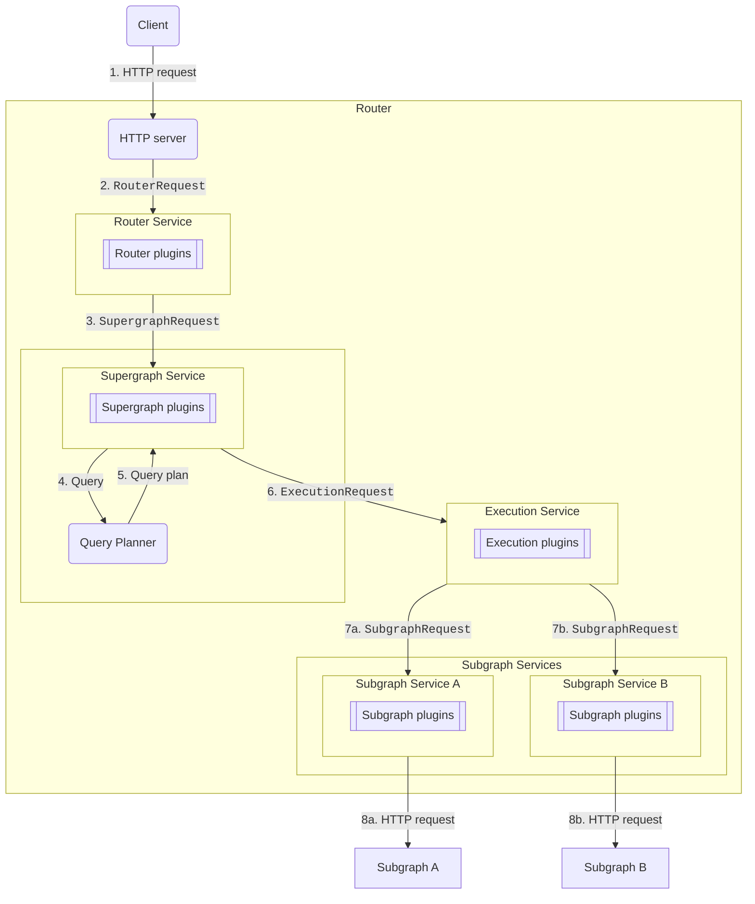
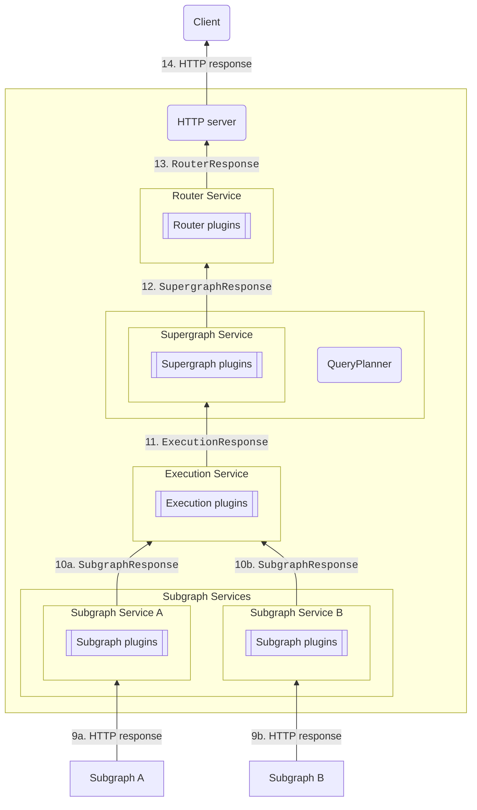
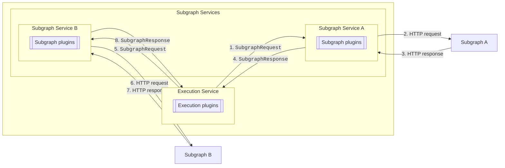
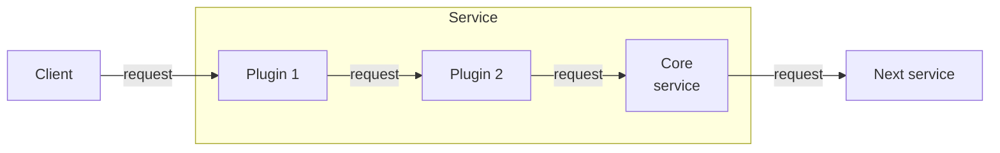
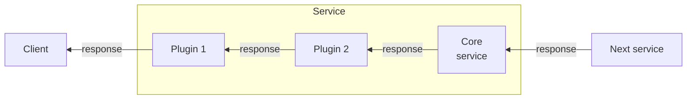

import RequestLifecycleOverviewDiagram from '../../shared/diagrams/router-request-lifecycle-overview.mdx';

Every client request made to an Apollo Router goes through the **router request lifecycle**: a multi-stage pipeline of services that processes requests and returns responses. 

<RequestLifecycleOverviewDiagram />

The router processes a client request by first passing it between services along the lifecycle's **request path**. In the request path, it needs to figure out how to use your subgraphs to fetch or update the fields of the request. To do this, the router generates a _query plan_:

A query plan is a blueprint for dividing a single incoming operation into one or more operations that are each resolvable by a single subgraph. Some of these operations depend on the results of other operations, so the query plan also defines any required ordering for their execution. The router's _query planner_ determines the optimal set of subgraph queries for each client operation, then merges the subgraph responses into a single response for the client.

## Request path

In the request path, the request lifecycle services process each request in the following order:

* The **Router service** receives the client request from the HTTP server and parses it into a GraphQL operation.
* The **Supergraph service** receives a GraphQL operation and calls the router's query planner to produce the query plan that most efficiently executes the operation.
* The **Execution service** executes a query plan by calling the necessary subgraph services to make subgraph requests
* Each subgraph has an associated **Subgraph service** that makes HTTP requests to the subgraph.

Each service encapsulates and transforms the contents of a request into its own context. The following diagram and its steps describe how an HTTP request is transformed and propagated through the request path:

1. The router receives a client request at an HTTP server. 
2. The HTTP server transforms the HTTP request into a `RouterRequest` containing HTTP headers and the request body as a stream of byte arrays.
3. The router service receives the `RouterRequest`. It handles Automatic Persisted Queries (APQ), parses the GraphQL request from JSON, validates the query against the schema, and calls the supergraph service with the resulting `SupergraphRequest`.
4. The supergraph service calls the query planner with the GraphQL query from the `SupergraphRequest`.
5. The query planner returns a query plan for most efficiently executing the query.
6. The supergraph service calls the execution service with an `ExecutionRequest`, made up of `SupergraphRequest` and the query plan.
7. For each fetch node of the query plan, the execution service creates a `SubgraphRequest` and then calls the respective subgraph service.
8. Each subgraph has its own subgraph service, and each service can have its own subgraph plugin configuration. The subgraph service transforms the `SubgraphRequest` into an HTTP request to its subgraph. The `SubgraphRequest` contains:
    - the (read-only) `SupergraphRequest`
    - HTTP headers
    - the subgraph request's operation type (query, mutation, or subscription)
    - a GraphQL request object as the request body

Subgraph responses follow the response path.

## Response path

In the response path, the lifecycle services gather subgraph responses into a client response in the following order:

* The **Execution service** receives and formats all subgraph responses.
* The **Supergraph service** gathers the content of all subgraph responses into stream.
* The **Router service** serializes the stream of responses into JSON and forwards it to the HTTP server to send it to the client. 

The following diagram and its steps describe the response path in further detail:

9. Each subgraph provides an HTTP response to the subgraph services.
10. Each subgraph service creates a `SubgraphResponse` containing the HTTP headers and a GraphQL response.
11. Once the execution service has received all subgraph responses, it formats the GraphQL responses—removing unneeded data and propagating nulls—before sending it back to the supergraph plugin as the `ExecutionResponse`.
12. The `SupergraphResponse` has the same content as the `ExecutionResponse`. It contains headers and a stream of GraphQL responses. That stream only contains one element for most queries—it can contain more if the query uses the `@defer` directive or subscriptions.
13. The router service receives the `SupergraphResponse` and serializes the GraphQL responses to JSON.
14. The HTTP server sends the JSON in an HTTP response to the client.

## Request and response nuances

Although the preceding diagrams showed the request and response paths separately and sequentially, in reality some requests and responses may happen simultaneously and repeatedly.

For example, `SubgraphRequest`s can happen both in parallel _and_ in sequence: one subgraph's response may be necessary for another's `SubgraphRequest`. The [query planner](/graphos/reference/federation/query-plans) decides which requests can happen in parallel vs. which need to happen in sequence. 

To match subgraph requests to responses in customizations, the router exposes a `subgraph_request_id` field that will hold the same value in paired requests and responses.

### Requests run in parallel 

### Requests run sequentially

Additionally, some requests and responses may happen multiple times for the same operation. With subscriptions, for example, a subgraph sends a new `SubgraphResponse` whenever data is updated. Each response object travels through all the services in the response path and interacts with any customizations you've created.

## Observability of the request lifecycle

To understand the state and health of your router as it services requests, you can add instrumentation to request lifecycle services and collect telemetry. The router's telemetry is based on [OpenTelemetry](https://opentelemetry.io/docs/what-is-opentelemetry/), so you can configure your router's YAML configuration to add traces, metrics, and logs. 

You can instrument the Router, Supergraph, and Subgraph services with [events](/router/configuration/telemetry/instrumentation/events) to capture data points along the request lifecycle. To customize events, you can set [conditions](/router/configuration/telemetry/instrumentation/conditions) to control when events are triggered, and [attributes](/router/configuration/telemetry/instrumentation/events#attributes) and [selectors](/router/configuration/telemetry/instrumentation/selectors) to specify the data attached to events.

To learn more about router observability with telemetry, go to [Router Telemetry](/graphos/routing/observability/telemetry).

## Router customizations along the request lifecycle

You can create customizations for the router to extend its functionality. Customizations intervene at specific points of the request lifecycle, where each point is represented by a specific service with its own request and response objects.

Customizations are implemented as plugins. Each service of the request lifecycle can have a set of customizable plugins that can be executed before or after the service: 

- For requests, the router executes plugins _before_ the service.

- For responses, the router executes the plugins _after_ the service.

Each request and response object contains a `Context` object, which is carried throughout the entire process. Each request's `Context` object is unique. You can use it to store plugin-specific information between the request and response or to communicate between different hook points. A plugin can be called at multiple steps of the request lifecycle.

To learn how to hook in to the various lifecycle stages, including examples customizations, start with the [router customization overview](/graphos/routing/customization/overview), then refer to the [Rhai scripts](/graphos/routing/customization/rhai/) and [external coprocessing](/router/customizations/coprocessor/) docs.

### Request termination and flow control

Customizations can not only observe and modify requests but also control request flow by terminating requests at various lifecycle stages. This is particularly useful for implementing authorization checks, conditional subgraph skipping, and custom traffic management policies. For detailed guidance on implementing these patterns while maintaining proper GraphQL response structure, see the [Rhai reference documentation on request termination](/graphos/routing/customization/rhai/reference#terminating-client-requests).
