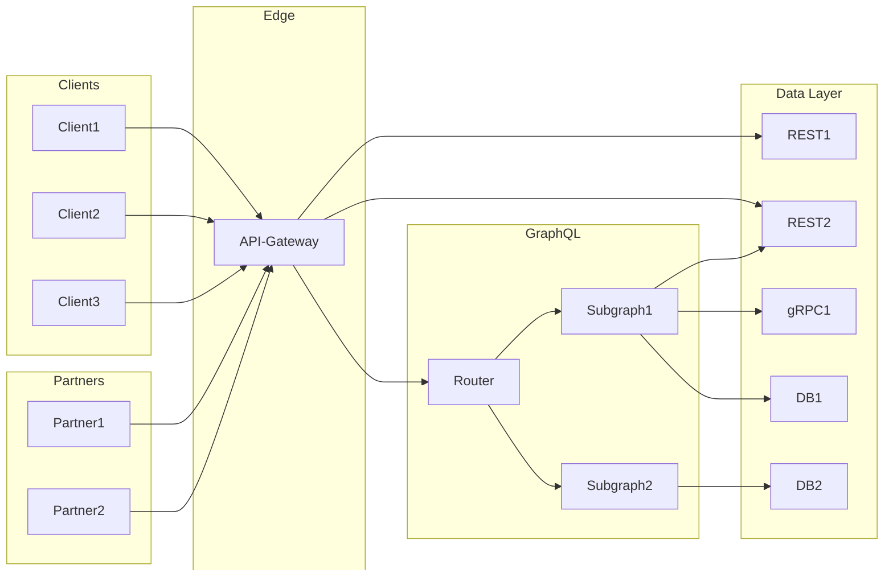

The GraphOS Router is a high-performant GraphQL gateway that supports [Apollo Federation](https://www.apollographql.com/docs/federation). It handles GraphQL requests that can then be resolved by many GraphQL subgraphs underneath. When comparing the router to other API technologies in the market today, a natural first comparison to draw is to API gateways. Tools like Kong or your cloud provider offer capabilities to secure, manage, and monitor your API endpoints.
These gateways usually live at the outermost edges of your companies infrastructure. Sometimes they are even required by your security team so that all inbound and outbound traffic flows through the same top layer of your tech stack.

The key distinction of the router is that is not based on URLs or REST endpoints. The router is a GraphQL-native solution to handle your clients API operations.

<Tip>

Apollo GraphQL and Kong have partnered to produce a joint paper that provides API practitioners with the tools they need to navigate the complex API landscape and drive successful digital experiences. Read more in the [blog post](https://www.apollographql.com/blog/leveraging-graphql-for-next-generation-api-platforms).

</Tip>

## GraphQL native

First, let's define what we mean by "GraphQL native." The GraphOS Router runs all the client operations against a [supergraph](/intro/platform/).
This means that requests processed by the router are not for any random service, but are restricted to what is defined and published by the GraphQL subgraphs for a given supergraph schema.
Subgraphs define the schema and capabilities they want to expose. A well-defined GraphQL schema does not just expose all the data available in a company, instead, a [demand-oriented schema](/graphos/schema-design/guides/demand-oriented-schema-design) gives clients access to all the operations they need to execute, but without over exposing your data.
Since subgraphs are also the ones that define their service capabilities, the router can be the central location to enforce standardized rules or policies that are declared by subgraphs, for example, [a directive-based authN/Z plugin](https://www.apollographql.com/blog/platform/financial-services/directive-based-authorization-for-financial-services/).

```graphql
type Query {
  bankAccounts: [BankAccount] @authenticated @hasRole(role: ADMIN)
}
```

API gateways (like Apigee, Mulesoft, or ones from AWS, Azure, or Google Cloud) usually have little understanding of all the services underneath them or what their capabilities are. They may have configuration options and rules that can apply to those services, but these are blanket rules that must be configured at the gateway level, not at the service definition.
If you wanted to apply a common rule across many services it would be up to the API gateway managers to configure, deploy, and apply that new rule to a set of services rather than the individual service teams.

```yaml
# Mock gateway rules
gatewayConfig:
  myCustomRule:
    tags: [requiresAuth]
    ruleToApply: validate-jwt-plugin
  myOtherCustomRule:
    URL: '/accounts'
    ruleToApply: requires-admin-permissions-plugin
```

## Support for non-GraphQL APIs

GraphQL is an innovative technology that give clients much more control over their operations and a common language for service teams to communicate. However, GraphQL usually is not the one and only API technology used by companies today.
If you need to have a common gateway to secure REST endpoints and GraphQL endpoints, the GraphOS Router can be a complimentary tool that lives underneath this higher-level API gateway. You can configure company-wide policies at the outermost edge layer, and anything else that is better defined as a GraphQL-specific policy can be managed by the router.
In addition, using a [defense-in-depth](https://csrc.nist.gov/glossary/term/defense_in_depth) security strategy reduces your companies risk, so having both an API gateway and router applying shared rules can lead to a more secure environment.



## When to consider GraphOS Router

If you are running a GraphQL API in production, and you want to be able to:

- [Monitor your GraphQL operations](/graphos/platform/insights/field-usage) in a way that other telemetry tools don't support while [continuing support for existing APM tools](/graphos/reference/router/telemetry/metrics-exporters/overview)
- [Safely publish new schemas without introducing a breaking change](/graphos/platform/schema-management/checks)
- [Secure your GraphQL schema](https://www.apollographql.com/docs/router/configuration/authn-jwt)
- [Extend the GraphQL runtime with custom features](https://www.apollographql.com/docs/router/customizations/overview)

And do all this with [minimal latency and scalable performance](https://www.apollographql.com/blog/announcement/backend/apollo-router-our-graphql-federation-runtime-in-rust) then consider adopting [GraphOS and the GraphOS Router](/graphos/) today!
