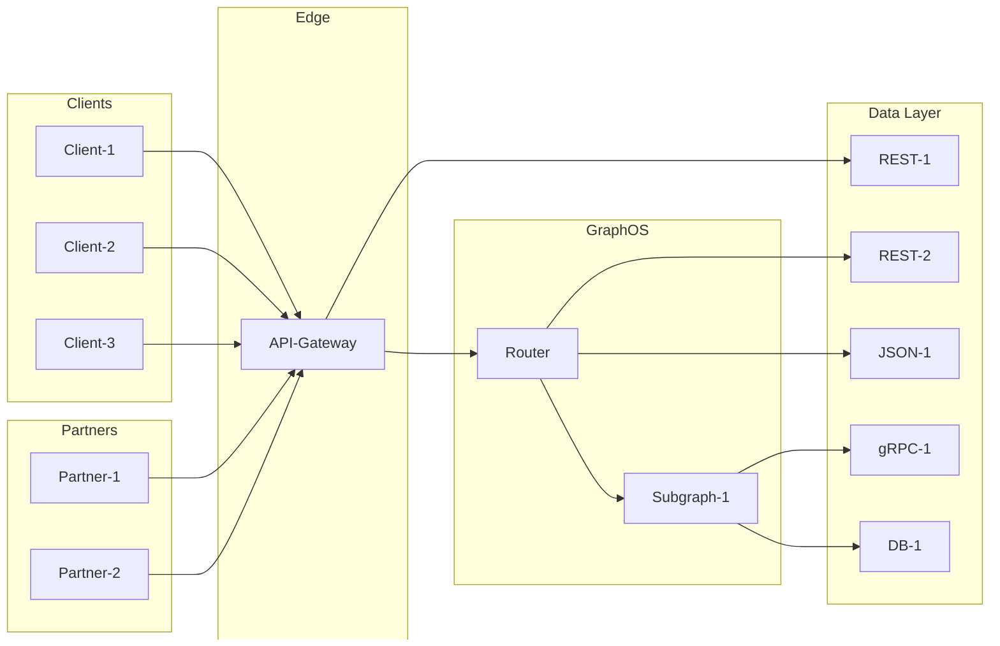

The GraphOS Router is a high-performant API orchestration gateway that supports [Apollo Federation](https://www.apollographql.com/docs/federation). It handles requests that can then be resolved by many different services underneath, whether they are REST or GraphQL.
When comparing the router to other API technologies in the market today, a natural first comparison to draw is to API management gateways.
Tools like Kong or your cloud provider offer capabilities to secure, manage, and monitor your API endpoints.
These gateways usually live at the outermost edges of your companies infrastructure. Sometimes they are even required by your security team at all layers, so that traffic flows through the same secure layer of your tech stack regardless of business use case.

The key distinction of GraphOS Router is that it is not a point-to-point solution for endpoints. The GraphOS Router is an API schema-aware solution to handle the orchestration of many different operations, even if that requires making multiple dependent service calls to resolve an operation.

<Tip>

Apollo GraphQL and Kong have partnered to produce a joint paper that provides API practitioners with the tools they need to navigate the complex API landscape and drive successful digital experiences.
Read more in the [blog post](https://www.apollographql.com/blog/leveraging-graphql-for-next-generation-api-platforms).

</Tip>

## Schema-aware

First, let's define what we mean by "schema aware". The GraphOS Router runs all the client operations against a [supergraph](/intro/platform/).
This means that requests processed by the router are not for any random service, but are restricted to what is defined and published by the connected services and what is defined in their API schema. In Apollo Federation, we call services connected to the GraphOS Router subgraphs.
Subgraphs define the schema and capabilities they want to expose via type-safe API schema language called [GraphQL](https://graphql.com/), however the service itself could be either a REST or GraphQL API. A well-defined GraphQL schema does not just expose all the data available in a company, instead, a [demand-oriented schema](/graphos/schema-design/guides/demand-oriented-schema-design) gives clients access to all the operations they need to execute, but without over exposing your data.
Since subgraphs are also the ones that define the capabilities they want to expose, the router can be the central location to enforce standardized rules or policies that are declared by subgraphs rather then the gateway, for example, [directive-based authN/Z](https://www.apollographql.com/docs/graphos/routing/security/authorization).

```graphql title="accounts-service-rest-api.graphql"
type Query {
  bankAccounts: [BankAccount] @authenticated @requiresScopes(scopes: [["accounts:read", "user:read"], ["accounts:admin"]])
}
```

API gateways (like Apigee, Mulesoft, or ones from AWS, Azure, or Google Cloud) usually have little understanding of all the services underneath them or what their capabilities are.
They may have configuration options and rules that can apply to those services, but these are blanket rules that must be configured at the gateway level, not at the service definition.
If you wanted to apply a common rule across many services it would be up to the API gateway team to configure, deploy, and apply that new rule to a set of services rather than the individual service teams.

```yaml
# Mock gateway rules
gatewayConfig:
  myCustomRule:
    tags: [requiresAuth]
    ruleToApply: validate-jwt-plugin
  myOtherCustomRule:
    URL: '/accounts'
    ruleToApply: requires-admin-permissions-plugin
```

## API Orchestration
Traditional API management tools are point-to-point solutions combined with a few other capabilities for discovery, but they do little handle the real complexity of APIs, which is understanding how to use them to power your clients.
Our front-end teams are typically not involved in our API and service design. They are the ones left to deal with the complexity of connecting data pieces, chaining calls together, and applying performance optimizations when each API team has met their SLOs, but calling all the APIs together is still to slow.
This orchestration problem leads to more services for dedicated use cases, which reduces our ability to reuse APIs in other scenarios (*see* [GraphQL as an Abstraction Layer](https://www.apollographql.com/docs/graphos/reference/guides/using-graphql-for-abstraction)).

GraphOS Router introduces a new concept for APIs, [Apollo Federation](https://www.apollographql.com/docs/graphos/schema-design/federated-schemas/federation). Federation is a declarative model, which means rather than just consuming and producing APIs as is, client teams instead declare what data they need in their operation definitions and subgraph teams define their API capabilities via the schema definitions.
Then we run both the operation and API schemas through a process called [Query Planning](https://www.apollographql.com/docs/graphos/routing/about-router#subgraph-query-planner). The planner figures out what services we need to call and in which order to resolve a given operation.


## Support for non-GraphQL APIs

GraphQL is an innovative technology that gives clients much more control over their operations and a common language for service teams to communicate. However, GraphQL usually is not the one and only API technology used by companies today.
Luckily, GraphOS Router supports non-GraphQL APIs via [Apollo Connectors](https://www.apollographql.com/docs/graphos/schema-design/connectors). With Connectors, you can bring in your JSON APIs as-is or you can even define a more focused API to limit your orchestration surface area and make sure there is not a duplication of data owners.

If you already have common gateway to secure REST and GraphQL endpoints, the GraphOS Router can be a complimentary tool that lives underneath this higher-level API gateway. You can configure company-wide policies at the outermost edge layer, and anything else that is better defined as a graph-specific policy can be managed by the router.
In addition, using a [defense-in-depth](https://csrc.nist.gov/glossary/term/defense_in_depth) security strategy reduces your companies risk, so having both an API gateway and GraphOS Router applying shared security rules can lead to a more secure environment.



## When to consider GraphOS Router

If you are running APIs in production, and you want to be able to:

- [Monitor your client operations and use](/graphos/platform/insights/field-usage) in a way that other telemetry tools don't support while [continuing support for existing APM tools](/graphos/reference/router/telemetry/metrics-exporters/overview)
- [Safely publish new API schemas without introducing a breaking change](/graphos/platform/schema-management/checks)
- [Secure your APIs with a declarative schema model](https://www.apollographql.com/docs/router/configuration/authn-jwt)
- [Extend the GraphOS Router runtime with custom features](https://www.apollographql.com/docs/router/customizations/overview)

And do all this with [minimal latency and scalable performance](https://www.apollographql.com/blog/announcement/backend/apollo-router-our-graphql-federation-runtime-in-rust) then consider adopting [GraphOS Studio and the GraphOS Router](/graphos/) today!
