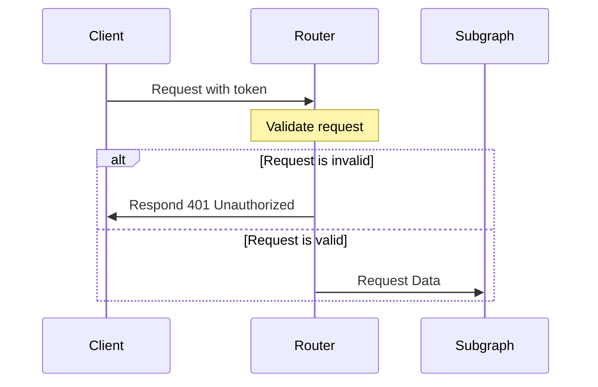
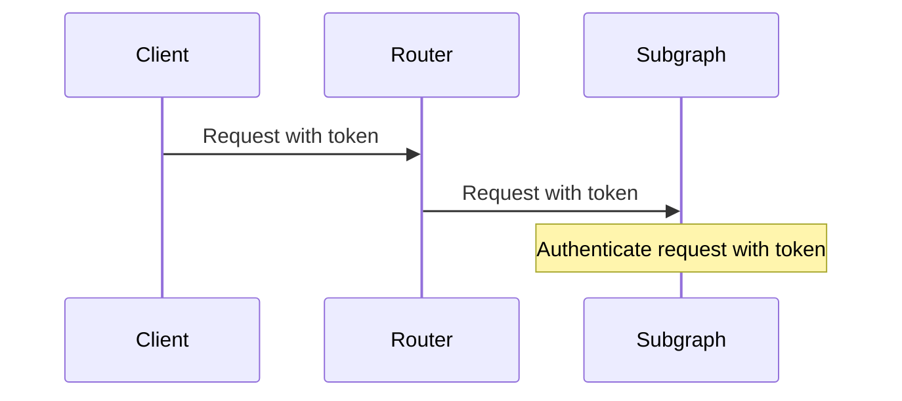
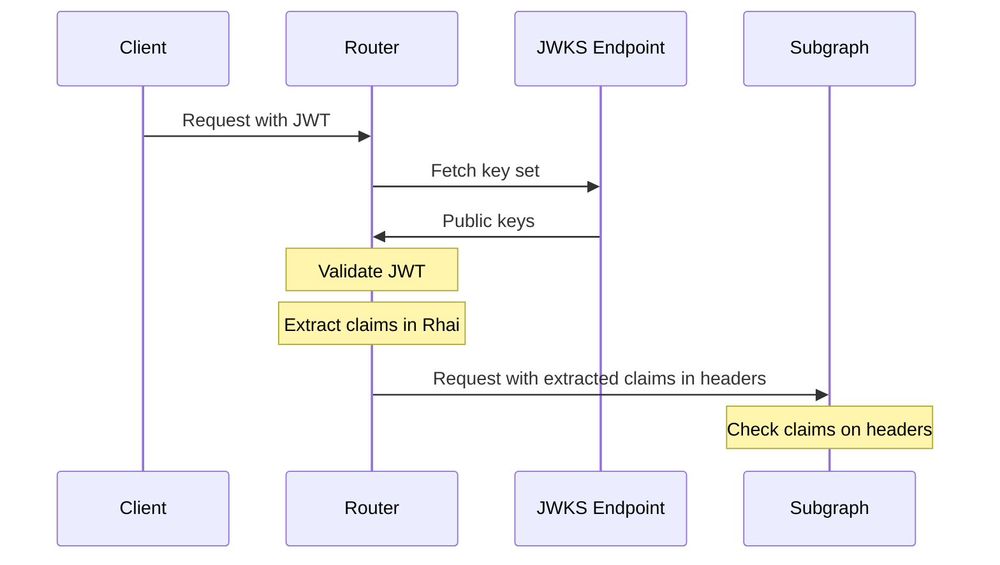
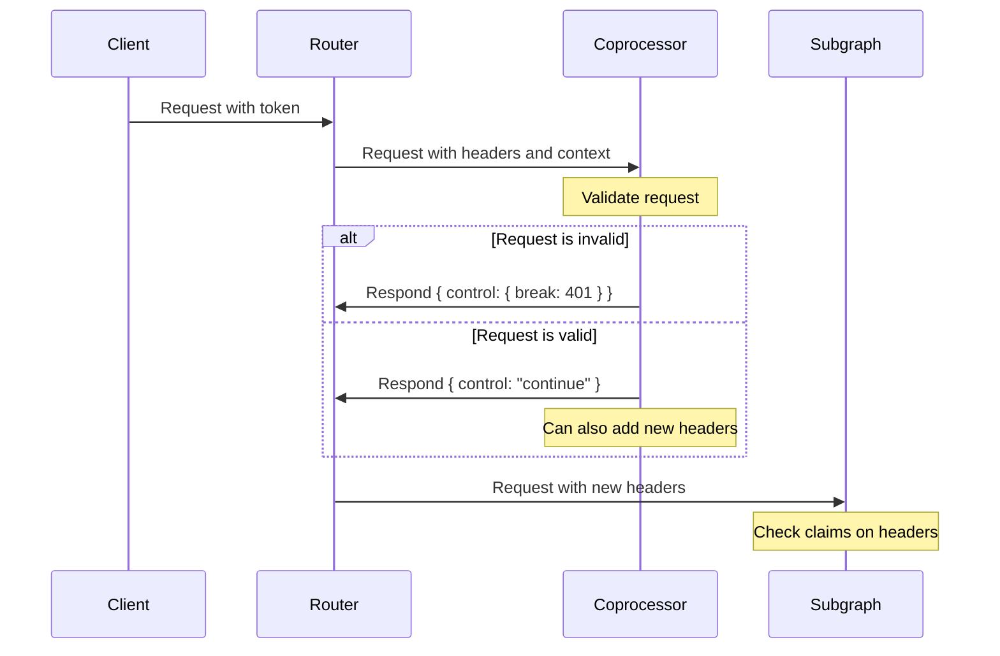

<EnterpriseFeature>

Self-hosting the GraphOS Router is limited to [GraphOS Enterprise plans](https://www.apollographql.com/pricing). Other plan types use [managed cloud routing with GraphOS](/graphos/cloud-routing). Check out the [pricing page](https://www.apollographql.com/pricing#graphos-router) to learn more.

</EnterpriseFeature>

<Tip>

If you're an enterprise customer looking for more material on this topic, try the [Enterprise best practices: Router extensibility](https://www.apollographql.com/tutorials/router-extensibility) course on Odyssey.

Not an enterprise customer? [Learn about GraphOS for Enterprise.](https://www.apollographql.com/pricing)

</Tip>

When using the router as the entry point to your federated supergraph, you have a few options for authenticating incoming client requests:

- [Use authorization directives](#use-authorization-directives)
- [Delegate authentication to your subgraphs.](#authenticate-in-subgraphs)
- [Use the JWT authentication plugin](#use-the-jwt-authentication-plugin) to your supergraph.
- [Use a coprocessor](#use-a-coprocessor).

In fact, we recommend you [combine all three strategies](#combining-authentication-strategies) to create a more robust authentication system!

## Use authorization directives

In addition to the approaches outlined below, you can use [authorization directives](/graphos/routing/security/authorization/) to enforce authorization at the router layer.
This allows you to authorize requests prior to them hitting your subgraphs saving on bandwidth and processing time.

<EnterpriseFeature>

This is an [Enterprise feature](/router/enterprise-features) of the GraphOS Router.
It requires an organization with a [GraphOS Enterprise plan](https://www.apollographql.com/pricing/).

</EnterpriseFeature>



Once the request's claims are made available via the JWT validation or a coprocessor, they can be used to match against the required type and field scopes to enforce authorization policies.

```graphql
# Request's authorization claims must contain `read:users`
type Query {
  users: [User!]! @requiresScopes(scopes: [["read:users"]])
}

# Request must be authenticated
type Mutation {
  updateUser(input: UpdateUserInput!): User! @authenticated
}
```

Pros:

- Validating authorization before processing requests enables the early termination of unauthorized requests reducing the load on your services
- Declarative approach that can be adopted and maintained by each subgraph while enforced centrally

Cons

- Schema updates will need to be made to each subgraph to opt into this authorization model

## Authenticate in subgraphs

The simplest authentication strategy is to delegate authentication to your individual subgraph services.



To pass `Authentication` headers from client requests to your subgraphs, add the following to your router's YAML configuration file:

```yaml
headers:
  all:
    request:
      - propagate:
          named: authorization
```

#### Pros

- Requires minimal changes to your router configuration.
- Can take advantage of existing authentication code in subgraphs, which is often tied to authorization logic for data sources.

#### Cons

- Each subgraph that contributes to resolving a request needs to authenticate that request.
- If subgraphs are written in different languages, maintaining consistent authentication code for each is complex.

## Use the JWT Authentication plugin

As of router v1.13, you can use the [JWT Authentication plugin](/router/configuration/authn-jwt) to validate JWT-based authentication tokens in your supergraph.

<PremiumFeature linkWithAnchor="https://www.apollographql.com/pricing#graphos-router" />



```yaml
authentication:
  jwt:
    jwks:
      - url: https://dev-zzp5enui.us.auth0.com/.well-known/jwks.json
```

Pros:

- The router prevents unauthenticated requests from reaching your subgraphs.
- The router can extract claims from the JWT and pass them to your subgraphs as headers, reducing logic needed in your subgraphs.

Cons:

- It supports only JWT-based authentication with keys from a JWKS endpoint.

## Use a coprocessor

If you have a custom authentication strategy, you can use a [coprocessor](/graphos/routing/customization/coprocessor) to implement it.

<PremiumFeature linkWithAnchor="https://www.apollographql.com/pricing#graphos-router" />



```yaml
coprocessor:
  url: http://127.0.0.1:8081
  router:
    request:
      headers: true
```

This example coprocessor is written in Node.js and uses Express:

```js
const app = express();
app.use(bodyParser.json());
app.post('/', async (req, res) => {
  const {headers} = req.body;
  const token = headers.authorization;
  const isValid = await validateToken(token);
  if (!isValid) {
    res.json({
      ...req.body,
      control: {break: 401}
    });
  } else {
    res.json({
      ...req.body,
      control: 'continue',
      headers: {'x-claims': extractClaims(token)}
    });
  }
});
```

Pros:

- You can implement any authentication strategy in any language or framework, as long as the coprocessor provides an HTTP endpoint.
- You can use the coprocessor to add headers to requests, which can be used by your subgraphs for additional authorization.

Cons:

- The initial lift of implementing a coprocessor is non-trivial, but once it's in place you can leverage it for any number of router customizations.

## Combining authentication strategies

You can combine the strategies to handle a number of authentication requirements and practice "defense-in-depth":

1. Use the JWT Authentication plugin to validate JWT-based authentication tokens.
2. Use auth directives to enforce authentication and authorization and at the supergraph layer
3. Use a coprocessor to identify traffic using a legacy authentication strategy and convert legacy session tokens to JWTs.
4. Forward JWTs to subgraphs for additional authorization.
