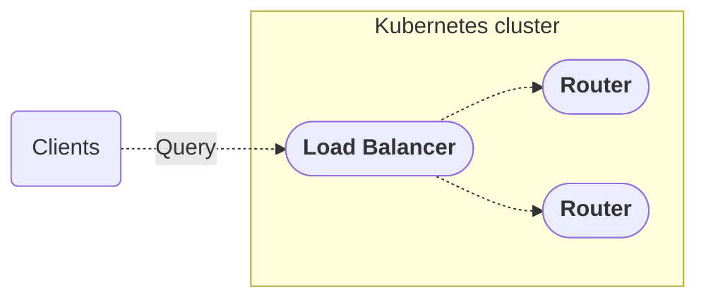

import HelmShowOutput from '../../../../../shared/helm-show-router-output.mdx';
import CoprocTypicalConfig from '../../../../../shared/coproc-typical-config.mdx';

This guide shows how to:

* Get the router Helm chart from the Apollo container repository.
* Deploy a router with a basic Helm chart.

<ElasticNotice />

<Note>
For a production-grade self-hosted deployment Apollo recommends the [Apollo GraphOS Operator](https://www.apollographql.com/docs/apollo-operator).
</Note>


## Prerequisites

<Note>

This guide assumes you are familiar with Kubernetes and Helm. If you are not familiar with either, you can find a [Kubernetes tutorial](https://kubernetes.io/docs/tutorials/) and a [Helm tutorial](https://helm.sh/docs/intro/quickstart/) to get started.

</Note>

* A GraphOS graph set up in your Apollo account. If you don't have a graph, you can create one in the [GraphOS Studio](https://studio.apollographql.com/).
* [Helm](https://helm.sh/docs/intro/install/) **version 3.x or higher** installed on your local machine.
* A Kubernetes cluster with access to the internet.

### GraphOS graph

Set up your self-hosted graph and get its [graph ref](/router/configuration/overview/#apollo_graph_ref) and [API key](/router/configuration/overview/#apollo_graph_ref).

If you need a guide to set up your graph, you can follow [the self-hosted router quickstart](/graphos/quickstart/self-hosted) and complete [step 1 (Set up Apollo tools)](/graphos/quickstart/self-hosted/#1-set-up-apollo-tools), [step 4 (Obtain your subgraph schemas)](/graphos/quickstart/self-hosted/#4-obtain-your-subgraph-schemas), and [step 5 (Publish your subgraph schemas)](/graphos/quickstart/self-hosted/#5-publish-your-subgraph-schemas).

### Kubernetes cluster

If you don't have a Kubernetes cluster, you can set one up using [kind](https://kind.sigs.k8s.io/) or [minikube](https://minikube.sigs.k8s.io/docs/) locally, or by referring to your cloud provider's documentation.

## Quickstart

To deploy the router, run the `helm install` command with an argument for the router's OCI image URL. Optionally, you can add arguments for the `values.yaml` configuration file and/or additional arguments to override specific configuration values.

```bash
helm install <name_for_install> --namespace apollo-router --set managedFederation.apiKey="<graph-api-key>" --set managedFederation.graphRef="<graph-ref>"  oci://ghcr.io/apollographql/helm-charts/router
```

The necessary arguments for specific configuration values:

* `--set managedFederation.graphRef="<graph-ref>"`: The reference to your managed graph (`id@variant`), the same value as the [`APOLLO_GRAPH_REF` environment variable](/router/configuration/overview/#apollo_graph_ref).
* `--set managedFederation.apiKey="<graph-api-key>"`: The API key to your managed graph, the same value as the [`APOLLO_KEY` environment variable](/router/configuration/overview/#apollo_key).

Some optional but recommended arguments:

* `--namespace <router-namespace>`. The namespace scope for this deployment.
* `--version <router-version>`. The version of the router to deploy. If not specified by `helm install`, the latest version is installed.

### Verify deployment

Verify that your router is one of the deployed releases with the `helm list` command. If you deployed with the `--namespace <router-namespace>` option, you can list only the releases within your namespace:

```bash
helm list --namespace <router-namespace>
```
## Deployed architecture

The default deployed architecture will be:



## Router Helm chart configuration

 Apollo provides an application Helm chart with each release of Apollo Router Core in GitHub. Since the router version v0.14.0, Apollo has released the router Helm chart as an [Open Container Initiative (OCI)](https://helm.sh/docs/topics/registries/) image in the GitHub container registry.

<Note>

The path to the OCI router chart is `oci://ghcr.io/apollographql/helm-charts/router` and tagged with the applicable router release version. For example, router version `v2.3.0`'s Helm chart would be `oci://ghcr.io/apollographql/helm-charts/router:2.3.0`.

</Note>

You customize a deployed router with the same [command-line options and YAML configuration options](/router/configuration/overview) using different Helm CLI options and YAML keys through a [values file](https://helm.sh/docs/chart_template_guide/values_files/).  

Each router chart has a defult `values.yaml` file with router and deployment settings. The released, unedited file has a few explicit settings, including:

* Default container ports for the router's [HTTP server](/router/configuration/overview/#listen-address), [health check endpoint](/router/configuration/health-checks), and [metrics endpoint](/router/configuration/telemetry/exporters/metrics/overview).
* A command-line argument to enable [hot reloading of the router](/router/configuration/overview/#--hr----hot-reload).
* A single replica.

<ExpansionPanel title="Click to expand values.yaml for router v2.3.0">

The values of the Helm chart for Apollo Router Core v2.3.0 in the GitHub container repository, as output by the `helm show` command:

```bash
helm show values oci://ghcr.io/apollographql/helm-charts/router
```

<HelmShowOutput/>

</ExpansionPanel>

## Separate configurations per environment

To support your different deployment configurations for different environments (development, staging, production, etc.), Apollo recommends separating your configuration values into separate files:

- A **common** file, which contains values that apply across all environments.
- A unique **environment** file per environment, which includes and overrides the values from the common file while adding new environment-specific values.

The `helm install` command applies each `--values <values-file>` option in the order you set them within the command. Therefore, a common file must be set before an environment file so that the environment file's values are applied last and override the common file's values. 

For example, this command deploys with a `common_values.yaml` file applied first and then a `prod_values.yaml` file:

```bash
helm install <name_for_install> --namespace <router-namespace> --set managedFederation.apiKey="<graph-api-key>" --set managedFederation.graphRef="<graph-ref>"  oci://ghcr.io/apollographql/helm-charts/router --version <router-version> --values router/values.yaml  --values common_values.yaml --values prod_values.yaml
```

## Consider using the Apollo GraphOS Operator

The [Apollo GraphOS Operator](/apollo-operator/), which is in Preview, offers an alternative method to deploy the router and manage your schema and subgraphs. The Operator provides declarative Kubernetes resources for managing routers, supergraphs, graph schemas, and subgraphs. It can simplify complex multi-service architectures.

The Operator offers different [workflow patterns](/apollo-operator/workflows/) depending on your infrastructure:
- Single-cluster setups for simpler deployments
- Multi-cluster and hybrid configurations for distributed services
- Deploy-only patterns for existing CI/CD workflows
