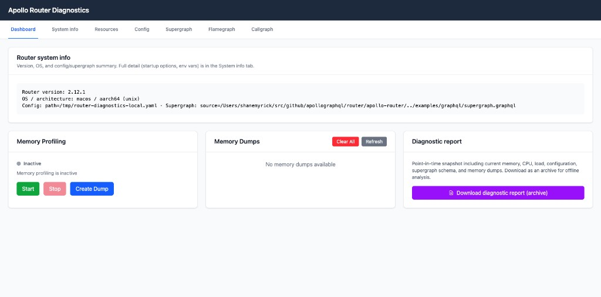

<ExperimentalFeature>

This feature is experimental. Your questions and feedback are highly valued—contact your Apollo representative. You can also discuss this feature in the [Apollo Community](https://discord.com/invite/apollo).

</ExperimentalFeature>

Apollo Router includes an experimental diagnostics plugin that collects system and memory information. Use it to diagnose issues such as memory leaks or configuration problems.

It has minimal overhead and can be enabled in production, but it exposes potentially sensitive information. Enable it only when needed and strictly control access by using port-forwarding to avoid network exposure.

## Enabling the plugin

Add the following to your `router.yaml`:

```yaml title="router.yaml"
experimental_diagnostics:
  enabled: true
  listen: 127.0.0.1:8089
  output_directory: /tmp/router-diagnostics
```

- `enabled`: Turn the diagnostics plugin on or off.
- `listen`: Socket address and port for the diagnostics server. Default: `127.0.0.1:8089`. Keep this bound to localhost; do not expose it to the network.
- `output_directory`: Directory where memory dump files are stored. Default: `/tmp/router-diagnostics` on Unix. Created automatically if it does not exist. Memory dumps are only generated on Linux.

After startup, the router logs the diagnostics URL, where you can find the interactive dashboard. For example:

```
Diagnostics endpoints at http://127.0.0.1:8089/diagnostics
```

## Getting system and router info

The plugin exposes two ways to get system-related information:

### Static router info (`GET /diagnostics/system_info`)

Returns JSON with stable metadata about the router process:

- Version, OS, architecture, target family, build type
- Rust version (when available)
- Config and supergraph paths and hashes
- Startup options (redacted; secrets shown only as “set”)
- Names of set environment variables the router reads (values are not included)

Use this endpoint when you need build/version/deployment metadata. It does not include live memory or CPU data and is only available after your router has completed startup.

```sh
curl http://127.0.0.1:8089/diagnostics/system_info
```

### Live system report (`GET /diagnostics/report.txt`)

Returns a plain-text report with current system state:

- Memory (total, used, free, swap; on Linux, detailed `/proc/meminfo`-style information)
- Jemalloc statistics (when available)
- CPU (cores, model, frequency, cgroup limits, Kubernetes CPU requests/limits when applicable)
- Load averages and per-CPU usage
- Container environment detection (Docker, Podman, Kubernetes)

Use this when you debug resource usage or prepare a snapshot for support. The content is time-dependent and changes each time you fetch it.

```sh
curl http://127.0.0.1:8089/diagnostics/report.txt
```

## Dashboard



From the diagnostics dashboard you can:

- View system information (via the live report), router configuration, and supergraph schema
- Perform memory profiling (start/stop, create dumps, list and download dumps)
- Export a full diagnostic package (see [Exporting diagnostics](#exporting-diagnostics))

## Memory profiling

Use memory profiling to help diagnose memory leaks, such as tracking growth over time after a schema reload. It is not intended for diagnosing sudden out-of-memory (OOM) events or peak memory usage from normal allocations.

Memory profiling (start, stop, dump, flamegraph, callgraph) works only on Linux with the jemalloc allocator. On other platforms, the memory endpoints return "not supported."

### Workflow for diagnosing leaks

1. Open the dashboard and go to the memory profiling section.
2. Press **Start** to begin profiling. The UI should indicate that memory profiling is active.
3. Press **Create Dump** to capture a baseline heap snapshot. It appears in the Memory Dumps list.
4. Let the router run until you believe more memory has leaked.
5. Press **Create Dump** again to capture a second snapshot.
6. You now have a baseline and a later dump to compare.

### Flamegraph

The flamegraph view provides a clear way to interpret data. It shows what has been allocated and not released between the base and actual profiles.

1. Select your base (first) and actual (second) heap profiles.
2. Look at the peaks in the differential view. The largest peaks are likely where the leak is.

### Callgraph

The callgraph is harder to interpret than the flamegraph. It can help when a leak has multiple stack paths and the flamegraph does not show a single clear culprit. It shows the percentage of allocation by function. Focus on high-memory nodes; in a leak scenario they are often highlighted in red.

### Next steps

After isolating the area of a leak, correlate it with the Router source code. You might need to add instrumentation to confirm the finding.

## Exporting diagnostics

The **Download Diagnostics Package** button (or `GET /diagnostics/export`) produces a `.tar.gz` archive containing:

- `manifest.txt` – Archive metadata and system information
- `router.yaml` – Current router configuration
- `supergraph.graphql` – Supergraph schema
- `report.txt` – Full diagnostic report (system info, memory, CPU, load, etc.)
- `memory/` – Memory profiling dumps (on Linux when available)
- `diagnostics_report.html` – Self-contained HTML report with all diagnostic data embedded

You can use this archive for offline analysis or when sharing information with your support or engineering team.

<Caution>

The archive may contain sensitive information (for example, if secrets are hardcoded in your config). Review the contents before sharing the file with anyone.

</Caution>
