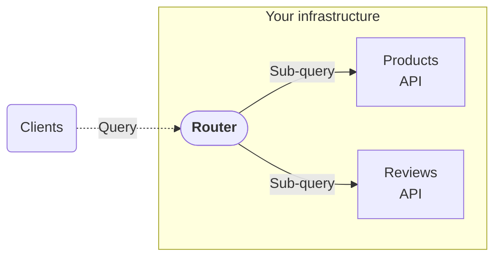

Apollo Router is a graph runtime that you can deploy in your own infrastructure.

Each release of Apollo Router includes:

- A binary
- A container image
- A Helm chart

## Local binary

Running Apollo Router directly from its binary speeds up local development, and it enables embedded use cases where containers are unavailable. 

Follow the [quickstart](/graphos/routing/get-started) to run a router binary.

## Kubernetes via Helm

Helm is a package manager for Kubernetes. Apollo provides an application Helm chart with each release of Apollo Router in GitHub Container Registry. Since router v0.14.0, Apollo has released each router Helm chart as an Open Container Initiative (OCI) image in `oci://ghcr.io/apollographql/helm-charts/router`.

Follow the [Kubernetes deployment guide] to deploy the router with a Helm chart.

## Container

For containerization without k8s or Helm, Apollo provides container images with each release of Apollo Router. The images are available in GitHub, downloadable from `ghcr.io/apollographql/router` and the [router repo](https://github.com/apollographql/router/pkgs/container/router). Both debug and production images are provided.

Follow the router deployment guide for your container environment:

- [AWS](/graphos/routing/self-hosted/containerization/aws)
- [Azure](/graphos/routing/self-hosted/containerization/azure)
- [GCP](/graphos/routing/self-hosted/containerization/gcp)
- [Docker](/graphos/routing/self-hosted/containerization/docker)
