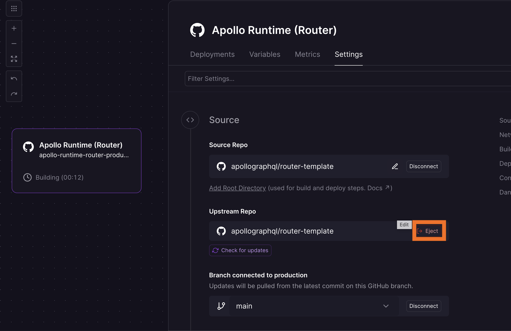

In this guide, you will deploy the GraphOS Router using the [Railway](https://railway.com/) template.

## Prerequisites

You will need:

- [A GraphQL API set up in GraphOS](/graphos/get-started/guides/graphql#step-1-set-up-your-graphql-api). You will need your graph credentials: `APOLLO_KEY` and `APOLLO_GRAPH_REF`.
- A [Railway account](https://railway.com/)
- A [GitHub account](https://github.com/)

## Steps

The fastest way to deploy the Apollo Router on Railway is using the official template:

1. Deploy using the template:
    

1. Configure your deployment:
   - **Template Name**: Enter a name for your deployment
   - **Repository Name**: Choose a name for the forked repository

1. Set environment variables:
   - `APOLLO_KEY`: Your Graph API key from GraphOS Studio
   - `APOLLO_GRAPH_REF`: Your graph reference, e.g. `my-graph@production`
   - Railway automatically sets the `PORT` variable to the correct value

1. Click **Deploy** to start the deployment.

1. After the deployment finishes, visit your service URL to confirm the router is running. Railway provides a public URL for your service.

1. You can clone the repo into your own GitHub account by navigating to **Settings** > **Source** > **Upstream Repo** and clicking **Eject**.

