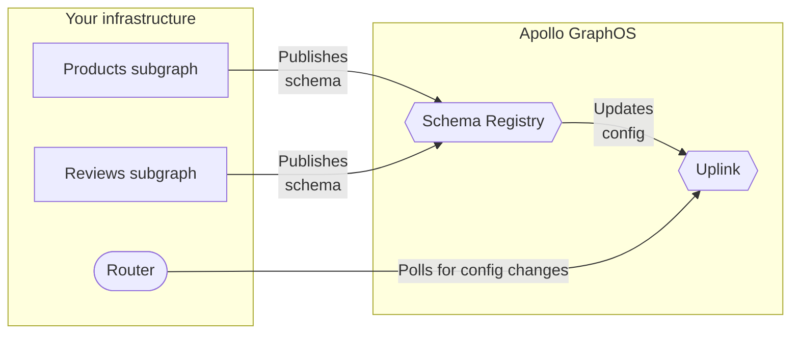

When using [managed federation](/federation/managed-federation/overview/), your supergraph's router by default regularly polls an endpoint called _Apollo Uplink_ for its latest supergraph schema and other configuration:



If you're using [Enterprise features](https://www.apollographql.com/pricing), Uplink also serves your router's license.

To maximize uptime, Uplink is hosted simultaneously at two endpoints, one in GCP and one in AWS:

- GCP: `https://uplink.api.apollographql.com/`
- AWS: `https://aws.uplink.api.apollographql.com/`

## Default polling behavior

### GraphOS Router

If you use the GraphOS Router with managed federation, it polls Uplink every ten seconds by default. Each time, it cycles through Uplink endpoints until it receives a response.

Whenever a poll request times out or otherwise fails (the default timeout is thirty seconds), the router continues polling as usual at the next interval. In the meantime, it continues using its most recent successfully obtained configuration.

### `@apollo/gateway`

If you use the `@apollo/gateway` library with managed federation, your gateway polls Uplink every ten seconds by default. Each time, it cycles through Uplink endpoints until it receives a response.

<Note>

Versions of `@apollo/gateway` prior to v0.45.0 don't support multiple Uplink endpoints and only use the GCP endpoint by default.

</Note>

Whenever a poll request fails, the gateway retries that request (again, using round robin). It continues retrying until a request succeeds, or until reaching the defined maximum number of retries.

Even if a particular poll request fails all of its retries, the gateway continues polling as usual at the next interval (with its own set of retries if needed). In the meantime, the gateway continues using its most recent successfully obtained configuration.

## Configuring polling behavior

You can configure the following aspects of your router's Uplink polling behavior:

- The interval at which your router polls (minimum ten seconds)
- The list of Uplink URLs your router uses
- The request timeout for each poll request (GraphOS Router only)
  - For `@apollo/gateway`, this value is always thirty seconds.
- The number of retries performed for a failed poll request (`@apollo/gateway` only)
  - The GraphOS Router does not perform retries for a failed poll request. It continues polling at the next interval.

### GraphOS Router

You configure Uplink polling for the GraphOS Router by providing certain command-line options when running the router executable. These options all start with `--apollo-uplink`.

[See the GraphOS Router docs](/graphos/reference/router/configuration#--apollo-uplink-endpoints).

### `@apollo/gateway`

#### Retry limit

You can configure how many times your gateway retries a single failed poll request like so:

```js {6}
const { ApolloGateway } = require('@apollo/gateway');

// ...

const gateway = new ApolloGateway({
  uplinkMaxRetries: 2
});
```

By default, the gateway retries a single poll request a number of times equal to three times the number of [Uplink URLs](#uplink-urls-advanced) (this is almost always `6` times).

Even if a particular poll request fails all of its retries, the gateway continues polling as usual at the next interval (with its own set of retries if needed). In the meantime, the gateway continues using its most recently obtained configuration.

#### Poll interval

You can configure the interval at which your gateway polls Apollo Uplink like so:

```js {6}
const { ApolloGateway } = require('@apollo/gateway');

// ...

const gateway = new ApolloGateway({
  pollIntervalInMs: 15000 // 15 seconds
});
```

The `pollIntervalInMs` option specifies the polling interval in milliseconds. This value must be at least `10000` (which is also the default value).

#### Uplink URLs (advanced)

<Note>

Most gateways never need to configure their list of Apollo Uplink URLs. Consult this section only if advised to do so.

</Note>

You can provide a custom list of URLs for the gateway to use when polling Uplink. You can provide this list either in the `ApolloGateway` constructor or as an environment variable.

##### `ApolloGateway` constructor

Provide a custom list of Uplink URLs to the `ApolloGateway` constructor like so:

```js {6-9}
const { ApolloGateway } = require('@apollo/gateway');

// ...

const gateway = new ApolloGateway({
  uplinkEndpoints: [
    // Omits AWS endpoint
    'https://uplink.api.apollographql.com/'
  ]
});
```

This example omits the AWS endpoint, which means it's never polled.

<Note>

If you also provide a list of endpoints via [environment variable](#environment-variable), the environment variable takes precedence.

</Note>

##### Environment variable

You can provide a comma-separated list of Uplink URLs as the value of the `APOLLO_SCHEMA_CONFIG_DELIVERY_ENDPOINT` environment variable in your gateway's environment:

```bash
APOLLO_SCHEMA_CONFIG_DELIVERY_ENDPOINT=https://aws.uplink.api.apollographql.com/,https://uplink.api.apollographql.com/
```

## Schema size limit

Supergraph schemas provided by Uplink cannot exceed 6MB in size. The vast majority of supergraph schemas are well below this limit.

If your supergraph schema does exceed 6MB, you can set up a [build status webhook](/graphos/platform/insights/notifications/build-status) for your graph. Whenever you're notified of a successful supergraph schema composition, your webhook can fetch the latest supergraph schema [via the Rover CLI](/rover/commands/supergraphs#supergraph-fetch).

## Bypassing Uplink

<PreviewFeature />

In advanced use cases, you may want your router to use a supergraph schema different than the latest validated schema provided by Uplink. For example, you have different deployment environments for the same [graph variant](/graphos/get-started/concepts/graphs-and-variants#variants), and you want everything that managed federation provides except for your routers to use supergraph schemas specific to their deployment environment.

For this scenario, you can follow a workflow that, instead of retrieving supergraph schemas from Uplink, uses the [GraphOS Platform API](/graphos/reference/platform-api) to retrieve a supergraph schema for a specific [GraphOS launch](/graphos/platform/schema-management/delivery/launch). The workflow, in summary:

1. When deploying your graphs, publish your subgraphs in a batch using the GraphOS Platform API.
    * The Platform API triggers a launch (and possible downstream launches for contracts) and returns the launch ID (and downstream launch IDs, if necessary).
1. Poll for the launch status, until the launch (and all downstream launches) has completed successfully.
1. Retrieve the supergraph schema of the successful launch by calling the Platform API with the launch ID.
1. Set or "pin" the supergraph schema to your routers by deploying them with the [`--supergraph` or `-s` option](/graphos/reference/router/configuration#-s----supergraph).

For an example with operations calling the Platform API, see a [blue-green deployment example](/graphos/schema-design/guides/production-readiness/best-practices#example-blue-green-deployment).
