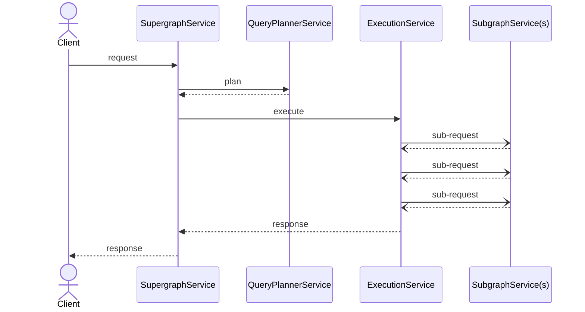

# Context

Demonstrate use of context to pass information between request lifecycle stages.

## Usage

```bash
cargo run -- -s ../../graphql/supergraph.graphql -c ./router.yaml
```

## Implementation

Context can be used to pass information between services. It's useful for storing things like authentication data or
collecting cache control information.

The request lifecycle looks like this:



For each request a single instance of `Context` is created and maintained .

In this example we:

1. Place some information in context at the incoming request of the router service. (world!)
2. Pick up and print it out at subgraph request. (Hello world!)
3. For each subgraph response merge some information into the `Context`. (response_count)
4. Pick up and print it out at router response. (response_count)

Context can store anything that is `Serde` compatible. For instance, all simple types or a custom type.

```rust
# Insert
context.insert("key1", 1)?;
```

Serialization and deserialization happen automatically. You may sometimes need to specify the type in the case
where the rust compiler cannot figure it out by itself.

```rust
# Get
let value : u32 = context.get("key1")?;
```

Upserts are guaranteed to happen serially. This is useful at the subgraph service where multiple requests are happening
in parallel.

```rust
# Upsert
context.upsert("present", |v| v + 1, || 0)?;
```
