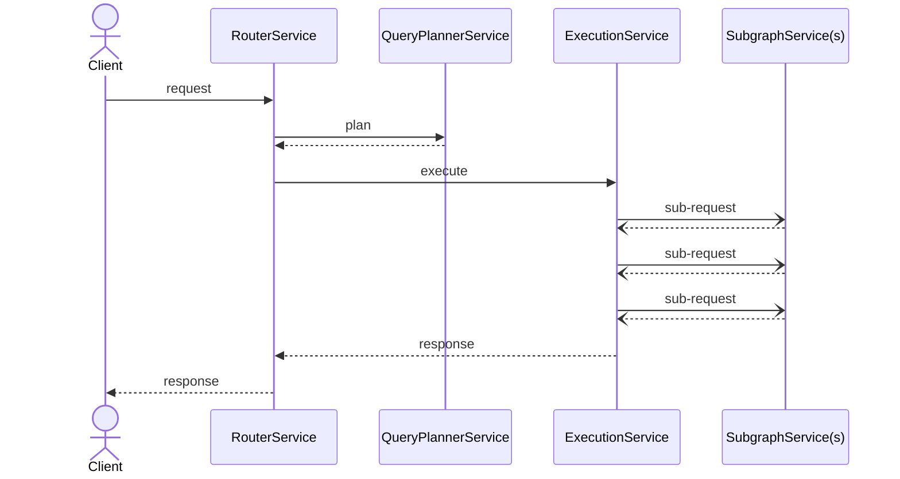

# Context

Demonstrate use of schema applied in various request lifecycle stages.

## Usage
```bash
cargo run -- -s ../graphql/supergraph.graphql -c ./router.yaml
```

## Implementation
A plugin may implement the `schema_update` function to receive notifications whenever the router schema is updated.
The schema may then be used in various plugin lifecycle hooks.

The request lifecycle looks like this:


In this example we:
<TBD>

