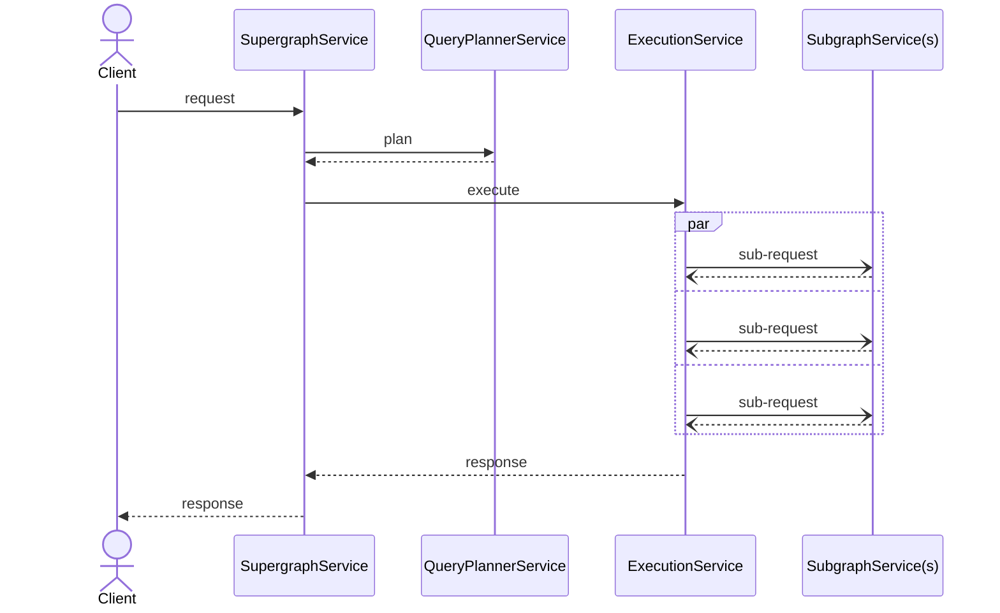

# Status code propagation

Demonstrates propagation of http status code from subgraph services to the overall response.
For instance, if a subgraph service fails and returns non 200 status code then it is propagated to the client.

## Usage

```bash
cargo run -- -s ../../graphql/supergraph.graphql -c ./router.yaml
```

## Implementation

This implementation makes use of `map_response` and `Context` to pass information from subgraph requests to the overall
`router_response` service.

The request lifecycle looks like this:



On each subgraph response the value `upsert` is called on the context to potentially place the http response code
into a known key.

When the overall response is returned at the router service, the response code is extracted from `Context` and set
on the response.
