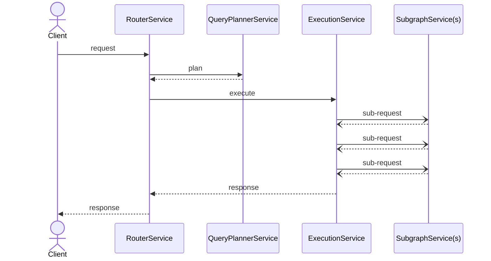

# Context

Demonstrate use of supergraph sdl (schema definition language)  applied in various request lifecycle stages.

## Usage
```bash
cargo run -- -s ../graphql/supergraph.graphql -c ./router.yaml
```

## Implementation
A plugin receives the supergraph sdl at startup (when `new` is invoked). 
The schema may then be used in various plugin lifecycle hooks.

The request lifecycle looks like this:


In this example we:
 - Store the supplied supergraph in our main struct
 - Use it to create a compiler context with apollo-rs ApolloCompiler
 - Log out any diagnostic errors or warning from the compiled supergraph
