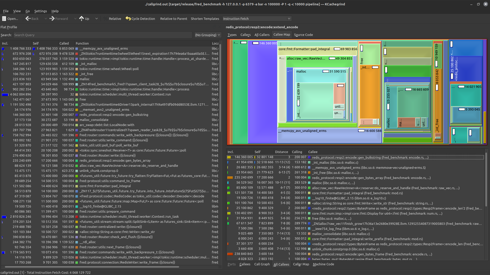
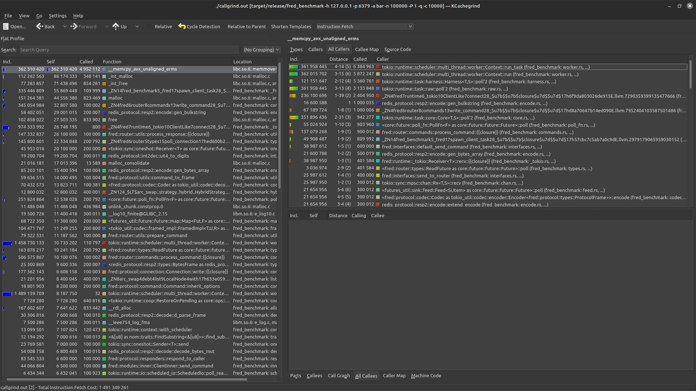

How It Works
============

This document describes how the client works in more detail. The intended audience is potential contributors or
maintainers, or anybody that wants a better understanding of how the library works.

Background information is covered first, then the current design goals and implementation is described, and finally this
document outlines previous designs and the various trade-offs between those approaches and the current implementation.

Redis and Valkey, particularly clustered deployments, push a lot of connection management complexity on the client
author, and there are several ways client library authors can handle this. Over the years this client has tried several
approaches, and this document will describe each of them and their trade-offs.

There are several other components to consider, such as protocol parsing, TLS, the Redis auth and connection handshake,
pipelining, transactions, sentinels, etc. However, this document will focus primarily on connection management patterns
since those design decisions influence the overall client design more than anything else. The centralized and sentinel
routing layers use the same general patterns as the clustered routing layer, but with just one connection rather than
multiple.

# Design Goals

1. Robust failure mode support across the board for issues related to networking. If a connection, server, or cluster
   fails the client should not fail or lose data (memory limits notwithstanding), and things should start working again
   once the server comes back online.
2. Performance. The client should support high-throughput use cases and memory-intensive use cases.
3. Ergonomics. The library should be easy to use and easy to read.
4. Safety and error handling. No unsafe rust, and never panic.
5. Feature parity with the latest Valkey or Redis features.

# Background

Before describing the library design it's important for callers to be familiar with a few patterns and dependencies:

* [Tokio Networking](https://docs.rs/tokio/latest/tokio/net/index.html)
* [Message Passing](https://docs.rs/tokio/latest/tokio/sync/index.html#message-passing)
* [RESP2 & RESP3](https://redis.io/docs/latest/develop/reference/protocol-spec/)
* [Futures](https://rust-lang.github.io/async-book/02_execution/02_future.html)
* [Actors In Tokio](https://ryhl.io/blog/actors-with-tokio/)

Additionally, it's important for callers to familiarize themselves with a few specific aspects of Redis/Valkey, most
notably clustering and pipelining. The next sections introduce these concepts and describe how they inform the library
design.

# Redis Cluster Crash Course

[Redis Cluster Specification](https://redis.io/docs/latest/operate/oss_and_stack/reference/cluster-spec/)

Redis & Valkey clustering works by spreading the keyspace (the remote data set) across several nodes that operate
independently. Nodes can either be primary or replica nodes, where only primary nodes are able to receive writes from
callers, and each primary may have multiple replicas. Client libraries typically hold connections to each primary node
and may optionally hold some number of replica connections open as well, but generally clients only use one connection
to each node.

The keyspace is divided into chunks via
the [cluster hash interface](https://redis.io/docs/latest/operate/oss_and_stack/reference/cluster-spec/#key-distribution-model).
This interface uses a hashing model to map keys to integers in the range 0-16383 (16384 total hash slots), where each
primary node owns some number of hash slots. As a result a cluster can have at most 16384 total nodes. When callers
issue a command to the cluster client libraries typically first perform a hashing operation to find the associated hash
slot, then they use that hash slot to select one of several connections before sending the command to that node. Cluster
nodes may respond with `MOVED` or `ASK` errors/redirections if they receive a command that should be sent to a different
cluster node.

When nodes change (adding a new node via scaling out, removing a node when scaling in, or just general hash slot
re-balancing) the cluster nodes coordinate amongst each other to re-assign these hash slots to different nodes. The
`CLUSTER SLOTS` or `CLUSTER SHARDS` commands can be used to inspect the state of the cluster. These commands return
payloads that describe the nodes in the cluster, how to communicate with each node (hostnames, ports, TLS server names,
etc), the hash slots owned by each node, and which replicas are assigned to which primary nodes.

From the Redis documentation for [CLUSTER SLOTS](https://redis.io/docs/latest/commands/cluster-slots/):

```
> CLUSTER SLOTS
1) 1) (integer) 0
   2) (integer) 5460
   3) 1) "127.0.0.1"
      2) (integer) 30001
      3) "09dbe9720cda62f7865eabc5fd8857c5d2678366"
      4) 1) hostname
         2) "host-1.redis.example.com"
   4) 1) "127.0.0.1"
      2) (integer) 30004
      3) "821d8ca00d7ccf931ed3ffc7e3db0599d2271abf"
      4) 1) hostname
         2) "host-2.redis.example.com"
2) 1) (integer) 5461
   2) (integer) 10922
   3) 1) "127.0.0.1"
      2) (integer) 30002
      3) "c9d93d9f2c0c524ff34cc11838c2003d8c29e013"
      4) 1) hostname
         2) "host-3.redis.example.com"
   4) 1) "127.0.0.1"
      2) (integer) 30005
      3) "faadb3eb99009de4ab72ad6b6ed87634c7ee410f"
      4) 1) hostname
         2) "host-4.redis.example.com"
3) 1) (integer) 10923
   2) (integer) 16383
   3) 1) "127.0.0.1"
      2) (integer) 30003
      3) "044ec91f325b7595e76dbcb18cc688b6a5b434a1"
      4) 1) hostname
         2) "host-5.redis.example.com"
   4) 1) "127.0.0.1"
      2) (integer) 30006
      3) "58e6e48d41228013e5d9c1c37c5060693925e97e"
      4) 1) hostname
         2) "host-6.redis.example.com"
```

Client libraries typically call one of these commands when first connecting in order to discover the rest of the cluster
nodes and to build their in-memory hash map routing layers. Some client libraries also periodically call these commands
and refresh their routing maps on an interval, or when handling certain events such as connections closing or `MOVED`
error redirections.

# Pipelining Overview

In practice most client libraries are shared among multiple concurrent Tokio tasks. Supporting high-throughput use cases
in this context is one of the most important design goals of a client library for a system like Redis or Valkey.
Pipelining is the primary mechanism used to accomplish this.

[Pipelining Background](https://redis.io/docs/latest/develop/use/pipelining/)

Pipelining is the process by which a client can send multiple commands to the server without waiting on a response
between each command. As shown in the link above this can have a dramatic effect on overall latency since clients do not
need to wait for a full round trip across the network for each command.

It's important to remember that the server still operates on each command in series, one at a time, before handling the
next command. Commands always finish in order (and TCP ensures packets always arrive in order) and the server always
operates on one command at a time. In other words - a server never operates on multiple commands in parallel, even with
pipelined commands. Pipelining is strictly concerned with minimizing the impact of network latency. As a result clients
can generally rely on responses arriving in order corresponding to the order in which the requests were sent (with
some exceptions such as pubsub). The invariant that the server returns responses in the same order that requests are
sent is what underpins most pipelining optimizations in this and other client libraries.

## Pipeline Interfaces

There are two types of pipelining to consider with Valkey/Redis clients, specifically with runtimes such as Tokio -
pipelining **across** tasks and pipelining **within** a task. The former is concerned with how multiple Tokio tasks can
share a single connection without coordination or waiting on one another, and the latter is concerned with how callers
can issue multiple commands in a single task without waiting on each response.

Internally the client handles these two use cases separately.

### Across Tasks

This example shows how multiple Tokio tasks can share a connection such that tasks do not have to wait on another task's
round trip across the network before sending a command. In almost all cases the client does this pipelining
transparently for the caller. The `redis-rs` library calls this multiplexing (`MultiplexedConnection`).

```rust
#[tokio::main]
async fn main() -> Result<(), Error> {
  let listener = TcpListener::bind("127.0.0.1:8080").await?;
  let client = Builder::default_centralized().build()?;

  loop {
    let (socket, _) = listener.accept().await?;
    process_socket(&client, socket);
  }
  Ok(())
}

async fn process_socket(client: &Client, mut socket: TcpStream) {
  let client = client.clone();
  tokio::spawn(async move {
    loop {
      let key = read_key(&mut socket).await?;
      let value: String = client.get(key).await?;
      println!("Got: {value}");
    }
  });
}

async fn read_key(socket: &mut TcpStream) -> Result<String, Error> {
  // read and parse the next frame from the socket
  unimplemented!()
}
```

### Within a Task

In this example the pipeline is created and executed in the context of a single Tokio task, but we only wait for one
round trip to the server.

```rust
async fn example(client: &Client) -> Result<(), Error> {
  let pipeline = client.pipeline();

  // commands are buffered in memory. the pipeline interface could be synchronous (the first two await points return 
  // immediately), but that would require duplicating >200 public functions, massively inflating compilation times just
  // to avoid an await point that doesn't actually wait on anything. instead the client interfaces re-use the same 
  // async interfaces but with a different implementation that buffers the commands in memory first.
  let _: () = pipeline.incr("foo").await?;
  let _: () = pipeline.incr("foo").await?;
  // commands are sent when calling all(), last(), or try_all(()
  let (first, second): (i64, i64) = pipeline.all().await?;
  assert_eq!((first, second), (1, 2));

  Ok(())
}
```

# Routing

The library has two primary code paths to consider - writing to a socket and reading from a socket. These sections cover
them separately, starting with the write path. It's important to read the pipelining section above first. The code
examples shown below start with simplified implementations then change to show how various features are actually
implemented.

In the context of most stateful TCP-based clients we have two types of futures to consider - request-response futures
and futures that drive the underlying connection(s) (checking for errors, connections closing, etc). This is an
important distinction because there are some events that can occur outside the request-response lifecycle, such as a
connection closing when no task is waiting on a response, and we often want to handle these events immediately without
requiring the caller to re-implement their own connection management logic around every single request.

Many clients, including this one, handle this by spawning one or more internal tasks or futures for connection
management while returning separate futures in request-response interfaces. For example, the `tokio-postgres` crate
returns both a `Client` and a `Connection` from
the [connect](https://docs.rs/tokio-postgres/latest/tokio_postgres/fn.connect.html) function. The `Client` is
responsible for creating request-response futures and the `Connection` future is what handles all the connection-related
events. This library uses a similar model where the `connect` function returns a Tokio task that manages all the
connections to the servers and the various command interface traits return futures that just drive individual
requests/commands.

In the context of this library the connection task is called the routing task since it often manages more than one
connection with clustered deployments. Callers send commands to this task via
a [message passing](https://en.wikipedia.org/wiki/Message_passing) interface implemented via
a [channel](https://docs.rs/tokio/latest/tokio/sync/mpsc/fn.unbounded_channel.html), and the routing task responds back
to callers via the [oneshot](https://docs.rs/tokio/latest/tokio/sync/oneshot/fn.channel.html) interface.

Generally speaking message passing implementations have some important trade-offs, such as it being more complicated to
preempt messages, but also offer several advantages around the lack of required synchronization. Currently, the hot code
paths in recent versions are entirely lock free for this reason.

As mentioned above, the routing task manages all the private state associated with connection management. This is
encapsulated in the `Router` struct, which is not shared across tasks and has the following fields (simplified
somewhat):

```rust
#[derive(Hash)]
struct Server {
  // note that `Str` is cheaply cloneable
  pub host: Str,
  pub port: u16
}

struct Router {
  pub connections: HashMap<Server, TcpStream>,
  pub retry_buffer: VecDeque<Command>,
  #[cfg(feature = "replicas")]
  pub replicas: HashMap<Server, TcpStream>
}
```

However, there is some state that must be shared between the routing task and callers. This includes configuration
information, channel senders, reconnection policy info, etc. The public `Client` struct is a thin wrapper around this
private struct, called `ClientInner`:

```rust
struct ClientInner {
  pub config: Config,
  pub reconnect_policy: ReconnectPolicy,
  pub command_tx: ArcSwap<UnboundedSender<Command>>,
  pub command_rx: ArcSwapOption<UnboundedReviever<Command>>,
  // ...
}

#[derive(Clone)]
pub struct Client {
  inner: Arc<ClientInner>
}

impl Client {
  pub fn new(config: Config, policy: ReconnectPolicy) -> Self {
    let (tx, rx) = unbounded_channel();
    Client {
      inner: Arc::new(ClientInner {
        config,
        policy,
        command_tx: ArcSwap::new(Arc::new(tx)),
        command_rx: ArcSwapOption::new(Arc::new(Some(rx)))
      })
    }
  }
}
```

At a high level the router task is created and used in a `recv` loop (simplified quite a bit):

```rust
impl Client {
  pub fn connect(&self) -> JoinHandle<Result<(), Error>> {
    let inner = self.inner.clone();

    tokio::spawn(async move {
      let mut router = Router::new();
      create_connections(&inner, &mut router).await?;

      while let Some(command) = inner.command_rx.recv().await? {
        process_command(&inner, &mut router, command).await?;
      }
      Ok(())
    })
  }
}
```

The `Command` struct contains all the state necessary to service a request. It has the following general
fields:

```rust
enum CommandKind {
  Get,
  Set,
  Del,
  // ...
}

struct Command {
  pub kind: CommandKind,
  pub args: Vec<Value>,
  pub tx: Option<OneshotSender<Resp3Frame>>,
  // ...
}
```

Request-response futures work by sending a `Command` to the `Router` via the `command_tx` channel on `ClientInner`. The
router then receives these commands and responds to the caller via the `tx` field. At a high level all request-response
functions use the following pattern:

```rust
impl Client {
  pub async fn get<K: Into<Key>>(&self, key: K) -> Result<Value, Error> {
    let (tx, rx) = oneshot_channel();
    let command = Command {
      kind: CommandKind::Get,
      args: vec![key.into().into()],
      tx
    };

    self.inner.command_tx.load().send(command);
    rx.await.and_then(|f| f.into())
  }
}
```

## Writes

At a high level the write path follows this process:

1. Receive a command from the `command_rx` receiver.
2. Find the associated `Server` that should receive the command, applying the cluster hash process if necessary.
3. Encode the `Command` as a `Resp3Frame` via the [redis-protocol](https://github.com/aembke/redis-protocol.rs) crate.
4. Store the `Command` at the end of a buffer associated with the socket from step 2.
5. Write the `Resp3Frame` to the associated socket.
6. If the socket write fails then put the `Command` in the `retry_buffer` field on `Router`. This is covered in more
   detail in the read path section. If a socket closes the underlying error will be returned in the next call to
   `poll_next`, so we want to handle errors there.
7. GOTO 1, without waiting on a response. Choosing to not wait on the response here is what allows the client to
   automatically pipeline commands **across** tasks.

Generally speaking the write path for normal commands is relatively simple. However, in practice the `command_tx` field
on `ClientInner` is responsible for sending more than just simple Valkey/Redis commands to the server - there's also
transactions, pipelines, and other features to consider. Additionally, since the `Router` owns all the `TcpStreams` it
also has to handle reconnection events and other connection management features for callers.

There is an additional command wrapper type to handle this, called `RouterCommand`:

```rust
enum RouterCommand {
  Command(Command),
  Reconnect(Server),
  Transaction(Vec<Command>),
  Pipeline(Vec<Command>),
  // ...
}

struct ClientInner {
  pub config: Config,
  pub reconnect_policy: ReconnectPolicy,
  pub command_tx: ArcSwap<UnboundedSender<RouterCommand>>,
  pub command_rx: ArcSwapOption<UnboundedReviever<RouterCommand>>,
  // ...
}
```

When the router receives a variant other than `RouterCommand::Command` it performs a different process depending on the
type of command. Transactions and pipelines are relatively straightforward, but reconnections are more complicated. When
a reconnection event is received the router enters a `sleep` loop based on the fields in the provided `ReconnectPolicy`:

```rust
async fn process_command(inner: &Arc<ClientInner>, router: &mut Router, command: RouterCommand) -> Result<(), Error> {
  match command {
    RouterCommand::Reconnect(server) => {
      reconnect_with_policy(inner, router, server).await
    }
    _ => unimplemented!()
  }
}

async fn reconnect_with_policy(inner: &Arc<ClientInner>, router: &mut Router, server: &Server) -> Result<(), Error> {
  loop {
    if let Err(err) = reconnect_once(inner, router, server).await {
      // this also checks whether the max reconnection attempts has been reached
      match inner.reconnect_policy.next_delay() {
        Some(dur) => tokio::sleep(dur).await,
        None => return Err(err)
      };
    } else {
      // drain the `retry_buffer`, retrying all the commands that were in-flight when the connection closed
      router.retry_failed_commands().await;
      break;
    }
  }

  Ok(())
}
```

In practice this is quite a bit more complicated due to how the read path is implemented. While the `sleep` call is
waiting we often want to perform other actions, such as preempting the client via `quit` or reading frames from other
healthy connections. This is covered in more detail in the read section. However, it's worth noting that while the
`sleep` call is waiting no other normal commands will be written to any of the other sockets. This may change in the
future, but for now it dramatically simplifies the reconnection logic.

## Connections

The following section covers lower level TCP connection details and how they relate to the pipelining features
implemented by the client. The [Reads](#Reads) section depends on several of the implementation details described here.

### Initializing Connections

When a connection is first created the client sends the following commands:

1. `AUTH` (if RESP2), `HELLO` (if RESP3), or `PING` (if no credentials are provided).
2. `SELECT`, if a database is provided
3. `CLIENT SETNAME`, if the `auto_client_setname` flag is set.
4. `CLIENT ID`. This can fail without causing issues.
5. `INFO server`. This is used to detect the server type and version, and can fail without causing issues.
6. `CLUSTER INFO`. This is used to check the health of the cluster node, and can be skipped if the
   `disable_cluster_health_check` flag is set.

If this connection is the first connection being created and the client is connecting to a cluster then we start the
cluster sync process. This is started in the private `sync_cluster` function, and does the following:

1. Send `CLUSTER SLOTS` or `CLUSTER SHARDS`.
2. Parse the response, building a `ClusterRouting` index in the process. This is then cached and used later to route
   commands to specific cluster nodes.
3. Diff the current connection map with the new routing index to find the set of connections that should be created and
   the set of connections that should be dropped.
4. Broadcast any pending changes to callers that subscribed via the `on_cluster_change` interface.
5. Concurrently connect to each of the new primary node servers.
6. Disconnect from all the servers that are no longer primary cluster nodes, placing any pending commands into the
   router's retry buffer.
7. Update any cached info, such as the server version, connection ID map, etc.

When a connection closes or upon receiving a `MOVED` redirection the client restarts the cluster sync process. Callers
can also trigger this via the public `force_reconnection` function.

### Interfaces

In general client library authors have a choice to make related to they should support various connection flavors, which
usually include TCP, TCP+TLS, and Unix sockets. This choice often boils down to whether they should expose a generic
interface where the caller specifies the type of connection in the `Client` signature or whether this information should
be kept private in private types.

In practice this usually results in choosing between one of the two following interfaces:

```rust
// expose connection details to the caller
pub struct Client<T: AsyncRead + AsyncWrite> {
  // ...
}

// or keep connection details hidden in private types
pub struct Client {
  // ...
}
```

In cases where callers want to use custom transport layers the first option usually best, but with Valkey/Redis
there's only 3 choices - TCP, TCP+TLS, or Unix sockets. For this reason this library uses the second option and hides
the connection types in private types. This is done via the `ConnectionKind` enum which has a variant for the 3
connection flavors mentioned above:

```rust
enum ConnectionKind {
  Tcp(TcpStream),
  #[cfg(feature = "enable-rustls")]
  Rustls(TlsStream<TcpStream>),
  #[cfg(feature = "enable-native-tls")]
  NativeTls(TlsStream<TcpStream>),
  #[cfg(feature = "unix-sockets")]
  Unix(UnixStream)
}
```

This model describes how the connection details are hidden from callers, but does not describe how the RESP2 and RESP3
protocols are implemented. The [Tokio codec](https://docs.rs/tokio-util/latest/tokio_util/codec/index.html) interface is
used to do this, which essentially converts `AsyncRead + AsyncWrite` to `Stream + Sink` by encoding and decoding frames
from `BytesMut` buffers. This is often called "framing", and is exposed via a `Framed` container type that wraps an
inner `AsyncRead + AsyncWrite` type. See
the [Redis Protocol Codec Documentation](https://docs.rs/redis-protocol/latest/redis_protocol/codec/struct.Resp3.html)
for more info.

With this interface we get the following implementation for `ConnectionKind`. The ability to peek errors from sockets is
often useful for error handling purposes, so we wrap each connection type in
a [Peekable](https://docs.rs/futures/latest/futures/stream/struct.Peekable.html) struct. The `Codec` type in this case
is a custom codec implementation that handles both RESP2 and RESP3, but converts inbound RESP2 frames into RESP3 frames
in order to simplify response handling logic.

```rust
enum ProtocolFrame {
  Resp2(Resp2Frame),
  Resp3(Resp3Frame)
}

enum ConnectionKind {
  Tcp(Peekable<Framed<TcpStream, Codec>>),
  #[cfg(feature = "unix-sockets")]
  Unix(Peekable<Framed<UnixStream, Codec>>),
  #[cfg(any(feature = "enable-rustls", feature = "enable-rustls-ring"))]
  Rustls(Peekable<Framed<RustlsStream<TcpStream>, Codec>>),
  #[cfg(feature = "enable-native-tls")]
  NativeTls(Peekable<Framed<NativeTlsStream<TcpStream>, Codec>>),
}

impl Stream for ConnectionKind {
  type Item = Result<ProtocolFrame, Error>;

  // ...
}

impl Sink<ProtocolFrame> for ConnectionKind {
  type Error = Error;

  // ...
}
```

Additionally, each connection must track some additional state in order to implement the pipelining features described
earlier.

```rust
pub struct Connection {
  pub transport: ConnectionKind,
  pub buffer: VecDeque<Command>,
  // ...
}
```

The most important field is `buffer`, which acts as a queue that tracks in-flight requests that are still waiting on a
response. Since the server always* responds to requests in the order in which they were sent we can simply push and pop
from opposite ends of this `VecDeque` when writing and reading frames. The front of `buffer` points to the command that
should be associated with the next frame received on the socket.

This results in the following high level process for writing and reading frames to a connection:

```rust
impl Connection {
  pub async fn write(&mut self, command: Command) -> Result<(), Error> {
    let frame = encode_frame(&command)?;
    self.buffer.push_back(command);
    self.transport.send(frame).await
  }

  pub async fn read(&mut self) -> Result<Option<(Resp3Frame, Command)>, Error> {
    let frame = self.transport.next().await?;
    Ok(self.buffer.pop_front().map(|cmd| (frame, cmd)))
  }
}
```

In the actual implementation both functions are quite a bit more complicated. In some cases we may choose not to flush
the TCP connection (such as when there's another pending request ready to be encoded), and in other cases we may not
store the command in `buffer` (such as when no responses are expected). Additionally, the read path also has to handle
out-of-band frames such as pubsub frames. This is covered in more detail later.

Ultimately this leads to something like the following `Router` definition. The `ClusterRouting` struct contains an
indexed version of the last response from `CLUSTER SLOTS` or `CLUSTER SHARDS`, optimized for mapping a `Key` to a
`Server`.

```rust
pub enum Connections {
  Centralized {
    connection: Connection,
    // ...
  },
  Sentinel {
    connection: Connection,
    // ...
  },
  Clustered {
    connections: HashMap<Server, Connection>,
    cache: ClusterRouting,
    // ...
  }
}

impl Connections {
  pub fn get_connection_mut(&mut self, server: &Server) -> Option<&mut Connection> {
    match self {
      Connections::Clustered { ref mut connection } | Connections::Sentinel { ref mut connection } => {
        connection
      }
      Connections::Clustered { connections, .. } => {
        connections.get_mut(server)
      }
    }
  }

  pub async fn write(&mut self, command: Command) -> Result<(), Error> {
    match self {
      Connections::Centralized { connection } | Connections::Sentinel { connection } => {
        connection.write(command).await
      }
      Connections::Clustered { connections, cache } => {
        let server = match cache.get_server(command.first_key()) {
          Some(server) => server,
          None => return Err(Error::new(
            ErrorKind::Routing,
            format!("Failed to find server for hash slot {hash_slot}.")
          ))
        };

        if let Some(connection) = connections.get_mut(server) {
          connection.write(command).await
        } else {
          Err(Error::new(ErrorKind::Routing, format!("Missing connection to {server}")))
        }
      }
    }
  }

  // ...
}

pub struct Router {
  pub connections: Connections,
  pub retry_buffer: VecDeque<RouterCommand>,
  #[cfg(feature = "replicas")]
  pub replicas: HashMap<Server, Connection>
}
```

## Reads

Before describing the read process it's important to consider the context in which the client handles commands.
Ultimately we have one Tokio task that has to handle both reads and writes from multiple sockets concurrently, and also
has to handle out-of-band frames from servers (such as pubsub frames, etc). This means we can't simply call `poll_next`
on the socket every time we write a frame. Instead, we have to expose an interface that operates as if each connection
had its own dedicated task for reading frames concurrently.

Typically this kind of thing is done in a `select` loop where we try either reading or writing a frame, but there's a
very important caveat with codecs that we have to consider - **combining a `Framed` container with a `TcpStream` results
in a `Stream` interface that is not cancel-safe.** In other words, if we try to read from all sockets with a `select`
wrapper, and multiple sockets have frames ready, then we'll drop all the frames other than the one we return.

In order to properly handle this situation the client implements a custom `Future` type for concurrently polling
multiple connections - called `ReadAllFuture` in the code. This future is designed to be called in the context of
`select`, and at a high level it does the following:

```rust
// a buffer containing response frames and the associated server identifier
type Responses = Vec<(Server, Option<Result<Resp3Frame, Error>>)>;

pub struct ReadAllFuture<'a, 'b> {
  inner: &'a Arc<ClientInner>,
  connections: &'b mut HashMap<Server, Connection>,
}

impl Future for ReadAllFuture<'_, '_> {
  type Output = Responses;

  fn poll(self: Pin<&mut Self>, cx: &mut Context<'_>) -> Poll<Self::Output> {
    if self.connections.is_empty() {
      // return pending because we know this will be interrupted by another future returning first, such 
      // as a command being received by the router, a reconnection attempt finishing, etc.
      return Poll::Pending;
    }

    let _self = self.get_mut();
    let mut out = Vec::new();
    for (_, conn) in _self.connections.iter_mut() {
      poll_connection(conn, cx, &mut out);
    }

    if out.is_empty() {
      Poll::Pending
    } else {
      Poll::Ready(out)
    }
  }
}

fn poll_connection(conn: &mut Connection, cx: &mut Context<'_>, buf: &mut Responses) {
  // check for response frames or tell the runtime to wake up later when one is received. the `server` is cloned 
  // because we need to mutably borrow the connection again after this, so we can't return a second immutable reference 
  // to a different field on that struct. hopefully one day partial borrowing will be supported, but for now we can 
  // rely on a `Server` being cheaply cloneable since the inner `bytes_utils::Str` is cheaply cloneable.
  match Pin::new(&mut conn.transport).poll_next(cx) {
    // indicates a frame has been received
    Poll::Ready(Some(frame)) => {
      buf.push((conn.server.clone(), Some(frame.map(|f| f.into_resp3()))));
    }
    // indicates the connection has closed
    Poll::Ready(None) => {
      buf.push((conn.server.clone(), None));
    }
    // indicates that no frames are ready
    Poll::Pending => Poll::Pending
  }
}
```

Finally, this logic is combined with write-path logic via a `select` loop. At a high level it does the following:

```rust
async fn read_or_write(inner: &Arc<ClientInner>, router: &mut Router) -> Result<(), Error> {
  let mut command_rx = inner.command_rx.swap(None);
  let mut result = Ok(());

  loop {
    // note that the outer futures passed to both select branches do not reference any of the same types
    tokio::select! {
      // prefer reading inbound responses from servers
      biased; 
      results = ReadAllFuture::new(router) => {
        for (server, frame) in results.into_iter() {
          match frame {
            Some(Ok(frame)) => {
              // note that is not async
              process_response(inner, router, server, frame);
            },
            // the connection closed with an IO error
            Some(Err(err)) => {
              let pending = router.disconnect(server).await;
              // put all the in-flight commands in the retry buffer
              router.retry_buffer.extend(pending);
              // defer the next reconnection attempt
              inner.command_tx.load().send(RouterCommand::Reconnect(server));
            },
            // the connection closed gracefully. in practice this also often triggers a reconnection event.
            None => router.disconnect(server).await
          }
        }
      },
      Some(command) = command_rx.recv() => {
        // only fatal errors are returned in this context. most write failure cases are handled internally.
        result = match command {
          // if this fails it typically puts the command in the `retry_buffer`.
          RouterCommand::Command(command) => router.write(command).await,
          // note that at this point `Router` is no longer borrowed by another future in the select! call, so we can
          // use a more sophisticated `reconnect_with_policy` implementation that simultaneously reads from sockets 
          // while sleeping before the next reconnection attempt.
          RouterCommand::Reconnect(server) => reconnect_with_policy(inner, router, server).await,
          RouterCommand::Pipeline(commands) => unimplemented!(),
          RouterCommand::Transaction(commands) => unimplemented!(),
        };
        
        if result.is_err() { break; }
      }
    }
  }

  // always put the old `rx` back in case this is called again
  inner.command_rx.swap(Some(command_rx));
  result
}

fn process_response(inner: &Arc<ClientInner>, router: &mut Router, server: Server, frame: Resp3Frame) {
  if frame.is_pubsub() {
    // do pubsub things
    unimplemented!()
  } else if let Some(conn) = router.connections.get_connection_mut(&server) {
    let command = match conn.buffer.pop_front() {
      Some(command) => command,
      None => return Err(Error::new(ErrorKind::Protocol, "Missing expected command."))
    };

    // respond to the caller
    command.tx.send(frame);
  }
}
```

We can then use `read_or_write` in the context of `Client::connect` like so:

```rust
impl Client {
  pub fn connect(&self) -> JoinHandle<Result<(), Error>> {
    let inner = self.inner.clone();

    tokio::spawn(async move {
      let mut router = Router::new();
      create_connections(&inner, &mut router).await?;
      read_or_write(inner, router).await
    })
  }
}
```

There are several other components in this library, but this covers the most important aspects that influence the
overall design and organization.

## Earlier Implementations

In earlier versions this library used a very different approach when reading from sockets. As mentioned above the
requirement that we quickly handle out-of-band frames and connection events means we can't simply call `poll_next` each
time we write a frame. Instead, we need an implementation that continuously polls the sockets to quickly detect frames
or IO errors. The sections above show how to do this with a `select` loop, but in the past this library used various
other approaches.

In versions 5.x - 9.x the client would instead spawn a new task for each connection. These tasks, previously called
reader tasks, used a `while` loop to repeatedly poll for frames or errors. However, this presented several challenges,
most notably that it meant we had to share connections across multiple tasks, and anything in Tokio that crosses a task
boundary must be `Send`.

The Tokio interface has a mechanism that can do this for TCP connections without locks via
the [split](https://docs.rs/tokio/latest/tokio/net/struct.TcpStream.html#method.into_split) interface, but that only
partially solves the state sharing issues mentioned above. The client would then split each connection after completing
the initialization process, storing the writer half on the `Router` and spawning a new task that owned the reader half.

```rust
async fn spawn_reader_task(inner: &Arc<ClientInner>, server: Server, reader: OwnedReadHalf) -> JoinHandle<Result<(), Error>> {
  let inner = inner.clone();
  // the router would then check the health of a reader by calling `is_finished` on the returned `JoinHandle`. 
  tokio::spawn(async move {
    while let Some(frame) = reader.try_next().await? {
      process_frame(inner, server, frame);
    }

    Ok(())
  })
}
```

This approach works, and provides a responsive way to handle out-of-band responses or IO errors, but has several
performance drawbacks. First, we're spawning one task per connection which introduces more scheduling overhead for the
runtime, but more importantly we also have to share the `buffer` field on each `Connection` across tasks in a way that
is `Send + Sync`, so a simple `VecDeque<Command>` no longer works.

In versions 5.x - 8.x the client used a `parking_lot::Mutex<VecDeque<Command>>`, which worked fine since the critical
section where we hold the lock is very small - it's just a single call to `push_back` or `pop_front`. In versions 9.x
this changed to use a `crossbeam::SeqQueue` instead, but readers might be surprised to learn this actually performed
2-5% worse in practice. I suspect this is primarily due to the fact that the critical section is small and `VecDeque`
has a different allocation strategy that may be more performant in certain scenarios.

Regardless, the real problems with this approach came from the fact that now all communication between readers and the
`Router` must be done via channels or locks. In some cases the `Router` may choose not to pipeline commands, such as for
blocking commands, `SELECT`, `HELLO`, or anything that modifies local connection state on the server. This meant the
reader task needed a way to "call back" to the `Router`, which meant the router would have to conditionally wait on yet
another oneshot channel whenever it wrote certain frames to a connection. Ultimately this lead to a lot of extra code (~
2000 LoC) simply for coordination between these tasks that would otherwise happen transparently via normal control flow
interfaces. Or said another way - one of the major benefits of the approach in versions 10.x is that whenever we have a
mutable reference to `Router` we have exclusive access to all the state needed to do anything to any of the connections,
and the compiler guarantees this. There's no need for any clever message passing shenanigans just to check if it's safe
to move on to the next command.

Needing multiple tasks to coordinate between one another had a noticeable impact on performance as well, but not for the
reasons I initially expected. This library includes a [benchmarking tool](../bin/benchmark), which showed the following
CPU usage profile when running with Valgrind/Callgrind:



A few things to note:

* A ton of time is spent allocating memory for large futures, using a relatively slow flavor of memcpy.
* A ton of time is spent in the timer wheel internals, despite the fact that this benchmark shouldn't really use any of
  the code paths that depend on timers. Most of the timing features are disabled when running this particular
  benchmark.
* `_int_malloc` is called far more often than I expected.

Digging in to the calls to calls to `__memcpy_avx_unaligned_erms` lead to a few discoveries:

* In `redis_protocol` most frame encoding calls require adding a length prefix to bulk string arrays (which is how the
  client encodes most outbound commands.) This was done with a naive implementation that just called
  `args.len().to_string().as_bytes()`, which incurred a heap allocation when creating the string. It turns out avoiding
  this is [somewhat complicated](https://github.com/aembke/redis-protocol.rs/blob/main/src/int2dec.rs), but it is
  possible.
* The code was not properly segmenting futures in some cases. `Box::pin` can help in some cases, but it doesn't
  remove the need to allocate this memory entirely, it just changes where it's stored. Ultimately the coordination
  between tasks required in the earlier implementation just resulted in a lot of large futures needing to be created in
  hot code paths. Fixing this would require some more invasive changes.
* While the inner contents of frames are cheaply cloneable thanks to the internals of `Bytes` and `Str`, the outer
  containers that hold those values in contiguous blocks were not cheaply cloneable. Avoiding this would require
  adding [a new frame variant](https://docs.rs/redis-protocol/latest/redis_protocol/resp3/types/enum.BorrowedFrame.html)
  that allowed the caller to pass around borrowed containers rather than owned containers.

Additionally, nearly 30% of the CPU cycles were spent in Tokio running portions of the Timer wheel implementation. This
was especially unexpected given that the benchmark logic disabled most of the features that depend on timers via
compilation flags.

This discovery is what lead to the rewrite of the routing logic in version 10.x - it became clear that the multi-task
approach for readers lead to some performance issues that were outside the direct control of this library. This was hard
to pin down, but my only plausible guess was that by using multiple tasks, and requiring Tokio to effectively context
switch between 2 or more tasks for every command, resulted in a bunch of other unnecessary scheduling logic to run more
often than expected.

In versions 10.x the router logic was rewritten to use the single-task model described above. After profiling with
Valgrind/Callgrind again:



A few new things to note:

* The timer wheel overhead is no longer present.
* The overall portion of time spent in `memcpy` was dramatically reduced, but it still represents a relatively large
  portion of the CPU cycles. The borrowed frame logic has not been fully integrated yet at the time of writing, so
  hopefully finishing that helps reduce this as well. However, most of the memcpy calls come from the Tokio runtime, so
  I suspect these are largely driven by the need to encapsulate complicated write path logic in relatively large
  futures.

These changes lead to the max throughput increasing by 3-5x in the benchmarks.

# Glommio

See the [glommio runtime docs](../src/runtime/README.md) for more info. 


