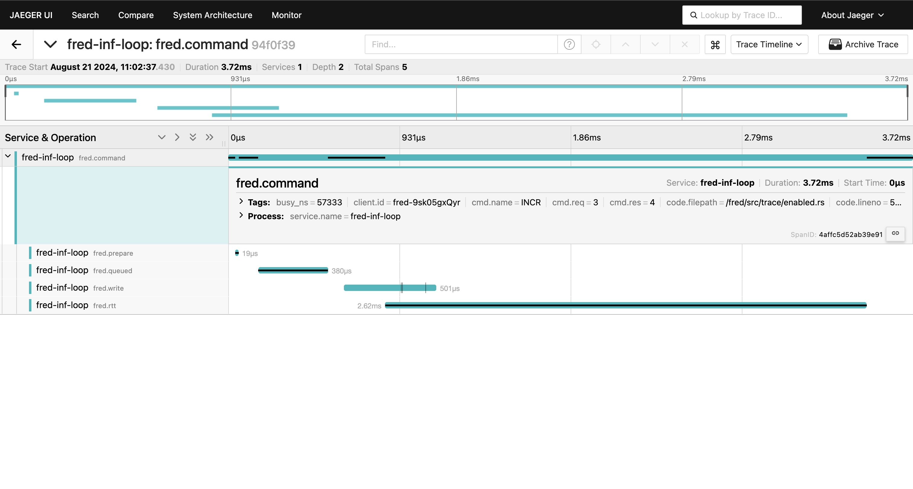

Tracing
=======

Tracing is implemented via the [tracing](https://github.com/tokio-rs/tracing) crate. This page describes the spans used
by the client and the fields emitted on each of the spans.

See the [benchmark](../../bin/benchmark) application for an example showing how to configure tracing with a
local Jaeger instance. This crate ships with a [small example](../../tests/docker/compose/jaeger.yml) that
uses `docker-compose` to run a local Jaeger instance.

## Spans

This table shows the spans emitted by the client. The `Partial Trace` column describes whether the span will appear when
only the `partial-tracing` feature flag is enabled.

| Name         | Description                                                                                                                                                  | Partial Trace |
|--------------|--------------------------------------------------------------------------------------------------------------------------------------------------------------|---------------|
| fred.command | The top level span used for all redis commands.                                                                                                              | x             |
| fred.prepare | Time spent checking and preparing arguments.                                                                                                                 |               |
| fred.queued  | Time spent waiting in the in-memory queue before being sent to the server. Pipelining and backpressure settings can significantly affect this.               |               |
| fred.write   | Time spent routing and writing a command to the socket.                                                                                                      |               |
| fred.rtt     | Time spent waiting on a response from the server, starting from when the first byte is fed to the socket and ending when the full response has been decoded. | x             |
| fred.pubsub  | Time spent parsing a publish-subscribe message.                                                                                                              |               |

Tracing levels for the two tracing features can be configured separately through the `TracingConfig`.

## Events

| Name              | Description                                                                  |
|-------------------|------------------------------------------------------------------------------|
| fred.backpressure | Emitted when a command hits backpressure due to too many in-flight commands. |

## Attributes

| Name          | Description                                                        |
|---------------|--------------------------------------------------------------------|
| client.id     | The ID of the client instance (`client.id()`).                     |
| client.queued | The length of the in-memory command queue.                         |
| cmd.name      | The redis command name.                                            |
| cmd.req       | The size (in bytes) of the command's arguments.                    |
| cmd.res       | The size (in bytes) of the command's response.                     |
| cmd.args      | The number of arguments being sent to the server.                  |
| cmd.flush     | Whether the socket was flushed while sending the command.          |
| msg.channel   | The channel on which a pubsub message was received.                |
| duration      | The duration of a pause, in milliseconds, of a backpressure event. |