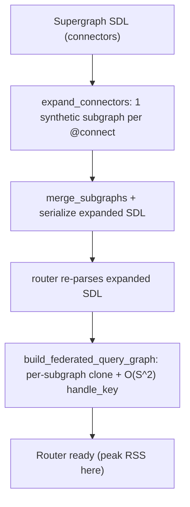

# 00 — Context (handoff anchor)

> Seeded in Phase 0 from `.cursor/plans/connectors_startup_memory_8bda2cb6.plan.md`.
> All later phases read this file first, then append results to their own `0N-*.md`.
> Branch: `smyrick/6817694b` (git-tracked, shareable, **never merged to main**).

## Problem (from the Slack thread)

Source: Apollo Constellation team (Calvin Cestari) in `#help` (`C02RNELA46A`).

- Router **OOMs on startup** when onlining large services.
- Currently **14Gi** allocated and still OOM-ing; Wayfair runs **28Gi**.
- Critical late detail: **every service is an Apollo Connector** (8 connectors now, no
  traditional subgraphs).
- Calvin's workaround — splitting connectors across **6 routers** behind an edge router
  (supergraph-of-supergraph) — cut total memory from ~14Gi to **~1.8Gi (~87% reduction)**.
- Renée Kooi: 14Gi at startup is **not** typical; hypothesizes a **connectors-specific**
  inefficiency. Asked for a **standalone reproduction + memory profiling** and a
  **router GitHub issue**.
- Service catalog (internal): `mdg-private/constellation-registry/service-catalog`.
- Matt Alexander did the original (internal) investigation, on vacation ~2 weeks.

## Root-cause hypothesis

The router expands **each `@connect` directive into its own synthetic federated subgraph**
before query planning (intentional, until a source-aware planner exists):

```49:55:apollo-federation/src/connectors/expand/mod.rs
/// Expand a schema with connector directives into unique subgraphs per directive
/// ...
/// each connector is separated into its own unique subgraph with relevant GraphQL directives to enforce
/// field dependencies and response structures.
```

Startup then builds a federated query graph over **all** synthetic subgraphs with repeated
clones and no cross-connector sharing. Peak RSS lands at router-ready.



## Ranked memory suspects (verified file:line — confirmed present in this worktree)

1. **`Connector.schema_subtypes_map` cloned per connector** — full source-schema subtype
   scan duplicated for every `@connect`. O(C × types).
   - field: `apollo-federation/src/connectors/models.rs:65` (`pub schema_subtypes_map`)
   - built per connector: `apollo-federation/src/connectors/models.rs:271`
   - scan fn: `apollo-federation/src/connectors/models.rs:282` (`subtypes_map_from_schema`)
2. **Query-graph build duplication** — `sources` + `subgraphs_by_name` hold same schemas
   twice; `api_schema.clone()` per subgraph; `handle_key` does ~`O(S^2)` node×subgraph pass.
   - entry: `apollo-federation/src/query_graph/build_query_graph.rs:60` (`build_federated_query_graph`)
   - `api_schema.clone()`: `apollo-federation/src/query_graph/build_query_graph.rs:91`
   - `copy_subgraphs`: `apollo-federation/src/query_graph/build_query_graph.rs:1189`
   - `subgraphs_by_name`: `apollo-federation/src/query_graph/build_query_graph.rs:74,1196`
   - `handle_key`: `apollo-federation/src/query_graph/build_query_graph.rs:1286`
3. **Expansion parse/serialize cycles** — supergraph parsed, subgraphs extracted, each
   connector schema serialized to string + re-parsed, merged, full SDL re-serialized, then
   router re-parses.
   - `apollo-federation/src/connectors/expand/mod.rs:56` (`expand_connectors`) and body to ~L236
4. **Repeated subgraph schema clones** down the pipeline (planner → `SubgraphSchemas` →
   router factory); no `Arc` sharing of schema bodies.
   - `apollo-router/src/query_planner/query_planner_service.rs:~233` (`SubgraphSchema::new(schema.schema().clone())`)
5. **Hot-reload doubling** (secondary; matches Walmart/OCI note) — old factory + planner
   stay alive while new one builds.
   - `apollo-router/src/state_machine.rs:157` (`Reloading` state)

Entry points for the connectors startup path:
- `apollo-router/src/spec/schema.rs:16` (import) / `:71` (`expand_connectors` call inside `parse_arc` at `:59`)
- planner build: `apollo-router/src/router_factory.rs:350` (`QueryPlannerService::new`)

## Profiling tooling available

- **dhat heap**: `cargo build --profile release-dhat -p apollo-router --features dhat-heap`,
  run with `-s supergraph.graphql -c router.yaml`, emits `dhat-heap.json` on exit.
  Wired in `apollo-router/src/allocator.rs:18+` (dhat cfg), started in `executable.rs`.
  Mutually exclusive with `global-allocator` metrics.
- **Federation-only dhat tests** to isolate planner from full router:
  `apollo-federation/tests/dhat_profiling/query_plan.rs` and `supergraph.rs`.
- **Local compose**: `rover supergraph compose --config supergraph.yaml` (rover **0.36.2**
  installed). Fallback: `cargo run -p apollo-federation-cli -- compose --config supergraph.yaml`.
- **RSS startup bench** pattern: `apollo-router-benchmarks/benches/memory_use.rs`.
- Largest existing connector fixture ~6.8KB — **no large connector supergraph in-repo**;
  must generate one.

## Environment (this machine)

- macOS (darwin 25.5.0), rover 0.40.0 (upgraded from 0.36.2; 0.36.2 had a `connector run`
  plugin-arg bug), cargo 1.95.0, python 3.14.
- Customer OOMs on Linux; allocation **shape** is platform-independent (dhat attribution
  transfers; absolute RSS may differ).

## Phase outputs (this dir)

- `00-context.md` — this file.
- `01-repro.md` — generator design, exact commands, generated artifact paths.
- `02-measurements.md` — raw numbers per run (N, RSS, dhat totals), scaling table.
- `03-rootcause.md` — dhat attribution mapped to code suspects.
- `04-report.md` — final writeup + draft GitHub issue body.
- `scripts/` — generator + run/measure scripts. `artifacts/` — generated SDL, dhat json, logs.
