# apollo-json — design

How the crate hangs together, written for an engineer joining the project.
It describes the implementation as it stands; the *why* behind the
requirements (workload analysis, measured decision records) lives in
[`docs/apollo-json-requirements.md`](../../../docs/apollo-json-requirements.md)
and the linked decision documents. Recorded performance and memory numbers
are in the benchmark crate's
[`RESULTS.md`](../apollo-json-benchmarks/RESULTS.md) and
[`MEMORY.md`](../apollo-json-benchmarks/MEMORY.md).

## The mental model in one paragraph

A parsed `Value` is an **arena**: the input bytes plus flat tables of
plain-data nodes, all behind a single `Arc`. Leaf values are byte spans into
the input, decoded lazily on access. Subtrees can be **shared across
documents by reference** — a share is one atomic increment, never a copy.
Mutation goes through a **builder**: it edits in place when it owns the
arena, and copies only the nodes along the mutated path when it does not.
Serializing an untouched document writes the original input spans back out
verbatim. The lifecycle is always:

```
parse ──▶ Value (immutable, shareable)
              │  read / share handles
              ▼
            edit() ──▶ ValueBuilder (mutable, uniquely owned)
                            │  set / remove / push / merge / cursors
                            ▼
                          seal() ──▶ Value ──▶ serialize
```

## The arena

**"Arena" here is not a bump-pointer allocator.** Nothing in the crate
bumps a pointer and nothing resembles `bumpalo`: the arena is a chunked,
index-addressed document store — plain `Vec`-backed fixed-size chunks
addressed by `u32` indices (`NodeId`, `SlabRef`, `ForeignId`), which is why
almost everything is safe Rust, why the byte cap can be
accounted exactly, and why the whole thing can be cleared and recycled
(`ParseBuffers`). What it shares with a classic arena — and why the word
stays — is the lifetime model: everything a document references lives in
one region that is freed wholesale, with no per-node bookkeeping.

`arena::Arena` owns everything a document refers to:

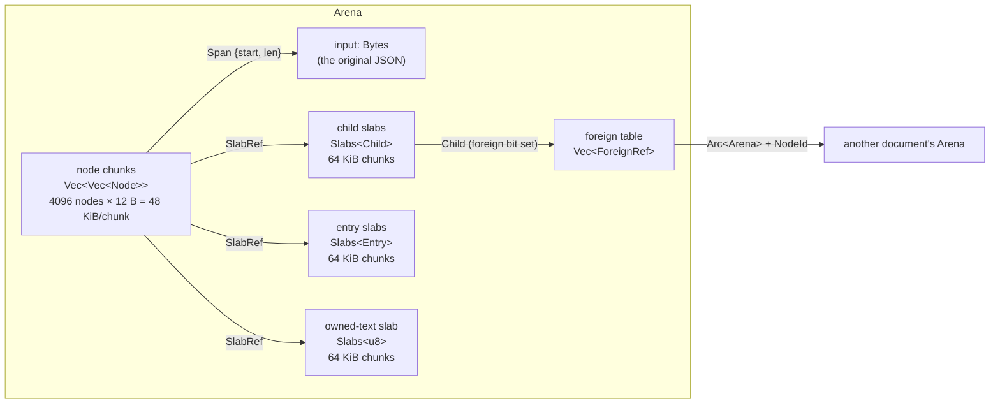

- **`input`** — the document bytes, held as `Bytes` so streaming
  serialization can yield zero-copy slices of it.
- **Node chunks** — nodes are addressed by `NodeId` (a `u32` index);
  `chunks[id / 4096][id % 4096]`. The first chunk is sized from
  `input_len / 16` and ramps up; after that, growth is one fixed 48 KiB
  chunk at a time.
- **Slab stores** (`slab::Slabs<T>`) — append-only chunked storage for
  container children, object entries, and owned text. A `SlabRef` is
  `(chunk: u16, start: u16, len: u32)`. Runs larger than a chunk get a
  dedicated chunk sized exactly to the run.
- **Foreign table** — references to nodes owned by *other* arenas; each
  entry holds an `Arc<Arena>` and a `NodeId` (see sharing, below).

**Growth policy: fixed-size chunks, no geometric doubling, no worst-case
pre-allocation.** Peak heap during parse tracks what the document actually
retains, within roughly one chunk of slack. The arena maintains a running
byte count (`Arena::bytes()`), and the parser aborts with
`JsonError::ArenaLimitExceeded` when input + nodes + slabs would exceed
`ParseOptions::max_arena_bytes` (default 256 MiB, additionally clamped to
`u32::MAX` because spans and ids are `u32`).

## Node representation

Nodes are plain `Copy` data — nothing in a node owns heap memory, which is
what makes drop O(chunks) rather than O(nodes):

| type | size | contents |
|---|---|---|
| `Node` | 12 B | tag + `Span` / `SlabRef` / overlay index |
| `Child` | 4 B | `u32`; high bit picks local `NodeId` vs foreign-table index |
| `Entry` | 16 B | `KeyRef` (span or owned text) + `Child` |

The `Node` variants: `Null`, `Bool`, `Number(Span)` /
`OwnedNumber(SlabRef)`, `String { span, escaped }` / `OwnedString(SlabRef)`,
`Array(SlabRef)`, `Object(SlabRef)`, and the builder-only `MutArray(u32)` /
`MutObject(u32)` overlays (never present in a sealed document). `Owned*`
variants hold values introduced by mutation or conversion in the arena's
owned-text slab; everything parsed stays a span into the input.

### Worked example

Parse `{"user":{"id":7,"tags":["a","b"]}}` and this is the entire resident
state — one arena, no pointers, every reference an index or a byte span.
The input ruler below is what every `Span{start,len}` points into; nodes are
pushed in completion order (leaves before their containers, the root last),
so the root is always the highest `NodeId`:

```
offset:  0         1         2         3
         0123456789012345678901234567890123
input:   {"user":{"id":7,"tags":["a","b"]}}
```

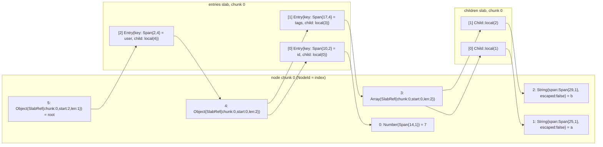

The text slab and the foreign table are empty: nothing was mutated and
nothing is shared. Every scalar is a span into the input — `7` is decoded
only if someone calls `as_i64()`.

Containers finish parsing *after* their children, so a container's children
always occupy one contiguous slab run — iteration is a linear scan over a
dense slice, and object lookup is a linear key compare that short-circuits
on length (key lengths live in the `KeyRef` itself).

## Ownership and refcounting

The unit of ownership is the **whole arena**: `Arc<Arena>`, one atomic
refcount. The one owner type, `Value`, is just an `(Arc<Arena>, NodeId)`
pair — a parsed document is a `Value` pointing at the arena's root, and a
shared subtree is a `Value` pointing at any other node; both are
`Send + Sync + 'static`. Its borrowed counterpart `ValueRef` is the `&str`
to `Value`'s `String`.

Cloning a `Value` is one atomic increment. There are **no per-node refcounts
and no per-node destructors**: dropping the last reference to an arena frees
its chunks wholesale. The only non-trivial drop work is releasing the
foreign table — `Arena::drop` unwinds chains of cross-arena references
iteratively (draining doomed arenas' tables into a work list) so a 50k-deep
chain of compositions cannot recurse through nested drops.

A three-document composition looks like this:

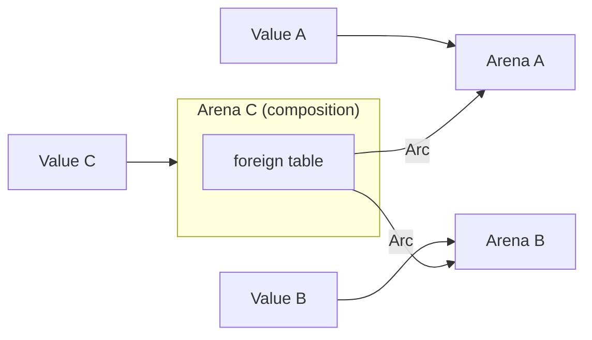

Dropping `Value A` and `Value B` leaves both arenas alive — arena C's
foreign table pins them. Dropping `Value C` then releases all three.
Teardown is a loop over foreign tables, never a recursive walk over nodes —
watch how the doomed arena's own references migrate into the work list
instead of dropping inside its destructor:

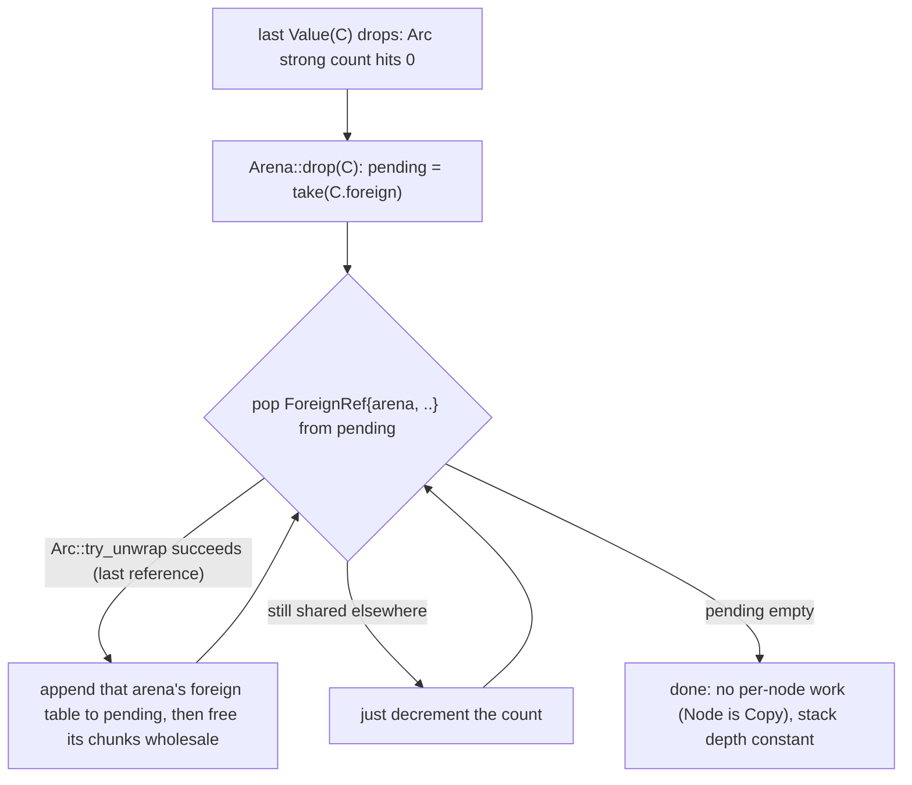

**Why cycles are structurally impossible.** An arena's foreign table only
grows while a `ValueBuilder` owns the arena *mutably*, and builders can
only adopt subtrees of **sealed** documents. For arena X to gain a reference
to arena Y, Y must already exist behind an `Arc`. Could Y in turn reference
X? Only if X was behind an `Arc` when Y was built — but then
`Arc::try_unwrap` would have failed for X and the builder would be editing a
*copy*, not X itself. Seal-before-share plus unique-or-copy mutation means
the reference graph is always a DAG ordered by seal time, so plain `Arc`
counting cannot leak.

## Cross-document sharing

A container child is a `Child`: either a local `NodeId` or (high bit set) an
index into the foreign table, whose entry holds `Arc<Arena>` + `NodeId` of
the owning arena. Traversal resolves transparently (`arena::resolve` for
borrowed reads, `resolve_owner` when an owned handle is needed), so readers
never notice arena boundaries.

After `builder.set("tags", a.get("user").unwrap().get("tags").unwrap())`
on a fresh builder, the sealed composition B looks like this. Note what is
*in* B: one node, one entry whose key text B owns, one foreign-table entry —
and nothing of the array itself, which stayed in A:

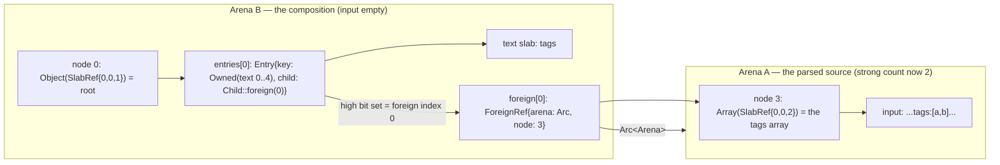

Sharing has **DAG semantics**: the same `Value` adopted twice produces
two references to one subtree, and serialization expands it at every
reference — the serialized form can be much larger than the resident form.
Nothing is ever copied at share time.

The flip side: **sharing pins whole arenas**. A handle to one 60-byte entity
keeps the entire source arena resident (see [Retention](#retention)).

## Mutation

Mutation goes through `ValueBuilder` — the builder/sealed split makes
"in place when unique" a type-level guarantee instead of a runtime hope.

- `ValueBuilder::new()` starts from an empty object.
- `Value::edit()` / `ValueBuilder::from_value(value)` consumes the
  handle. If it holds the **last** reference (`Arc::try_unwrap`
  succeeds), the builder takes the arena over and mutates it in place. If
  the arena is shared — including any handle to a subtree of a shared
  arena — the builder starts a fresh arena whose root is a foreign
  reference to the old one, and mutations **path-copy**.

**Path copying** (`localize_child`) is shallow, one level at a time: copying
a foreign container imports its own structure into the builder's arena while
every child becomes a foreign reference back into the source. Only the nodes
*along the mutated path* are ever copied; untouched siblings stay shared.
No holder of the original document can observe a builder's edits, in either
direction.

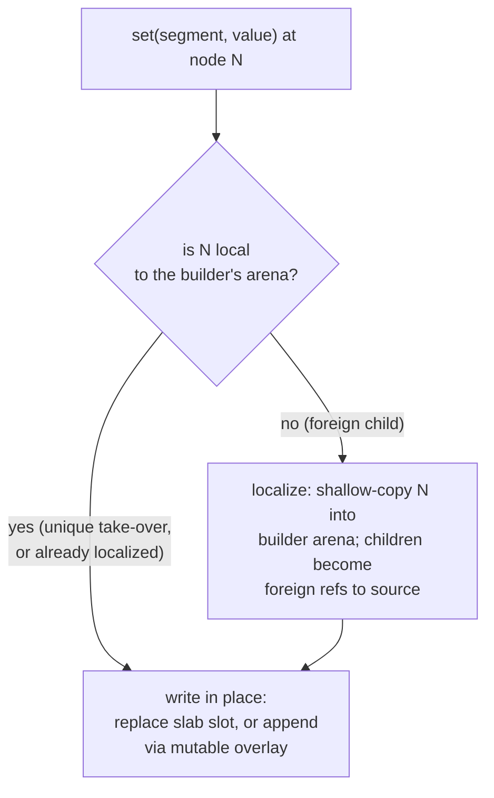

The two lifecycles end at the same `seal()` but do very different work.
Shared document — every step that touches a shared node copies exactly that
node into the builder's arena, one level at a time:

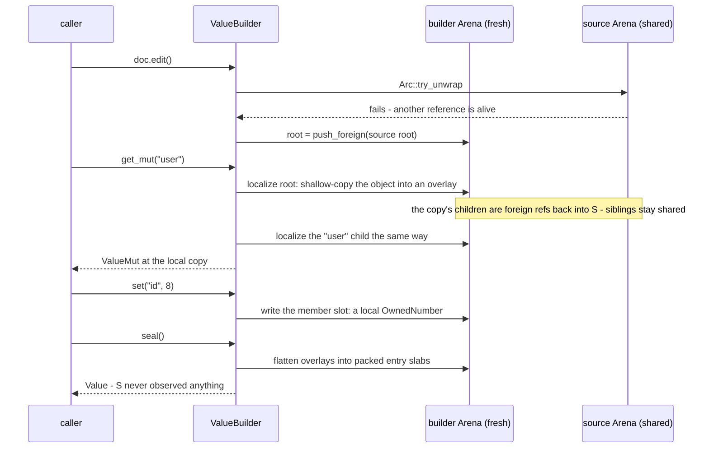

Uniquely owned document — the builder steals the arena and the same calls
become in-place writes:

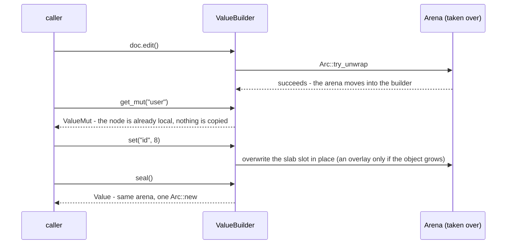

**Overlays.** Container slabs are written once, so replacing a child is an
in-place slab write, but *growth* (new key, append) opens the container into
a mutable overlay (`Node::MutArray` / `MutObject` pointing into the
builder's overlay vectors). `seal()` flattens every overlay back into packed
slabs — a sealed document is always in the immutable form.

**Cursors** (`ValueMut`, from `builder.get_mut(...)`) navigate the
copy-on-write spine **once**; every subsequent edit at the cursor is a local
operation with no re-descent from the root. Cursors chain by value and carry
the single `&mut` borrow of the builder, so a cursor cannot outlive the
builder or race other edits. The path-based methods (`set_path`,
`remove_path`, `push_path`) exist for computed paths; `set`/`remove`/`push`
plus cursors are the primary API.

**Merge** (`builder.merge(&other)`) is the execution-merge workload: object
keys union recursively, array elements merge index-wise (extras appended),
scalars and mismatched shapes replace. Containers taken from `other` are
adopted **by reference**; scalars a merge *inserts* (new keys, appended
elements) are **copied** into the local arena — a few bytes of text cost
less than a foreign-table entry plus its refcount traffic — while replaced
slots and escaped strings stay by reference (a later chunk may overwrite a
replaced slot again, and an escaped string's original spelling only
survives as a span into its source input). The fold runs with an explicit
stack; descending localizes the target spine exactly like any other
mutation.

### Pending trees: `NewValue::Array` and `NewValue::Object`

The mutation API writes into structure that already exists, which suits a
caller editing a document but not one *assembling* a tree top-down. Response
formatting is the latter: it walks a selection set, and at each level it knows
its members only after it has formatted them. With scalars-and-handles as the
only things writable, each level had to seal a document of its own and let its
parent adopt the result — so a response with *C* containers cost *C* arenas,
*C* `Arc`s, *C* slab allocations and *C* separate drops, where one of each
would do. Profiling the router's formatter put roughly half its CPU in
allocate/seal/drop rather than in JSON work.

`NewValue::Array(Vec<NewValue>)` and `NewValue::Object(Vec<(String,
NewValue)>)` name that missing thing: a *pending* tree, structure that exists
as Rust data and belongs to no arena yet. A caller assembles one with plain
`Vec` pushes — no arena involved, so no allocation is wasted on a subtree that
later gets discarded, which is what nullability propagation does constantly —
and hands the whole tree to one builder in a single pass. One arena, keys
written once, no intermediate documents.

Handles nest freely inside a pending tree: `NewValue::Node` is still adopted by
reference at whatever depth it appears, so new structure can splice existing
subtrees in without copying them.

Writing a pending tree does **not** recurse. `new_child` keeps its open
containers in an explicit `Vec<Frame>` and closes each one — allocating its
slab — only when its last member is written, matching the parser's guarantee
that nesting depth is bounded by data structures rather than by the thread
stack. Dropping a pending tree *does* recurse, through the compiler's `Drop`
glue, which no code in this crate can change; the type's documentation says so.

Keys and strings in a pending tree are `Cow<'a, str>`, so `NewValue<'a>`
carries a lifetime. This is not incidental: the strings a formatter writes are
overwhelmingly borrowed already — field names come from the parsed query,
`__typename` is a literal — and forcing them through `String` would trade the
per-level arena for a per-member heap allocation and copy, which is the same
cost in a different place. Profiling the first version of this showed exactly
that: keys round-tripping through `String` cost more than the container nodes
they were describing. `From<&'a str>` therefore borrows, and the only copy is
the one into the arena that the document needs anyway.

One consequence worth naming: a non-finite float can now appear at any depth of
a value handed to a single `set`. `Value::array`/`Value::object` promise to
coerce those to `null` rather than report `NonFiniteNumber` to a caller passing
plain Rust data, and that promise used to be kept by checking the one scalar
being written. It is now a `ValueBuilder` mode (`coercing_non_finite`) that
applies at every depth, rather than a check at a single call site — a
per-builder setting so that cursors handed out by the builder inherit it.

### Reading a document under construction

Overlays live in the builder, not the arena, so a reader that borrows only
the arena — `ValueRef` — cannot see them: a grown container reads as its
pre-growth slab, members report absent and lengths stale. That is a wrong
answer, not an error, and assembling a GraphQL response needs exactly those
reads — "have I written this key already?" is how fragment merging decides
between descending and inserting.

`BuilderRef` is the reader for this state: it borrows the builder as well as
the arena, resolves overlay nodes through the builder's tables, and follows
adopted subtrees into their own (sealed) arenas where overlays stop
applying. `ValueBuilder::value` and `ValueMut::value` hand one out.
`ValueRef` remains the sealed-document reader; nothing that only holds an
`&Arena` can be made overlay-aware, which is why the two readers are
distinct types rather than one type with a flag.

## Serialization

The serializer's contract: **untouched input spans are emitted verbatim**.
Numbers keep their exact literal (`1e2`, `1.50`), strings keep their
original escape spelling (`A` stays `A`), key order is insertion
order — an unmodified document round-trips byte-identically. Values
introduced by mutation live as owned text and are escaped with
`serde_json`-compatible rules on the way out. All walks are iterative.

Four forms, all producing identical bytes:

- `to_vec()` / `to_string()` / `to_bytes()` — one buffer, sized from the
  arena's input length.
- `write_to(writer)` — chunked writes (16 KiB) without one contiguous
  buffer.
- `into_chunks(target_size)` — an owned `Iterator<Item = Bytes>` suitable as
  an HTTP response body. Output accumulates in a small buffer that flushes
  near the target size, **except** that input spans of at least
  `max(target/2, 64)` bytes are yielded as zero-copy `Bytes` slices sharing
  the arena's input buffer (shorter spans are cheaper to copy than to
  refcount). A held chunk can therefore pin a source arena's input buffer.

**Lazy leaves.** Parsing records spans; decoding happens on access:
`as_f64`/`as_i64`/`as_u64` parse the literal, `as_str` unescapes only if the
span contains an escape (escape-free strings borrow the input). Router
traffic reads a handful of fields per document, so pass-through never pays
for decoding it doesn't use.

## Walkthrough: a cache-composition request

The pieces above compose into the driving workload: pull fragments from a
long-lived cache of parsed documents, write a few fields, stream the
response, drop everything. Watch the two zero-copy moments — adoption (an
`Arc` bump instead of copying the fragment) and streaming (a `Bytes` slice
of the cache arena's input instead of copying a large span) — and the drop
order at the end:

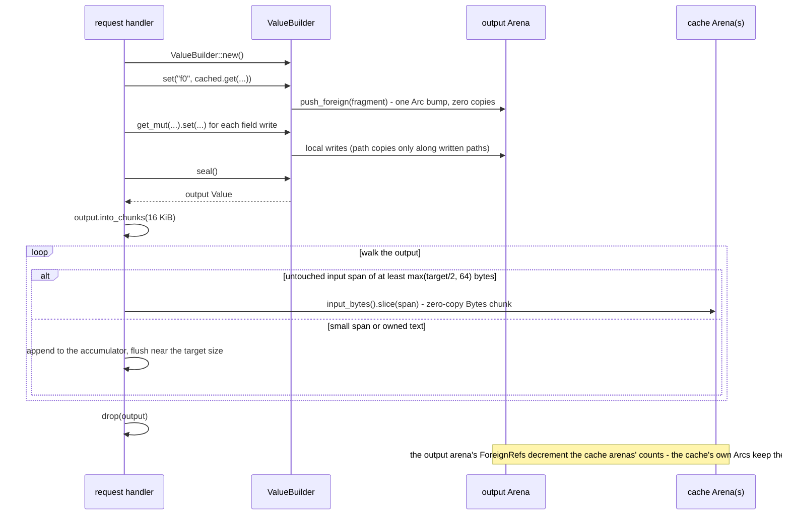

A held chunk can outlive the response: a zero-copy chunk shares the cache
arena's input buffer, which is exactly the pinning trade the
[Retention](#retention) section is about.

## Parsing

`parse::parse` is a single pass with an explicit frame stack — never
recursive, so nesting depth is bounded by `ParseOptions::max_depth`
(default 128), not the thread stack. The shape of a parse, including where
each error class fires:

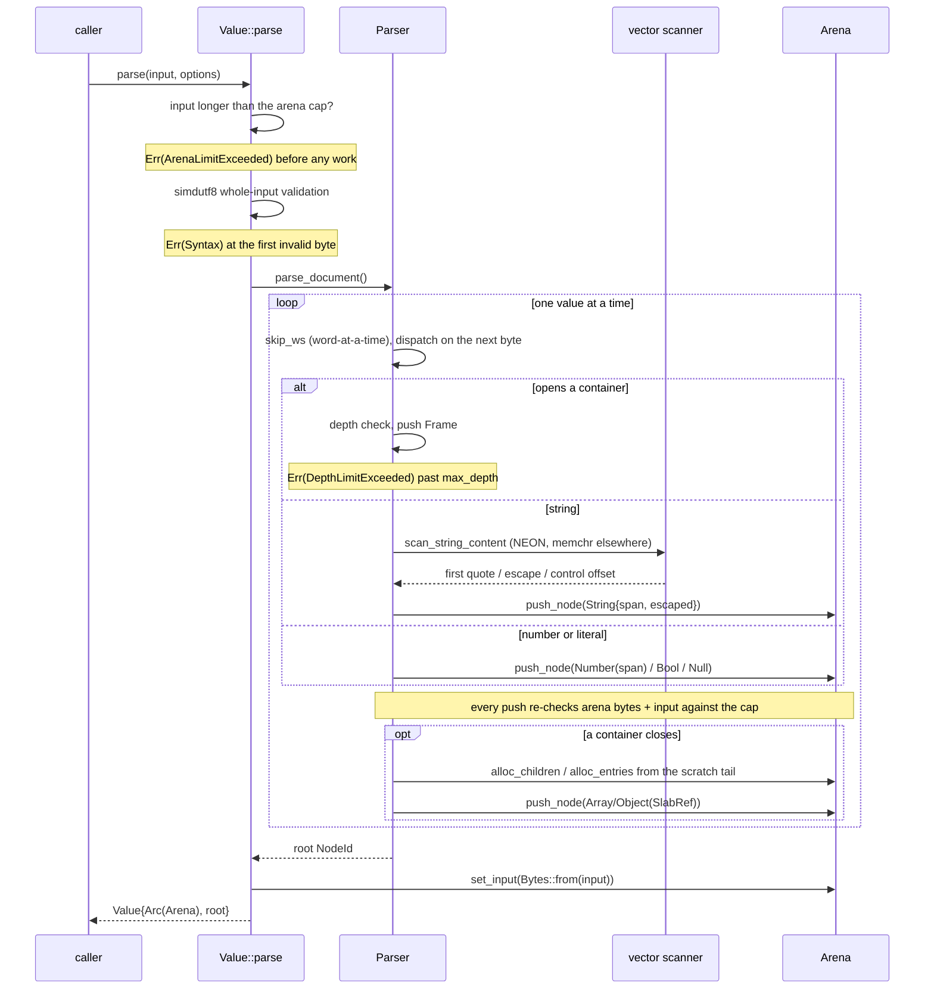

- **Scratch stacks.** Children of every open array and entries of every open
  object accumulate in two reusable scratch vectors, contiguous per frame;
  when a container closes, its tail range is copied into an arena slab and
  the scratch truncates. No per-container heap allocation.
- **UTF-8 is validated once** for the whole input up front (`simdutf8`);
  string spans never need re-validation because quotes are ASCII and cannot
  split a multi-byte character.
- **String scanning is the hot loop** and the larger of the crate's two
  `unsafe` surfaces
  (`simd.rs`): on aarch64 a NEON classifier finds the first quote, escape,
  or control byte 16–64 bytes at a time; everywhere else (and under Miri) a
  portable `memchr`-based scanner is used. Whitespace and digit runs skip
  word-at-a-time (SWAR).
- **Duplicate keys** collapse with `serde_json` `preserve_order` semantics:
  first position, first spelling, last value. Narrow objects use a linear
  scan; an object growing past 32 members switches to an `ahash` index.
- **Limits are hard parse errors**, not degradation: depth →
  `DepthLimitExceeded`, arena size (checked as nodes are pushed) →
  `ArenaLimitExceeded`, malformed input → `Syntax { offset, reason }`.
- **Recycling.** A parse-and-drop loop can reuse storage: `ParseBuffers`
  carries a cleared arena (chunk capacity kept, oversized dedicated slab
  chunks dropped) plus the parser's scratch vectors between
  `Value::parse_with_buffers` calls, and `Value::recycle` reclaims a
  value's arena into it. Steady state allocates roughly the document's
  `Arc` and the parser stack.

The recycling cycle, including both refusal paths — a still-shared arena
(some clone or handle is alive) and recycled storage too big for the
current cap:

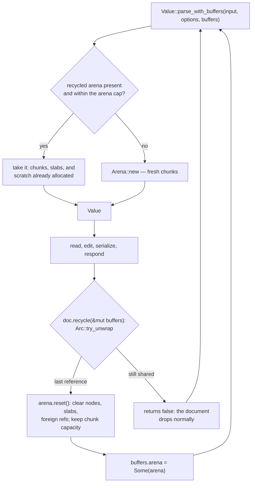

## Retention

Pinning is by design: a `Value` (or a composition) keeps every arena it
references fully resident, which is the right trade *within* a request and
for caches that own their arenas anyway. It is the wrong trade for anything
that outlives its source — retaining 1% of a document pins 100% of it.

The retention boundary:

- `Value::is_self_contained()` — is the value's footprint bounded by its
  own content? A runtime property of the handle: `false` when it pins
  another arena, and also when it points at an inner node of its own arena
  (a subtree handle, or a serde capture) and so retains more than it can
  reach.
- `Value::into_self_contained()` — identity (and allocation-free) when
  already self-contained; otherwise a deep copy into a fresh minimal arena.
  Anything storing values beyond the request lifecycle — caches,
  subscription state, deduplication — must call this or require
  self-contained inputs.
- `Value::compact()` — unconditional deep copy (prefer
  `into_self_contained`).

Compaction copies spans verbatim into the new arena's input buffer, so the
result still serializes byte-identically.

## Typed deserialization

Two entry-point families implement the same serde data model:

- **Over a document** — `from_value` drives visitors directly off the
  arena's node table, with no intermediate tree.
- **Over the byte stream** — `from_slice` / `from_str` drive visitors
  straight off the byte lexer in a single pass. No document is
  materialized: a fully typed target never touches an arena, so the typed
  hot path stops paying parse-then-walk.

The recorded entity-response run
([`COMPARISON.md`](../apollo-json-benchmarks/COMPARISON.md) → "Typed
deserialization") has the streaming path ahead of `serde_json_bytes` at
every size and ahead of plain `serde_json` from 100 KB up — while the
scenario's raw field captures a subtree per entity rather than rebuilding
an owned tree.

Shared semantics:

- **Leaves stay lazy.** Escape-free strings and keys visit as `&str`
  borrowed from the backing bytes (arena input or input slice; `&str`
  fields are zero-copy under `from_value`); numbers
  dispatch from their raw literals at natural width — `i64`/`u64` for
  integers, `f64` otherwise, with 64-bit overflow falling back to `f64` and
  explicit `i128`/`u128` requests parsing the full literal. `-0` reads as
  the float `-0.0` (an integer reading would drop the sign), exactly as
  `serde_json` does. There is no arbitrary-precision mode; float literals
  that overflow to infinity are errors.
- **serde_json-compatible surface.** The full data model is implemented on
  both paths — all four enum representations, `deserialize_any` (so
  `flatten` and untagged enums buffer correctly), numeric/bool map-key
  coercion from the string form. `deserialize_ignored_any` is a no-op over
  a document (nothing needs skipping in an already-parsed tree); the
  streaming path skips iteratively, still fully validating what it skips.
- **Depth is budgeted, not trusted.** Both paths spend an explicit budget
  equal to the default parse depth cap and error with `DepthLimitExceeded`.
  Over a document that guards compositions stacking arbitrarily many
  arenas; over the stream it also bounds the recursion through serde's
  data model, so the deserializer's stack use is capped along with the
  input's nesting. The budget is the parser's, not `serde_json`'s, so
  acceptance diverges at two margins: both paths deserialize exactly 128
  nested containers where `serde_json`'s recursion limit stops at 127, and
  the streaming path budgets skipped (ignored) content that `serde_json`
  skips without any depth bound — one shared cap for everything a request
  makes the deserializer walk, whether the target keeps it or not.
- **Errors bridge into `JsonError`.** `serde::de::Error::custom` lands in a
  `Deserialization` variant; type mismatches report expected/found and the
  byte offset of the offending value where one exists (span-backed leaves
  over a document, every value over the stream).

Where the paths deliberately differ:

- **Duplicate keys.** The parser collapses duplicates (first position,
  last value) before the document deserializer runs, so `from_value`
  reads `{"a":1,"a":2}` as `{"a":2}` — replicating `serde_json`
  there would mean retaining shadowed entries in the arena purely for
  serde to trip over. The streaming path sees both entries, so
  `from_slice` / `from_str` reject duplicate struct fields exactly as
  `serde_json`'s deserializer does. The consequence: the byte entry points
  can stand in for `serde_json` as a duplicate-rejecting validator — up to
  the depth margins above — while the document entry points cannot.
- **Recycling belongs to the document path.** `from_slice_with_buffers`
  parses to a document (keeping the collapse semantics above), deserializes,
  and reclaims the storage into a `ParseBuffers` — the entry point for a
  loop that also wants document storage reuse. The streaming path has
  nothing to recycle: it allocates only what the target type itself owns,
  plus a dedicated arena per capture.

### Capture: `Value` fields cross without a rebuild

A field typed `Value` never rebuilds its subtree through
serde's data model — that would pay an allocation-per-node copy and lose
the raw literal spellings (`1.50e2` re-reads as an `f64`) that
byte-identical reserialization depends on.

The mechanics: serde's data model cannot carry an `Arc` in band, so the
`Deserialize` impls request a newtype struct with a private marker name
(the `serde_json` `RawValue` technique), and the deserializer recognizes
the marker and hands `(Arc<Arena>, NodeId)` over through a thread-local
slot. What lands in the slot differs by path:

- **Document path: a share.** The deserializer is already standing on the
  node the field wants, so the capture is one refcount bump on the source
  arena. A share pins that whole arena — the [Retention](#retention)
  boundary applies, and a `Value` captured this way points at an inner
  node and reports `is_self_contained() == false` until
  `into_self_contained()` severs it.
- **Streaming path: a minimal arena.** The subtree at the cursor is parsed
  in place — a single-pass prefix parse that stops at the matching close —
  into a dedicated arena retaining a copy of exactly the bytes it consumed.
  The capture owns only its slice of the input — pinning it retains nothing
  else, and a `Value` captured this way is already self-contained. The
  sub-parse runs under the default arena cap, so a captured subtree past
  256 MiB fails with `ArenaLimitExceeded` where a fully typed field would
  stream through uncapped.

On any other deserializer the marker goes unrecognized and the impls
**panic** — the same limitation `RawValue` has, made unignorable. Two
situations reach the panic, and neither is a runtime condition:

- **A foreign deserializer** (`serde_json`, a framework's `.json()`) has no
  arena to hand over. No input makes the call succeed.
- **Serde's internal content buffering.** `flatten`, untagged enums, and
  internally tagged enums deserialize by copying the input into serde's
  private owned tree (`Content`) and replaying it — for those shapes serde
  cannot know the target types until it has read past the data. The replay
  runs inside the code `serde_derive` generates for the *containing* type,
  so no `Deserializer` implementation avoids it, and `Content` has no
  variant that can carry an arena reference: by replay time the capture's
  type information exists but the arena is gone. The two are never in the
  same place. Adjacently tagged enums buffer only when the content member
  precedes the tag, which makes a capture inside one succeed or panic by
  JSON key order — treat them as unsupported.

The escape hatch is to stop needing the buffering: parse the whole message
with this crate and read the envelope by key. A parsed document is randomly
addressable, so the tag's position is irrelevant — the property serde buys
with `Content` — and the payload captures from the same arena by reference.

## Typed serialization

The reverse direction is symmetric. `Value` and `ValueRef`
implement `serde::Serialize` by walking arena nodes with the same explicit
nesting budget the deserializer spends, and `to_value` implements a
serde `Serializer` over the arena primitives: scalars land as owned text
with `serde_json`'s formatting (non-finite floats as `null`, exactly as
`serde_json` writes them), containers collect their children and pack
into slabs when they end (like the parser's scratch stacks), duplicate map
keys collapse with parse semantics (first position, last value), and
128-bit integers keep their full value — raw-text storage makes that free.

- **The adoption rule is the capture rule mirrored.** A field typed
  `Value` serializes by stashing its `(Arc<Arena>, NodeId)`
  in the same thread-local hand-off and emitting the marker newtype;
  `to_value` recognizes the marker and records a foreign reference —
  one refcount bump, no copy, byte-identical reserialization. Adopting at
  the root hands back the source document itself. `ValueRef` is the
  exception: a borrowed view carries no owning `Arc`, so it always copies
  structurally.
- **Unrecognized markers degrade gracefully**, unlike capture. The
  content of a shared subtree is available in band, so a serializer that
  does not recognize the marker (serde_json, or a wrapper replaying a
  recorded stream) receives the structural walk — equal content, no
  sharing, never an error. The deserialize direction must fail loudly
  instead: an arena cannot be conjured out of replayed content.
- **Raw literals do not survive serde's data model.** Serializing into
  serde_json re-reads every number at its natural width (`1.50e2` becomes
  `150.0`); that is inherent, and byte-identical output stays the job of
  the crate's own serializers. In the opposite direction `to_value`
  recognizes serde_json's arbitrary-precision number struct by its marker
  name and stores the validated literal raw.

## Conversion to the legacy type

`to_legacy()` / `from_legacy()` convert to and from
`serde_json_bytes::Value` in a single iterative walk with no intermediate
byte buffer. Numbers cross via their literal text and take on `serde_json`'s
reading (integers as `i64`/`u64`, everything else `f64`; out-of-range
literals saturate) — the legacy type simply cannot represent more. This
boundary is meant to be paid only where a legacy consumer is actually
registered.

## Trade-offs and alternatives

What this design gives up and what it buys, against the stacks it was
measured against and against the roads not taken. Numbers live in the
benchmark crate — the five-stack capture in
[`COMPARISON.md`](../apollo-json-benchmarks/COMPARISON.md), the full matrix
in [`RESULTS.md`](../apollo-json-benchmarks/RESULTS.md), memory in
[`MEMORY.md`](../apollo-json-benchmarks/MEMORY.md) — and in the dated
decision records under
[`docs/`](../../../docs/apollo-json-requirements.md); this section states
the reasons.

### Versus the alternative stacks

#### serde_json

The reference owned DOM: every value is a heap object, objects are maps.
It beats us on ubiquity — the entire serde ecosystem, zero integration
risk. Architecturally it pays one
allocation per value (~80k for a 1 MB entity document, against our ~72),
keeps 6–7x the input resident, cannot share structure, and (without
`preserve_order`) loses key order. *Choose it for tooling and typed
configs; choose this crate when documents are the hot path.*

#### serde_json_bytes

The router's stack today: serde_json's model with string leaves borrowing
the input `Bytes` and insertion-ordered maps. That borrowing is the one
architectural idea we kept and generalized — our arena owns the input for
the same reason. It beats us on maturity and on drop-in serde interop.
It still allocates per value, keeps 10–18x resident (97x on deeply nested
shapes), and its only isolation mechanism is a deep clone — five isolated
field writes on a shared 1 MB document cost it ~8.5 MiB and 21k
allocations against our ~155 KiB and 64
([`COMPARISON.md`](../apollo-json-benchmarks/COMPARISON.md)). *Choose it
for compatibility today; choose this crate for pass-through, sharing, and
memory.*

#### sonic-rs

SIMD parser over a bump-arena tape behind an `Arc` — the closest relative,
and the stack this crate was nearly built on (see the
[foundation evaluation](../../../docs/apollo-json-q1-parser-foundation.md)).
Where it wins, honestly: raw parse on container-dense shapes — 1.6–1.7x
faster on entity documents, 2.5x on wide objects
([`RESULTS.md`](../apollo-json-benchmarks/RESULTS.md) headline charts) —
and its per-node-`Arc` copy-on-write is cheaper at micro scale (five
isolated writes: ~45 KiB / 16 allocations against our ~155 KiB / 64).
Where the architecture loses: mutation converts nodes into `Arc`'d hash
maps, so key order — and with it byte-identical serialization — does not
survive the first write, and neither does arena sharing (the recorded
eight-chunk merge: 5.20 ms against our 1.98 ms, worse than
serde_json_bytes' 2.11 ms); parse pre-allocates ~8x-input scratch and its
bumpalo chunks double, a flat 9x over-allocation at every size; retention
has no remedy (retaining 1% pins ~300–430x with no `detach`); and the
unsafe surface is pervasive where ours is one scanner module plus one
trusted-UTF-8 conversion. We also serialize
large entity documents faster (verbatim spans: 8.58 ms vs 10.24 ms at
10 MB). *Choose it to parse and read transient documents at maximum speed;
choose this crate the moment documents are mutated, merged, shared, or
retained.*

#### simd-json

The two-stage parser: a SIMD pass finds structural indexes, an iterative
second stage builds the tape — the reference for this crate's iterative
parse, and the parked option for closing the parse gap (below). As a
document model it is disqualified rather than outscored: the tape borrows
the input (`'input` lifetimes, so no owned handles), unescapes strings
destructively in place (the verbatim spans we serialize from no longer
exist after its parse), and its mutable DOM is a per-node boxed tree with
hash-map objects — never byte-identical. It also carries 3–15x parse
over-allocation. *Choose it to validate or scan bytes you will drop;
choose this crate for anything that outlives its input buffer.*

### Design decisions and the roads not taken

#### Whole-arena refcounting — not per-node, not per-chunk

Per-node `Arc`s buy fine-grained liveness at the price of an atomic per
node on every share and a destructor walk on every drop — the exact costs
this crate exists to avoid, and visible in sonic-rs's owned mode. The
middle road, per-chunk counting, was simulated before building
([ownership-model record](../../../docs/apollo-json-q2-q4-ownership-model.md)):
under realistically *spread* retention even 16 KiB chunks only cut pinned
amplification from ~245x to ~119x — still two orders of magnitude — and
only *clustered* retention (one wide object: 319x → 9x) actually pays,
while every share would touch one atomic per chunk spanned. `detach()`
brings retention to ~3.6x regardless, so the bookkeeping never earns its
place. **Reconsider if** a real workload shows clustered retention where
callers cannot be made to call `detach()`.

#### A chunked, index-addressed store — not a bump-pointer arena

Indices are half the size of pointers, keep the whole store in safe Rust,
make the byte cap exact, and make `reset()` — and therefore `ParseBuffers`
recycling — trivial. The measured consequence is peak ≈ resident
(0.01–0.05x over-allocation against sonic-rs's flat 9x;
[`COMPARISON.md`](../apollo-json-benchmarks/COMPARISON.md)). The price is
bounds checks on hot lookups, folded into the parse gap discussed below.

#### No slot reuse, no free lists

A replaced slot in a *shared* arena is dead only if nothing anywhere
references it — unknowable without per-node liveness, which was rejected
above, so sealed arenas never reclaim. Inside a builder the story is
different: ownership is unique by construction, so a builder-local free
list is provably sound — it is the designed extension point if long-lived
builder churn ever becomes a real workload. Until then, dead runs count
against the arena cap until `seal()` (conservative in the right direction
for a DoS posture), and `compact()` / `into_self_contained()` is the
defragmentation path.

#### Builder/sealed split — not `make_mut`-style mutation everywhere

Measured before building
([ownership-model record](../../../docs/apollo-json-q2-q4-ownership-model.md)):
on a uniquely owned document the builder costs nothing over `make_mut` —
same path — but `make_mut` alone has a silent degraded mode where one
retained clone turns the merge ~3x slower with ~7x the copies, invisible
at the call site. The builder makes in-place mutation structural, and the
same shape is what the wasm ABI needs. Nothing pending would change this.

#### Document and Value as separate owner types — superseded (2026-08)

The public surface has carried two owned handle types with identical
representation — `Document` and `Value` are each `(Arc<Arena>, NodeId)` —
distinguished only by intent: a `Document` points at what an arena was
built to represent, a `Value` at any node. Integration feedback showed the
split earns none of that distinction at runtime:

- The property the split was meant to encode — "this handle owns exactly
  what it reaches" — is already a *runtime* answer (`is_self_contained()`),
  because serde captures and adopted subtrees produce documents rooted at
  inner nodes. The type never guaranteed it.
- Mutation entry is identical through either type: `edit()` does the same
  unique-take-over-or-copy-on-write regardless of which handle opened it.
- Every read API must exist on both (and again on `ValueRef`), a
  duplication treadmill this file's history shows growing with each
  addition — `get_path`, `contains_key`, and the scalar comparisons all
  landed three times.

Decision: merge `Document` and `Value` into one owned handle type. The
merge is a separate sweep; new API is written on `Value`/`ValueRef` (with
`Document` delegating) so it carries over unchanged.

#### Flat insertion-ordered vectors — not hash maps or persistent maps

Key order is load-bearing (byte-identical serialization), which rules out
hash maps outright; persistent maps (HAMTs) reintroduce per-node refcounts
and pointer chasing for a workload that is iterate/serialize-heavy and
mutate-light. The accepted cost is O(width) member lookup. That
acceptance is now measured, not assumed: a builder-side hashed index was
implemented and reverted — at the real widths of merge traffic (~16–27
keys) every variant lost (+5% to +35%) to length-first linear scans,
because build cost cannot amortize below the parser's 32-key threshold.
**Reconsider if** real traffic shows much wider objects under repeated
builder lookups.

#### Lazy raw-span leaves — not eager decoding

Measured before building: raw-span numbers make number-heavy pass-through
2.2–2.4x faster and only lose when essentially *every* number is read —
the crossover sits between 10% and 100% access, and router traffic reads a
handful of fields. Repeated reads of one hot leaf re-pay the parse;
memoizing a decoded value in the node is a local extension if profiling
ever shows that pattern.

#### Panic on uncapturable deserialization — not an error, not a rebuild

When a capture cannot cross (foreign deserializer, or serde buffering),
three responses were on the table:

- **Rebuild silently** — deserialize structurally and copy. Rejected: it
  hides an allocation-per-node copy behind an innocent-looking field, and
  the round trip through serde's data model normalizes number spellings
  (`1.50` re-reads as `1.5`), so byte-identical reserialization silently
  stops holding. A guarantee that degrades quietly is not a guarantee.
- **Return an error** — the original choice. Rejected after integration
  evidence: deserialization errors are consumed as control flow.
  `unwrap_or_else` fallbacks turn the defect into different behavior, and a
  cache treats a failed read as a miss — the observed failure mode was a
  distributed cache writing entries it could never read back, degrading to
  a 0% hit rate with a log line per read. Nothing forced anyone to look.
- **Panic** — the current contract. The situation is a defect in the
  compiled code, not bad input: no data makes the call succeed (and the
  adjacently-tagged case, which succeeds or fails by key order, is worse
  than never succeeding). Panicking is the only signal that cannot be
  absorbed by a fallback arm.

Callers that genuinely want a structural rebuild write it at the field,
where the copy is visible — a `#[serde(with = ...)]` adapter through the
legacy tree — rather than getting one implicitly.

#### Scalar dispatch loop — not a two-stage structural-index parse (parked)

The honest gap: sonic-rs parses container-dense shapes 1.6–1.7x faster
(and wide objects 2.5x). Closing it means a simd-json-style structural
pass — a second architecture-specific unsafe module plus a structural
index buffer that peak memory must account for. It is parked, not
rejected: pass-through totals already compete (the serialize side wins
back what parse loses), the string scanner already took the
vectorization win where strings dominate, and merge/compose — not parse —
dominate the router's per-request cost. **Reconsider when** parse-only
throughput is a measured production bottleneck, or an x86 recording shows
a wider gap than aarch64's.

#### Safe index addressing — not raw pointers

The bounds-check tax on node and slab lookups is part of the parse gap
above. It buys: a Miri-clean test suite, fuzzing that exercises logic
instead of memory safety, and an `unsafe` surface small enough to audit in
one sitting — the string scanner (`simd.rs`) plus one trusted-UTF-8
conversion (`utf8::ValidatedUtf8::as_str`, justified below). These are
load-bearing for a DoS-exposed hot path; raw pointers would only be
revisited together with the structural-index work.

#### Trusted UTF-8 spans — not per-access re-validation

The whole input is UTF-8 validated once, up front, and quotes are ASCII, so
a string span can never cut a multi-byte character: every stored span is
valid UTF-8 by construction, and owned text is copied from `&str`. The
accessors originally re-validated anyway (`str::from_utf8` on every key and
string read) to stay in safe Rust; profiling the typed deserializer showed
that re-validation at ~30% of self time — spans are short and arbitrarily
aligned, the worst case for the word-at-a-time validator (a vectorized
re-validation via `simdutf8` was tried first and lost at these lengths).

The unchecked conversion is the one `unsafe` outside the string scanner,
and the type system carries its proof: bytes reach it only as
`utf8::ValidatedUtf8`, whose constructors are the validity-establishing
paths themselves — whole-input validation (the lexer will not accept
anything else), copies of `&str` (the owned-text slab will not accept
anything else), and boundary-respecting slices or copies of already-
validated text (capture prefixes, detach assembly). A new read path
cannot reach the unchecked conversion without going through one of those
constructors, so the audit surface is the `utf8` module alone. Debug
builds still re-validate on every conversion as defense in depth.

#### Insert-only scalar copy in merge — not full copy, not full adoption

Full adoption made every merged-in scalar a foreign-table entry plus
refcount traffic — 18% of the merge request cycle spent in `Arena::drop`.
Full copying swung too far: replaced slots are often overwritten again by
the next chunk, and the dead text piled up in the arena (+45% on the
repeated-subtree fold). Insert-only splits it: scalars that will live
(new keys, appended elements) are copied, replaced slots and escaped
strings stay by reference — a ~5% faster merge-serialize-drop cycle and
8–10% fewer bytes allocated, at the cost of the fold-only benchmark rows
noted in [`RESULTS.md`](../apollo-json-benchmarks/RESULTS.md).

## Where things live

The crate is small; each module is one concern. `lib.rs` wires up: arena and
slab storage, the node representation, the byte lexer, the parser and its
vectorized scanner, the immutable read surface (`document`), value
construction from Rust data (`construct`), the builder and
cursors, the serializers (buffered, streaming), the typed serde
deserializers (document-walking and streaming), detach/compact, legacy
conversion, text escaping, the UTF-8 validity types, errors, and parse
options. Tests are integration-style under
`tests/` (round-trip, sharing, mutation, cursor, limits, memory,
concurrency, proptest-based sharing-algebra properties, and differential
serde suites against serde_json), with fuzz targets under `fuzz/`.
